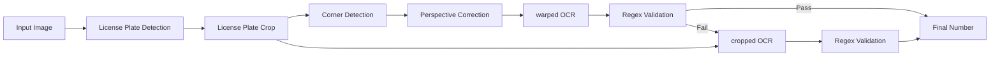
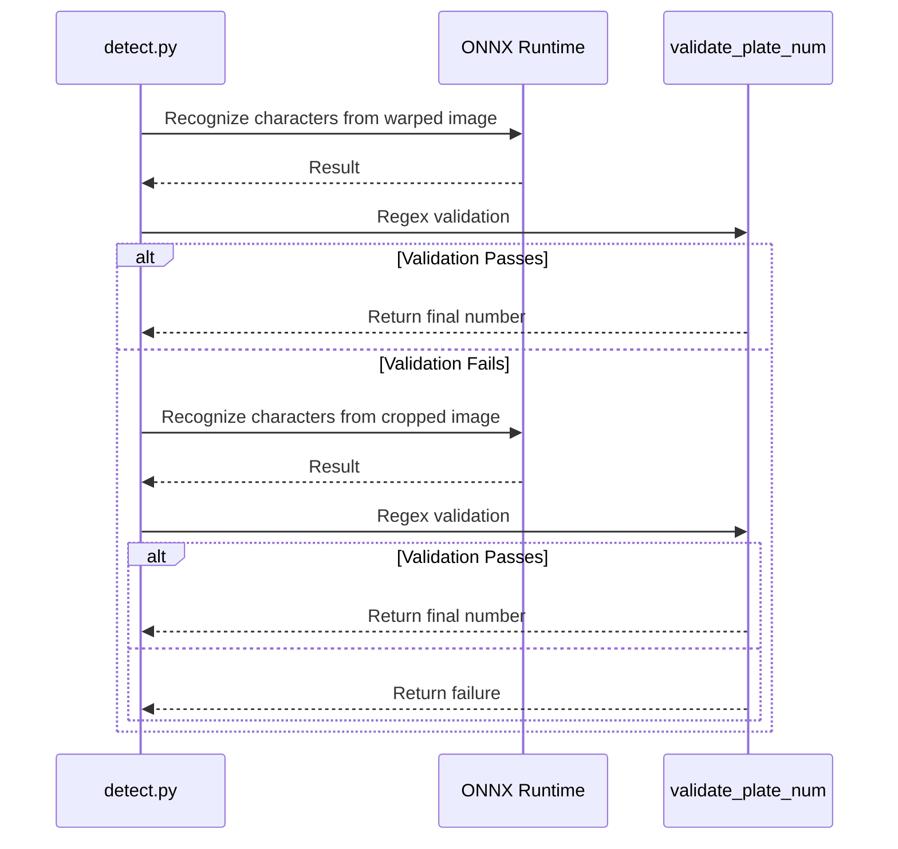

## Problem Awareness

Traditional OCR works well on clean documents but is vulnerable with blurry and tilted images like license plates. If the character spacing is irregular or partially obscured, the recognition rate drops sharply. Additionally, Korean car license plates have diverse character arrangements and a mix of regional names and numbers, which posed limitations for general OCR models.

This project adopts a perspective that views characters as objects rather than text. Using YOLO-based object detection, each character is independently identified, and OCR is performed on both the original and corrected image versions for dual verification. NMS and extremum-based line fitting are used to separate regional names and numbers, ensuring robust operation even in environments where traditional OCR fails.

## Three-Stage Pipeline: The Art of Division of Labor

The entire flow is controlled by the `get_num()` function in `detect.py`. Three ONNX models handle their respective areas of expertise.

| Stage | Model                | Role                                                     |
| ----- | -------------------- | -------------------------------------------------------- |
| 1     | `plate_detect_v1`    | Detects license plate area in the entire image           |
| 2     | `vertex_detect_v1`   | Detects four corners and performs perspective correction |
| 3     | `syllable_detect_v1` | Detects individual characters with 75 classes            |

The first model finds one license plate area in the entire image. It selects the most reliable candidate among several and crops it. The second model finds the four corners in the cropped image and performs perspective correction. The third model detects individual characters as objects with 75 classes. Instead of reading text lines like traditional OCR, it finds the position of each character within the license plate, allowing recognition even if character spacing is irregular or partially obscured.

All models run with ONNX Runtime, and the PyInstaller binary excludes torch or ultralytics to minimize size.



## Validation and Fallback: Balancing Stability and Efficiency

Perspective transformation is not always perfect. Corner detection may fail, or you may encounter a tilted license plate.

This project **prioritizes OCR on warped images**, and if it passes regex validation, it immediately returns the result. Only if it fails does it fallback to the original cropped image for additional OCR.

```python
def get_num(img):
    cropped = plate_detector.detect_and_crop(img)
    warped = vertex_detector.detect_and_warp(cropped)

    # Step 1: Prioritize OCR on warped image
    if warped is not None:
        res = syllable_detector.get_num_from_img(warped)
        result = validate_plate_num(res, mask=False)
        if result:
            return result

    # Step 2: Fallback - OCR on cropped image
    if cropped is not None:
        res = syllable_detector.get_num_from_img(cropped)
        result = validate_plate_num(res, mask=False)
        if result:
            return result

    return None

def validate_plate_num(plate_num, mask=True):
    """Regex validation + mask application for a single OCR result"""
    if plate_num is None:
        plate_num = ''

    m = re.fullmatch(PLATE_REGEX, plate_num)
    if m is None:
        return None

    if mask:
        plate_num = re.search(OUTPUT_REGEX, plate_num).group()

    return plate_num
```

This approach processes with a single OCR if warping is successful, and falls back to the cropped image only if it fails. It is designed to reduce unnecessary inference while maintaining stability.

After character detection, duplicate bounding boxes are removed using NMS, and lines are drawn based on left and right extremum points to separate regional names and number areas. Regional names are corrected by comparing them with a hardcoded list of valid regions such as Seoul, Gyeonggi, and Busan.



## User-Friendly GUI Design

What should be done if some images fail detection during batch processing? Ignoring them lowers data quality, and stopping the entire process reduces efficiency.

The PySide6-based GUI automatically pauses when detection fails and displays the image on the screen. It halts processing until the user manually inputs the license plate number and presses the confirm button. This hybrid approach achieves 100% coverage while maintaining batch processing efficiency. Results are automatically saved as result.xlsx via openpyxl, and progress is visualized with a progress bar.

## Deployment: Ready for Immediate Use

A single executable file is created using PyInstaller. Large libraries like torch, tensorflow, and matplotlib are explicitly excluded to minimize the binary size. All ONNX models are automatically downloaded from the Hugging Face Hub and stored in a local cache to prevent re-downloads.

GitHub Actions automatically build releases for Linux, macOS, and Windows upon pushing v\* tags and upload them to GitHub Releases. Users can simply extract and run them.

## Trade-offs and Design Philosophy

YOLO-based character detection is strong against irregular spacing and occlusion but may have lower fine recognition rates for small characters compared to traditional OCR. To compensate, the mechanism prioritizes OCR on warped images and immediately returns results if regex validation passes, only falling back to the cropped image if it fails. An NMS threshold of 0.3 balances duplicate removal and omission prevention on license plates with many overlapping characters.

The modal input method of the GUI may seem somewhat outdated but is a practical choice for handling edge cases where full automation is impossible in real operating environments. Balancing data quality and processing efficiency is the core philosophy of this project.

## Conclusion

This project aims to be a tool usable in real-world scenarios beyond a simple deep learning demo. The modularization of the three-stage model pipeline, stability of prioritized validation and fallback, usability of the PySide6 GUI, and cross-platform deployment utilizing PyInstaller and GitHub Actions highlight a design considering the entire lifecycle. It is a case that maximizes the potential of object detection in the narrow domain of license plate recognition.
