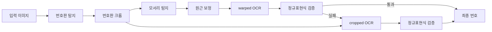

## Problem statement

Traditional OCR works well on clear documents, but it's weak on
but it struggles with blurry, skewed images like license plates.
Recognition rates plummet when characters are irregularly spaced or partially obscured.
In addition, Korean license plates have a varied arrangement of characters and a mix of
and a mix of regional names and numbers, which was a challenge for typical OCR models.

The project took the perspective of viewing characters as objects rather than text.
YOLO-based object detection was used to find each character independently.
Double-validate by performing OCR on both versions of the original and calibrated images.
Separate place names and numbers with NMS and extreme point-based line fitting.
Robustly performs in environments where traditional OCR fails.

## 3-step pipeline: the art of the division of labor

The entire flow is controlled by a single `get_num()` function in `detect.py`.
Three ONNX models are responsible for their respective areas of expertise.

| Step | Model | Role |
| ---- | -------------------- | -------------------------------- |
| 1 | `plate_detect_v1` | Detect license plate regions in the entire image |
| 2 | `vertex_detect_v1` | Detect four corners and correct for perspective |
| 3 | `syllable_detect_v1` | Detect individual characters with 75 classes |

The first model finds one license plate region in the entire image.
It selects the one with the highest confidence among several candidates and crops it.
The second model finds four corners in the cropped image and performs perspective correction.
and performs perspective correction.
The third model detects individual characters as objects with 75 classes.
Rather than reading lines of text like traditional OCR
it finds the position of each character within the license plate
even if the characters are irregularly spaced or some are obscured.
the rest can still be recognized.

All models run with the ONNX Runtime
PyInstaller binaries do not include torch or ultralytics to minimize the
minimized size.



## Validation and fallback: balancing reliability and efficiency

Perspective transformations aren't always perfect.
Edge detection may fail, or you may encounter a tilted license plate.

This project **prioritizes OCRing warped images** and,
and returns the result immediately if it passes regular expression validation.
Only if it fails does it fall back to the original cropped image for
perform additional OCR.


___code_block_1___


This approach treats warping as a single OCR if it succeeds,
only falling back to the cropped image when it fails.
This design reduces unnecessary inference while maintaining stability.

After character detection, we use NMS to remove redundant bounding boxes,
draws lines based on the left and right extreme points
Separate the region name from the numeric region.
For example, Seoul, Gyeonggi, Busan, etc.
Proofread against a hard-coded list of valid regions.

```python
def get_num(img):
    cropped = plate_detector.detect_and_crop(img)
    warped = vertex_detector.detect_and_warp(cropped)

    # Step 1: warped 이미지 우선 OCR
    if warped is not None:
        res = syllable_detector.get_num_from_img(warped)
        result = validate_plate_num(res, mask=False)
        if result:
            return result

    # Step 2: fallback - cropped 이미지 OCR
    if cropped is not None:
        res = syllable_detector.get_num_from_img(cropped)
        result = validate_plate_num(res, mask=False)
        if result:
            return result

    return None

def validate_plate_num(plate_num, mask=True):
    """단일 OCR 결과에 대해 regex 검증 + mask 적용"""
    if plate_num is None:
        plate_num = ''

    m = re.fullmatch(PLATE_REGEX, plate_num)
    if m is None:
        return None

    if mask:
        plate_num = re.search(OUTPUT_REGEX, plate_num).group()

    return plate_num
```

## Design a user-friendly GUI

What if some images fail to be detected during batch processing?
Ignoring them leads to poor data quality and
Stopping the entire batch is less efficient.

The PySide6-based GUI automatically pauses on detection failures and displays the
and shows the corresponding images on the screen.
The user manually enters the license plate number and presses the
and stops processing until the user presses the OK button.
This is a hybrid approach that achieves 100% coverage
efficiency of batch processing.
The results are automatically saved as result.xlsx via openpyxl.
The progress is visualized in the progress bar.

## Deployment: Write on the fly

Create a single executable with PyInstaller.
Large libraries like torch, tensorflow, matplotlib, etc.
explicitly excluded to minimize binary size.
All ONNX models are automatically downloaded from the Hugging Face Hub and
stored in a local cache to prevent re-downloads.

GitHub Actions are enabled on v\* tag pushes.
automatically builds releases for Linux, macOS, and Windows and uploads them to
GitHub Releases.
Users can unzip it and run it right away.

## Tradeoffs and design philosophy

YOLO-based character detection is robust to irregular spacing and occlusions, but fine-grained recognition of small characters may be lower than traditional OCR.
but the fine-grained recognition rate for small characters can be lower than traditional OCR.
To compensate for this, we prioritize OCRing warped images and
and return it immediately if it passes regular expression validation,
only falling back to the cropped image if it fails.
An NMS threshold of 0.3 is recommended for license plates with high character overlap.
It is a balance between deduplication and miss prevention.

The modal input method in the GUI may seem a bit archaic, but it's a good compromise between
practical for handling edge cases where full automation is not possible
edge cases that cannot be fully automated in real-world production.
Balancing data quality and processing efficiency is the core philosophy behind
is the core philosophy of this project.

## Conclusion.

This project is more than just a deep learning demo
to a tool that can be used in the real world.
Modularization of the 3-step model pipeline, reliability of first validation and fallback,
usability of the PySide6 GUI,
and cross-platform deployment using PyInstaller and GitHub Actions.
cross-platform deployment with PyInstaller and GitHub Actions.
In the narrow domain of license plate recognition
This is an example of object detection at its full potential.
