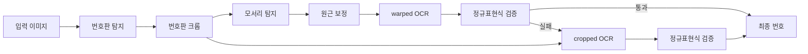
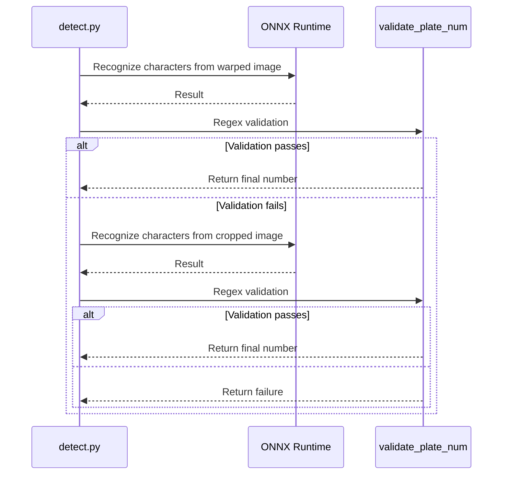

## Problem Awareness

Traditional OCR works well on clean documents but is vulnerable to blurred and tilted images like license plates. Recognition rates plummet when character spacing is irregular or partially obscured. Additionally, Korean license plates have diverse character arrangements and a mix of region names and numbers, posing limitations for general OCR models.

This project views characters as objects rather than text. Using YOLO-based object detection, each character is independently identified, and OCR is performed on both the original and corrected images for dual verification. NMS and extreme point-based line fitting separate region names and numbers, ensuring robust operation even in environments where traditional OCR fails.

## Three-Step Pipeline: The Art of Division

The entire flow is controlled by a single function, `get_num()`, in `detect.py`. Three ONNX models handle their respective specialties.

| Step | Model                | Role                             |
| ---- | -------------------- | -------------------------------- |
| 1    | `plate_detect_v1`    | Detect license plate area in the entire image |
| 2    | `vertex_detect_v1`   | Detect four corners and perform perspective correction |
| 3    | `syllable_detect_v1` | Detect individual characters with 75 classes |

The first model identifies a single license plate area from the entire image, selecting the most reliable candidate for cropping. The second model finds the four corners in the cropped image and performs perspective correction. The third model detects individual characters as objects with 75 classes. Unlike traditional OCR, which reads text lines, this approach locates each character within the license plate, allowing recognition even if character spacing is irregular or partially obscured.

All models run on ONNX Runtime, and the PyInstaller binary excludes torch and ultralytics to minimize size.



## Verification and Fallback: Balancing Stability and Efficiency

Perspective transformation is not always perfect. Corner detection may fail, or tilted license plates may be encountered.

This project **prioritizes OCR on warped images**, returning results immediately if regex validation passes. If it fails, it falls back to the original cropped image for additional OCR.

```python
def get_num(img):
    cropped = plate_detector.detect_and_crop(img)
    warped = vertex_detector.detect_and_warp(cropped)

    # Step 1: Prioritize OCR on warped images
    if warped is not None:
        res = syllable_detector.get_num_from_img(warped)
        result = validate_plate_num(res, mask=False)
        if result:
            return result

    # Step 2: Fallback - OCR on cropped images
    if cropped is not None:
        res = syllable_detector.get_num_from_img(cropped)
        result = validate_plate_num(res, mask=False)
        if result:
            return result

    return None

def validate_plate_num(plate_num, mask=True):
    """Regex validation + mask application for a single OCR result"""
    if plate_num is None:
        plate_num = ''

    m = re.fullmatch(PLATE_REGEX, plate_num)
    if m is None:
        return None

    if mask:
        plate_num = re.search(OUTPUT_REGEX, plate_num).group()

    return plate_num
```

This approach processes with a single OCR if warping succeeds, and falls back to the cropped image only upon failure, reducing unnecessary inference while maintaining stability.

After character detection, duplicate bounding boxes are removed using NMS, and lines are drawn based on extreme points to separate region names and number areas. Region names are corrected by comparing them with a hardcoded list of valid regions like Seoul, Gyeonggi, and Busan.



## User-Friendly GUI Design

What should be done if some images fail detection during batch processing? Ignoring them decreases data quality, while stopping the entire process reduces efficiency.

The PySide6-based GUI automatically pauses on detection failure and displays the image. Processing halts until the user manually inputs the license plate number and presses the confirm button. This hybrid approach achieves 100% coverage while maintaining batch processing efficiency. Results are automatically saved to result.xlsx via openpyxl, and progress is visualized with a progress bar.

## Deployment: Ready for Field Use

A single executable file is created using PyInstaller. Large libraries like torch, tensorflow, and matplotlib are explicitly excluded to minimize binary size. All ONNX models are automatically downloaded from the Hugging Face Hub and stored in the local cache to prevent redownloads.

GitHub Actions automatically build releases for Linux, macOS, and Windows upon v\* tag push, uploading them to GitHub Releases. Users can extract and run immediately.

## Trade-offs and Design Philosophy

YOLO-based character detection is robust against irregular spacing and occlusion but may have lower fine recognition rates for small characters compared to traditional OCR. To compensate, the mechanism prioritizes OCR on warped images and returns immediately if regex validation passes, falling back to cropped images only upon failure. An NMS threshold of 0.3 balances duplicate removal and omission prevention in license plates with overlapping characters.

The modal input method of the GUI may seem outdated, but it is a practical choice for handling edge cases where full automation is impossible in real-world operations. Balancing data quality and processing efficiency is the core philosophy of this project.

## Conclusion

This project aims to be a practical tool for real-world use, beyond a simple deep learning demo. The modularization of the three-step model pipeline, the stability of prioritization and fallback, the usability of the PySide6 GUI, and the cross-platform deployment using PyInstaller and GitHub Actions highlight a design that considers the entire lifecycle. It is a case where the potential of object detection is maximized within the narrow domain of license plate recognition.
