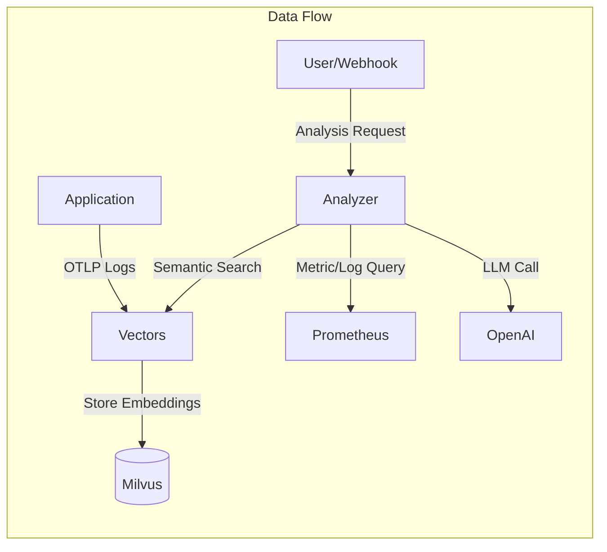
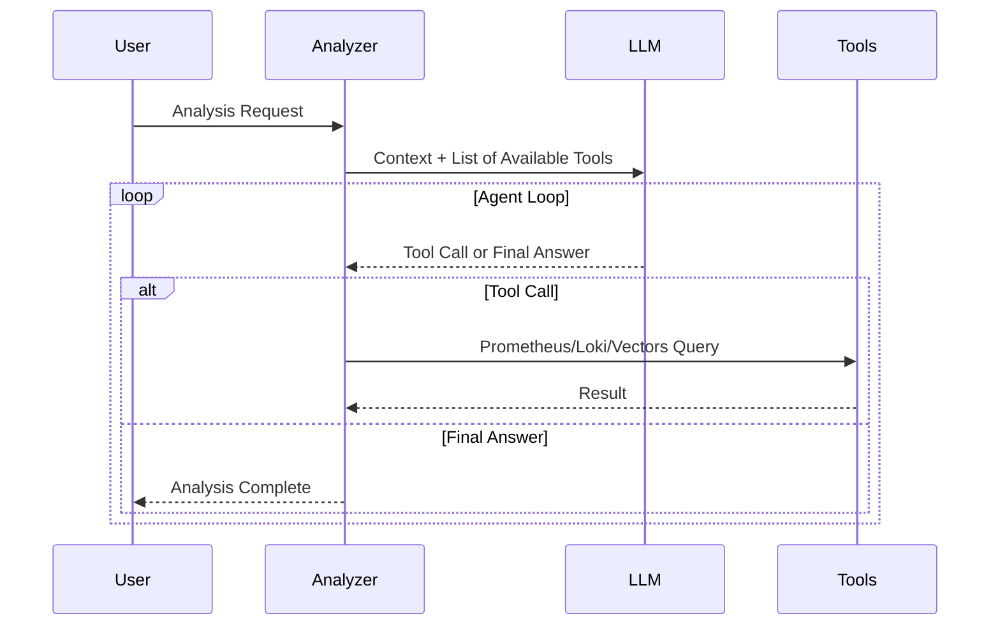

## Problem Awareness

A PagerDuty alert rings in the middle of the night. "CPU exceeds 90%."
You wake up and check the dashboard, only to find that a batch job running since yesterday is the cause, and it’s set to automatically decrease in 30 minutes.
Accumulating such false alerts can desensitize you to real issues when they arise.

Meerkat was initiated to fundamentally solve this problem.
Instead of rule-based alerts, an AI Agent directly reads logs and metrics,
calls tools like Prometheus and Loki, and infers the cause.
Logs are vectorized for semantic search and stored,
and the system is divided into two services, Analyzer and Vectors, which can be independently scaled.

## Core Design: Two Services, Two Responsibilities

Meerkat consists of two services: Analyzer and Vectors.
This separation is an intentional design.

**Vectors** focuses solely on meaningfully storing logs.
Logs received via OpenTelemetry OTLP are deduplicated through template extraction,
embedded with OpenAI, and stored as vectors in Milvus.
Even if a service logs tens of thousands of entries a day, only a few dozen unique templates are actually vectorized,
greatly improving storage costs and search efficiency.

**Analyzer** focuses solely on AI analysis and worker management.
It processes requests received via HTTP API in an asynchronous worker pool,
and requests semantic searches from Vectors if necessary.
The two services communicate via gRPC and can scale out independently.

### Effects of Template Extraction

| Filter Mode         | Operation                     | Use Case                      |
| ------------------- | ----------------------------- | ----------------------------- |
| **all**             | Vectorize all logs            | Small-scale services, dev environments |
| **severity**        | Process only above a certain level | Production environments, error-focused monitoring |
| **template** (default) | Deduplicate with Drain algorithm | Large-scale services, cost optimization |

## AI Using Tools

The core of Analyzer is to provide tools to the LLM and let it use them independently.
It offers four tools: Prometheus, Loki, VictoriaLogs queries, and Vectors semantic search.

When a request like "Analyze the error spike" comes in, the flow is as follows.
First, search for recent error logs of the service in Vectors,
check the error rate trend in Prometheus,
and analyze the frequency of specific error messages in Loki.
Then, it synthesizes the information to conclude something like "Error spike due to Redis connection timeout,
started at 14:23 and auto-recovered at 14:45."

Tool results are limited to 30,000 characters,
and errors are categorized into query syntax errors, connection failures, and query failures.
The LLM makes judgments like "My query is wrong, let's fix it and try again" or
"Prometheus is unresponsive, let's switch to Loki."

## Considerations in Production Environment

The worker pool is configured with a buffered channel size of 1000 and 10 workers.
If the queue is full, it immediately returns a 429 error to provide backpressure.
Duplicate analyses for the same trigger and query are automatically blocked within a 5-minute window.

Deployment is managed with Helm Chart,
with ConfigMap storing configurations and system prompts,
and Secret storing API keys and DB passwords separately.
However, since the worker pool queue is an in-memory channel,
queued tasks are lost upon server restart.
We plan to implement a persistent queue in the future.

## Conclusion

Meerkat goes beyond simply calling an LLM API.
By combining an AI Agent architecture that uses tools, semantic-based log search,
and an asynchronous worker pool,
we have created a platform usable in real production environments.
For teams hitting the limits of rule-based alerts,
it offers new infrastructure visibility where you can understand the infrastructure situation with a single natural language phrase.
This is the value this project aims to pursue.
