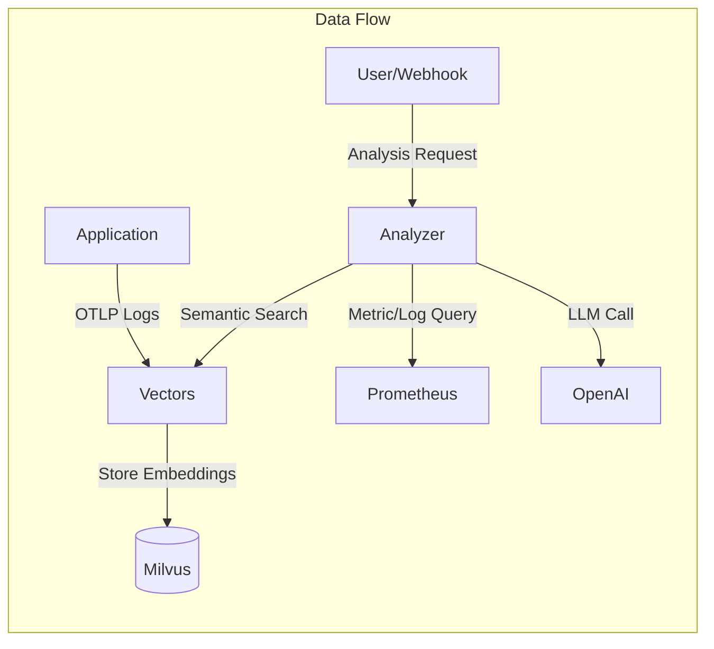
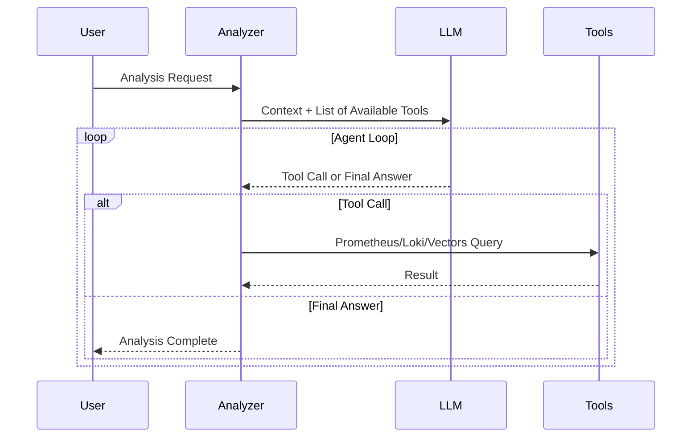

## Problem Awareness

PagerDuty alerts ringing in the middle of the night. "CPU exceeds 90%."
Waking up to check the dashboard reveals that a batch job running since yesterday is the cause,
and it is expected to automatically decrease in 30 minutes.
Accumulating such false alerts desensitizes you to real issues when they arise.

Meerkat was initiated to fundamentally solve this problem.
Instead of rule-based alerts, AI Agents directly read logs and metrics,
calling tools like Prometheus and Loki to infer causes.
Logs are vectorized for semantic search and stored,
allowing independent scaling by separating into two services: Analyzer and Vectors.

## Core Design: Two Services, Two Responsibilities

Meerkat consists of two services: Analyzer and Vectors.
This separation is an intentional design.

**Vectors** focuses solely on meaningfully storing logs.
Logs entering through OpenTelemetry OTLP are deduplicated through template extraction,
embedded via OpenAI, and stored as vectors in Milvus.
Even if a service logs tens of thousands of entries a day,
only a few dozen unique templates are vectorized, significantly improving storage costs and search efficiency.

**Analyzer** focuses solely on AI analysis and worker management.
It processes requests received via HTTP API in an asynchronous worker pool,
and requests semantic searches from Vectors if necessary.
The two services communicate via gRPC and can scale out independently.

### Effects of Template Extraction

| Filter Mode         | Operation                    | Use Case                     |
| ------------------- | ---------------------------- | ----------------------------- |
| **all**             | Vectorize all logs           | Small-scale services, development environments      |
| **severity**        | Process only above specified level | Production environments, error-centric monitoring |
| **template** (default) | Deduplicate with Drain algorithm | Large-scale services, cost optimization    |

## AI Using Tools

The core of Analyzer is providing tools to the LLM and letting it use them independently.
It offers four tools: Prometheus, Loki, VictoriaLogs queries, and Vectors semantic search.

When a request like "Analyze the error spike" comes in, the flow is as follows.
First, it searches for recent error logs of the service in Vectors,
checks the error rate trend in Prometheus,
and analyzes the frequency of specific error messages in Loki.
It then synthesizes this information to conclude, "Error spike due to Redis connection timeout,
started at 14:23 and automatically recovered at 14:45."

Tool results are limited to 30,000 characters,
and errors are categorized into query syntax errors, connection failures, and query failures.
The LLM makes decisions like "This query is wrong, fix it and try again" or
"Prometheus is unresponsive, let's use Loki instead."

## Considerations in Production Environment

The worker pool is configured with a buffered channel size of 1000 and 10 workers.
If the queue is full, a 429 error is immediately returned to provide backpressure.
Duplicate analyses for the same trigger and query are automatically blocked within a 5-minute window.

Deployment is managed with Helm Chart,
and ConfigMap stores configurations and system prompts,
while Secret stores API keys and DB passwords separately.
However, since the worker pool's queue is an in-memory channel,
queued tasks are lost upon server restart.
There are plans to apply a persistent queue in the future.

## Conclusion

Meerkat goes beyond merely calling LLM APIs.
By combining an AI Agent architecture that uses tools, semantic-based log search,
and a controllable asynchronous worker pool,
it creates a platform usable in real production environments.
For teams hitting the limits of rule-based alerts,
it offers a new observability possibility of understanding infrastructure situations with a single natural language phrase,
which is the value this project aims to pursue.
