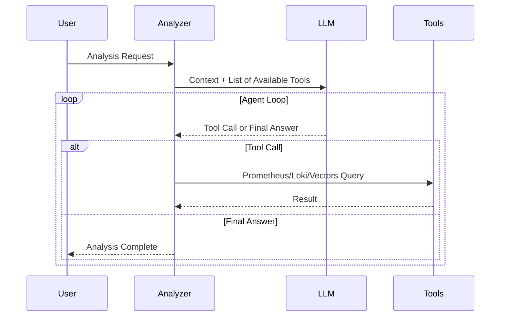

## Problem Awareness

A PagerDuty alert rings in the middle of the night: "CPU exceeds 90%."
You wake up and check the dashboard, only to find that a batch job running since yesterday is the cause, and it’s expected to decrease automatically in 30 minutes.
Accumulating such false alerts can desensitize you to real issues when they arise.

Meerkat was initiated to fundamentally solve this problem.
Instead of rule-based alerts, an AI Agent directly reads logs and metrics, calls tools like Prometheus and Loki, and infers the cause.
Logs are vectorized for semantic search storage, and the system is divided into two independently scalable services: Analyzer and Vectors.

## Core Design: Two Services, Two Responsibilities

Meerkat consists of two services: Analyzer and Vectors.
This separation is an intentional design.

**Vectors** focuses solely on meaningfully storing logs.
Logs received via OpenTelemetry OTLP undergo template extraction to remove duplicates and are stored as vectors in Milvus after OpenAI embedding.
Even if a service logs tens of thousands of entries a day, only a few dozen unique templates are vectorized, significantly improving storage costs and search efficiency.

**Analyzer** focuses solely on AI analysis and worker management.
It processes requests received via HTTP API in an asynchronous worker pool and requests semantic searches from Vectors if necessary.
The two services communicate via gRPC and can scale out independently.

### The Effect of Template Extraction

Template extraction is a key technology for removing log duplication.
For example, "User 123 logged in" and "User 456 logged in" are extracted into the same template "User \* logged in."
This approach maintains log diversity while significantly reducing the number of unique items to be vectorized.

The template extraction method is as follows:

| Filter Mode            | Operation                               | Use Case                                          |
| ---------------------- | --------------------------------------- | ------------------------------------------------- |
| **all**                | Vectorizes all logs                     | Small services, development environments          |
| **severity**           | Processes only above a specified level  | Production environments, error-focused monitoring |
| **template** (default) | Removes duplicates with Drain algorithm | Large-scale services, cost optimization           |

Three modes are provided to suit the service scale and requirements.
The all mode vectorizes all logs but is costly,
the severity mode processes only important logs like errors or warnings to reduce costs,
and the template mode uses the Drain algorithm to extract logs into templates, maximizing storage space and search efficiency.

## The Concept of AI Using Tools

The core of Analyzer is to provide tools to the LLM and let it use them autonomously.
It offers four tools: Prometheus, Loki, VictoriaLogs queries, and Vectors semantic search.

When a request like "Analyze the error spike" comes in, the flow is as follows.
First, it searches for recent error logs of the service in Vectors,
checks the error rate trend in Prometheus,
and analyzes the frequency of specific error messages in Loki.
It then synthesizes this information to draw conclusions like "Error spike due to Redis connection timeout, started at 14:23 and auto-recovered at 14:45."

Tool results are limited to 30,000 characters,
and errors are categorized into query syntax errors, connection failures, and query failures.
The LLM makes decisions like "My query is wrong, let’s fix it and retry" or "Prometheus is unresponsive, let’s switch to Loki."

## Considerations in the Production Environment

The worker pool is configured with a buffered channel size of 1000 and 10 workers.
If the queue is full, a 429 error is returned immediately to provide backpressure.
Duplicate analyses for the same trigger and query are automatically blocked within a 5-minute window.

Deployment is managed with Helm Chart,
with configurations and system prompts stored in ConfigMap,
and API keys and DB passwords stored separately in Secret.
However, since the worker pool's queue is an in-memory channel,
queued tasks are lost upon server restart.
There are plans to apply a persistent queue in the future.

## Conclusion

Meerkat goes beyond merely calling the LLM API.
By combining an AI Agent architecture that uses tools, semantic-based log search, and an asynchronous worker pool,
it has created a platform usable in real production environments.
For teams hitting the limits of rule-based alerts,
it offers a new infrastructure visibility where you can understand the infrastructure situation with a single natural language phrase.
This is the value this project aims to pursue.
