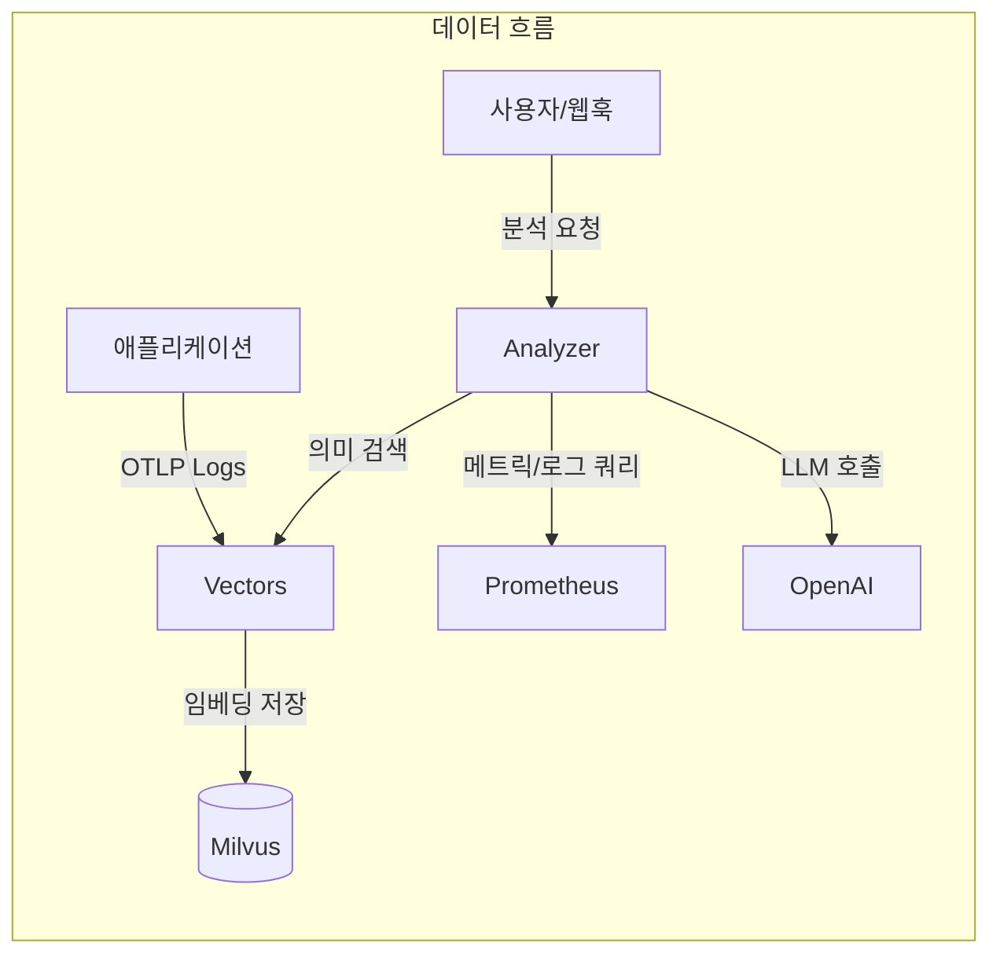
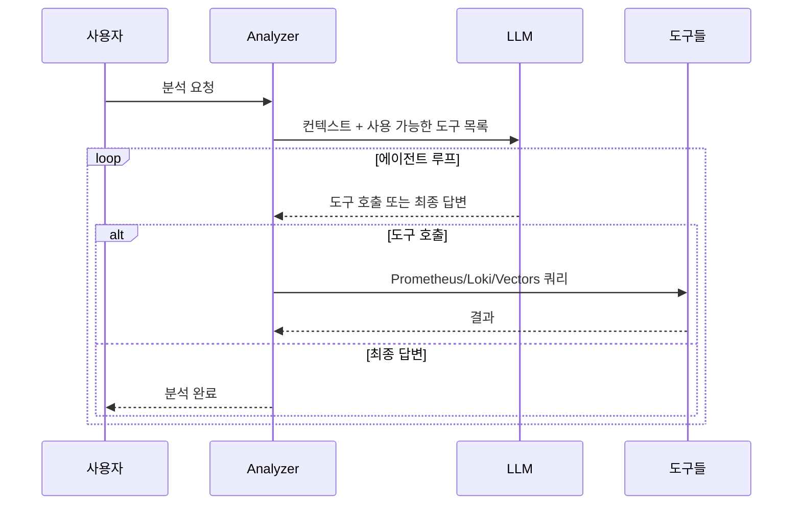

## Problem statement

PagerDuty notification that goes off in the middle of the night. "CPU over 90%".
Woke up and checked the dashboard and realized it was caused by a batch job that was running from yesterday,
It's supposed to go down automatically in 30 minutes.
These false alerts pile up and desensitize you to the real problem when it comes.

Meerkat set out to solve this problem from the ground up.
Instead of rule-based alerts, our AI agent reads logs and metrics directly and uses
tools like Prometheus, Loki, and others to infer the cause.
Logs are vectorized and stored for semantic search,
Analyzer and Vectors into two services that can scale independently.

## Core design: two services, two responsibilities

Meerkat is organized into two services: Analyzer and Vectors.
This separation is an intentional design.

**Vectors focuses solely on taking logs and storing them in a meaningful way.
Logs coming into the OpenTelemetry OTLP are template extracted to remove duplicates,
OpenAI embedding, and then stored as vectors in Milvus.
Even if a service leaves tens of thousands of logs per day, only a few dozen unique templates are actually vectorized.
significantly reducing storage costs and improving search efficiency.

The **Analyzer** focuses solely on AI analysis and worker management.
It receives requests via HTTP API and processes them in an asynchronous worker pool,
requests Vectors for semantic search when needed.
The two services communicate with gRPC and can scale out independently of each other.

### Effect of template extraction

| Filter Modes | Behavior | Use Cases |
| ------------------- | ---------------------------- | ----------------------------- |
| **all** | Vectorizes all logs | Small services, development environments |
| **severity** | Processes only above a specified level | Production environments, error-centric monitoring |
| **template** (default) | Drain algorithm removes duplicates | large services, cost optimization

## That AI uses tools

At its core, Analyzer is about giving LLMs tools and letting them use them on their own.
Prometheus, Loki, VictoriaLogs queries and Vectors semantic search,
We provide four tools

When I get a request to "analyze error spikes," this is what happens.
First, we search Vectors for recent error logs for that service,
Prometheus to see how the error rate is trending,
Loki to analyze the frequency of specific error messages.
Putting it all together, we find "Error spike due to Redis connection timeout,
started at 14:23, auto-recovered at 14:45" and draws conclusions such as "Redis connection timeout.

The tool limits its results to 30,000 characters,
Errors are categorized into query syntax errors, connection failures, and query failures.
If LLM says, "This is wrong with my query, fix it and try again" or
"Prometheus is unresponsive, let's go to Loki".

## Considerations for production environments

The worker pool is configured with a buffered channel size of 1000 and 10 workers.
When the queue is full, it immediately returns a 429 error to provide a backpressure.
Duplicate analytics for the same trigger and query are automatically blocked within a
automatically blocked within a 5 minute window.

Deployments are managed by Helm Chart,
ConfigMap contains settings and system prompts,
Secret stores API keys and DB passwords separately.
However, the queue in the worker pool is an in-memory channel.
there is a limitation that queued jobs are lost when the server is restarted.
In the future, we plan to apply persistence queues.

## Closing

Meerkat has gone beyond simply calling the LLM API.
It uses an AI Agent architecture with tools and semantic log search,
and a controllable pool of asynchronous workers.
we've created a platform that can be used in real production environments.
For teams where rules-based alerting has hit its limits
Opening up new observability to understand what's going on with your infrastructure in natural language,
That's the value of this project.
