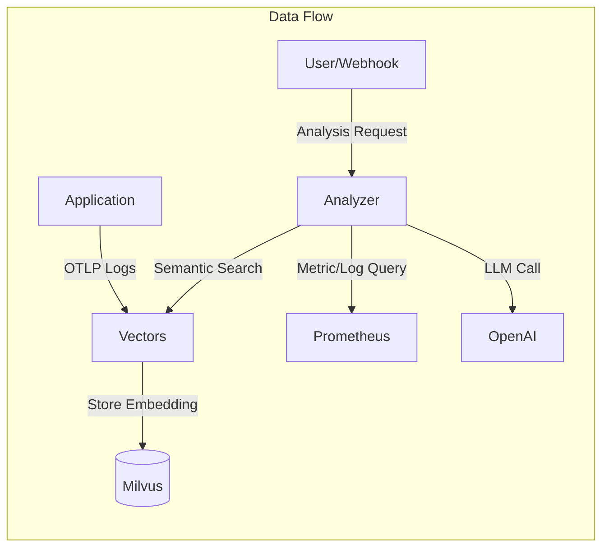
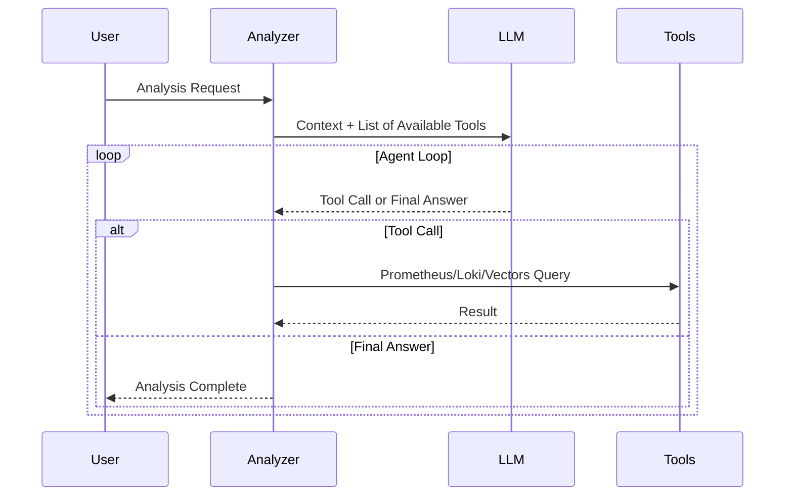

## Problem Awareness

A PagerDuty alert rings in the middle of the night: "CPU exceeds 90%." You wake up and check the dashboard, only to find that a batch job running since yesterday is the cause, and it is expected to automatically decrease in 30 minutes. When such false alerts accumulate, you become desensitized to real issues.

Meerkat was initiated to fundamentally solve this problem. Instead of rule-based alerts, an AI Agent directly reads logs and metrics, calls tools like Prometheus and Loki, and infers the cause. Logs are vectorized and stored for semantic search, and the system is divided into two services, Analyzer and Vectors, which can be independently scaled.

## Core Design: Two Services, Two Responsibilities

Meerkat is composed of two services: Analyzer and Vectors. This separation is an intentional design.

**Vectors** focuses solely on meaningfully storing logs. Logs received via OpenTelemetry OTLP are deduplicated through template extraction and stored as vectors in Milvus after OpenAI embedding. Even if a service logs tens of thousands of entries a day, only a few dozen unique templates are vectorized, significantly improving storage costs and search efficiency.

**Analyzer** focuses solely on AI analysis and worker management. It processes requests received via HTTP API in an asynchronous worker pool and requests semantic searches from Vectors if necessary. The two services communicate via gRPC and can scale out independently.

### Effects of Template Extraction

| Filter Mode            | Operation                          | Use Case                                         |
| ---------------------- | ---------------------------------- | ------------------------------------------------ |
| **all**                | Vectorize all logs                 | Small-scale services, dev environment            |
| **severity**           | Process only above a certain level | Production environment, error-focused monitoring |
| **template** (default) | Deduplicate with Drain algorithm   | Large-scale services, cost optimization          |

## What It Means for AI to Use Tools

The core of Analyzer is to provide tools to the LLM and let it use them independently. It offers four tools: Prometheus, Loki, VictoriaLogs queries, and Vectors semantic search.

When a request like "Analyze the error spike" comes in, the flow is as follows. First, search for recent error logs of the service in Vectors, then check the error rate trend in Prometheus, and analyze the frequency of specific error messages in Loki. Finally, it synthesizes the information to conclude something like "Error spike due to Redis connection timeout, started at 14:23 and auto-recovered at 14:45."

The tool results are limited to 30,000 characters, and errors are categorized into query syntax errors, connection failures, and query failures. The LLM can make decisions like "My query was wrong, let's fix it and try again" or "Prometheus isn't responding, let's switch to Loki."

## Considerations in Production Environment

The worker pool is configured with a buffered channel size of 1000 and 10 workers. If the queue is full, it immediately returns a 429 error to provide backpressure. Duplicate analysis for the same trigger and query is automatically blocked within a 5-minute window.

Deployment is managed with a Helm Chart, with ConfigMap storing settings and system prompts, and Secret storing API keys and DB passwords separately. However, since the worker pool's queue is an in-memory channel, queued tasks are lost upon server restart. There are plans to apply a persistent queue in the future.

## Conclusion

Meerkat goes beyond simply calling LLM APIs. By combining an AI Agent architecture that uses tools, semantic-based log search, and a controllable asynchronous worker pool, it has created a platform usable in real operational environments. For teams hitting the limits of rule-based alerts, it offers a new observability possibility to understand infrastructure situations with a simple natural language phrase. This is the value this project aims to pursue.
