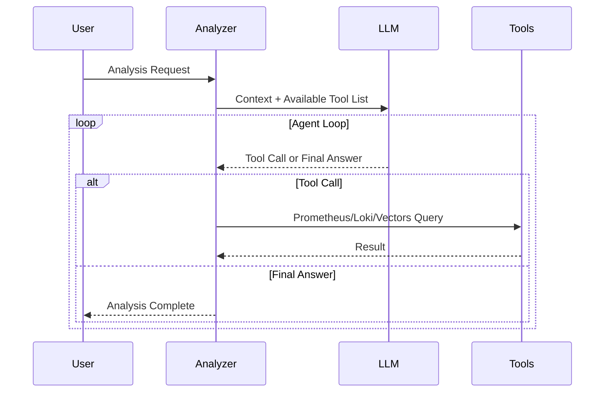

## Problem Awareness

A PagerDuty alert rings in the middle of the night: "CPU exceeds 90%."
Waking up to check the dashboard, you find that a batch job running since yesterday is the cause, and it's expected to automatically decrease in 30 minutes.
Accumulating such false alerts can desensitize you to real issues when they arise.

Meerkat was initiated to fundamentally solve this problem.
Instead of rule-based alerts, an AI Agent directly reads logs and metrics, calls tools like Prometheus and Loki, and infers the cause.
Logs are vectorized for semantic search and stored, and the system is divided into two services, Analyzer and Vectors, which can be independently scaled.

## Core Design: Two Services, Two Responsibilities

Meerkat consists of two services: Analyzer and Vectors.
This separation is an intentional design.

**Vectors** focuses solely on storing logs meaningfully.
Logs coming in via OpenTelemetry OTLP are deduplicated through template extraction and stored as vectors in Milvus after OpenAI embedding.
Even if a service logs tens of thousands of entries a day, only a few unique templates are vectorized, significantly improving storage costs and search efficiency.

**Analyzer** focuses on AI analysis and worker management.
It processes requests received via HTTP API in an asynchronous worker pool and requests semantic searches from Vectors if needed.
The two services communicate via gRPC and can each scale out independently.

### The Effect of Template Extraction

Template extraction is a key technology for removing log redundancy.
For example, "User 123 logged in" and "User 456 logged in" are extracted as the same template "User * logged in."
This maintains log diversity while significantly reducing the number of unique items to be vectorized.

The template extraction methods are as follows:

| Filter Mode         | Operation                     | Use Case                      |
| ------------------- | ----------------------------- | ----------------------------- |
| **all**             | Vectorize all logs            | Small-scale services, development environments |
| **severity**        | Process only above a certain level | Production environments, error-focused monitoring |
| **template** (default) | Deduplicate with Drain algorithm | Large-scale services, cost optimization |

Three modes are provided to choose according to the service scale and requirements.
The all mode vectorizes all logs but is costly, while the severity mode processes only critical logs like errors or warnings to reduce costs.
The template mode uses the Drain algorithm to extract logs into templates, maximizing storage space and search efficiency.

## AI Using Tools

The core of Analyzer is providing tools to the LLM and letting it use them autonomously.
It offers four tools: Prometheus, Loki, VictoriaLogs queries, and Vectors semantic search.

When a request like "Analyze the error spike" comes in, the flow is as follows.
First, it searches for recent error logs of the service in Vectors, checks the error rate trend in Prometheus, and analyzes the frequency of specific error messages in Loki.
It then synthesizes this information to derive a conclusion like "Error spike due to Redis connection timeout, started at 14:23 and automatically recovered at 14:45."

Tool results are limited to 30,000 characters, and errors are categorized into query syntax errors, connection failures, and query failures.
The LLM makes judgments like "My query is wrong, so I'll fix it and try again" or "Prometheus is unresponsive, let's switch to Loki."

## Considerations in Production Environment

The worker pool is configured with a buffered channel size of 1000 and 10 workers.
If the queue is full, it immediately returns a 429 error to provide backpressure.
Duplicate analysis for the same trigger and query is automatically blocked within a 5-minute window.

Deployment is managed with Helm Chart, with settings and system prompts stored in ConfigMap, and API keys and DB passwords separated into Secret.
However, since the worker pool's queue is an in-memory channel, queued tasks are lost upon server restart.
There are plans to apply a persistent queue in the future.

## Conclusion

Meerkat has gone beyond simply calling the LLM API.
By combining a tool-using AI Agent architecture with semantic-based log search and an asynchronous worker pool, it has created a platform usable in real operational environments.
For teams hitting the limits of rule-based alerts, it offers new infrastructure visibility, allowing them to grasp the infrastructure situation with a single natural language phrase. This is the value this project aims to pursue.
