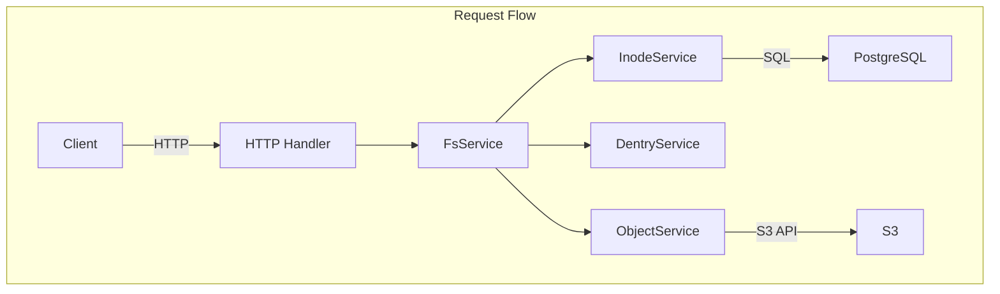
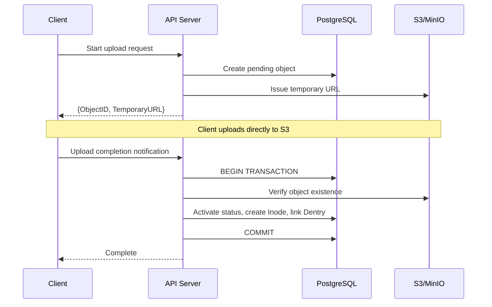

## Problem Awareness

S3 offers excellent durability and scalability, but it remains complex for developers to handle directly. There are no directories, permission management is coarse, and large file uploads need to be implemented manually.

Retrowin is a system that maintains the scalability of S3 while providing a POSIX filesystem interface. By storing Inode and Dentry in PostgreSQL as JSON, directory lookups can be done without joins, and large files are efficiently handled through a two-step upload using temporary URLs. Additionally, a retro UI styled after Windows XP was added to pursue both technical challenges and fun.

## Core Design: Modern Interpretation of Inode and Dentry

The biggest design question was "How to represent the hierarchical structure of a filesystem in a relational DB?" We borrowed the concepts of inode and dentry from Linux but reinterpreted them in a modern way.

The Inode table stores file metadata, and Dentry manages the mapping of filenames and Inode IDs within a directory. An interesting decision was to store Dentry as JSON in the content column of Inode rather than a separate table. This allows directory lookups to read only a single row without joins, reducing latency and leveraging PostgreSQL's JSONB indexing. The downside is that the entire JSON must be rewritten when modifying a directory, but since most directories contain fewer than a few hundred files, this overhead is minimal.



## Large File Upload: Temporary URLs and Atomic Completion

Proxying files through the server to S3 creates bandwidth and memory bottlenecks. Retrowin addresses this issue with a two-step upload using temporary URLs.

When a client requests an upload, the server creates a pending record in the DB and issues a temporary S3 URL. The client uploads directly to S3 using this URL. Upon completion, the client notifies the server, which then performs an atomic sequence within a PostgreSQL transaction: verifying S3 existence, activating the status, creating an Inode, and linking the Dentry. Idempotency keys are supported to reuse existing records on retrying the same upload request.



### Core of Atomic Upload

```go
func (s *FsService) AtomicUpload(ctx context.Context, objectID string) error {
    return s.db.WithTx(ctx, func(tx *sql.Tx) error {
        // 1. Verify S3 object existence
        if err := s.s3.HeadObject(objectID); err != nil {
            return err
        }
        // 2. Activate status
        if err := s.objectSvc.CompleteUpload(ctx, tx, objectID); err != nil {
            return err
        }
        // 3. Create Inode + Link Dentry
        inode, err := s.inodeSvc.Create(ctx, tx, objectID)
        if err != nil {
            return err
        }
        return s.dentrySvc.Link(ctx, tx, inode)
    })
}
```

Since all operations are performed atomically within a transaction, there is no risk of data inconsistency even if a failure occurs midway.

## Authentication and Authorization: Adhering to Standards

Permission management is crucial for filesystems. By using Keycloak as an OIDC provider, we follow standardized authentication flows. PKCE is applied to ensure safe authentication for mobile and desktop clients, and OIDC clients are lazily initialized so that server startup is not halted if Keycloak is temporarily down.

File permissions follow the standard Unix permission bits. Read, write, and execute permissions are controlled for the owner, group, and other users, with root having full access.

| Subject         | Read | Write | Execute |
| --------------- | ---- | ----- | ------- |
| Owner           | ✅   | ✅    | ✅      |
| Group           | ✅   | ❌    | ✅      |
| Other           | ❌   | ❌    | ❌      |

## Managing Forgotten Files

Over time, pending files that were not uploaded and orphaned records that remain in the DB but have been deleted from S3 can accumulate. A two-step cleanup is performed daily at 3 AM using a Kubernetes CronJob. First, expired objects pending for over 24 hours are removed, followed by cleaning up orphaned objects marked as active in the DB but not present in S3.

## Trade-offs and Lessons Learned

While JSON-based Dentry improves lookup performance, the in-memory lock for concurrent directory modifications limits horizontal scalability. Additionally, resolving symbolic links is recursive and lacks cycle detection, making it vulnerable to link loops. However, in single-user or small team environments, these trade-offs are acceptable, and the simplicity offers operational advantages.

In the security context, non-root execution, a read-only root filesystem, and privilege escalation prevention were applied.

## Conclusion

Retrowin is an intriguing experiment that combines the scalability of object storage with the familiarity of a POSIX filesystem. It includes elements like atomic uploads, OIDC authentication, and garbage collection, all considering real operational environments while actively utilizing modern tools from the Go ecosystem like Ent ORM and ogen. The retro UI reflects the project's identity of pursuing both technical challenges and fun.
