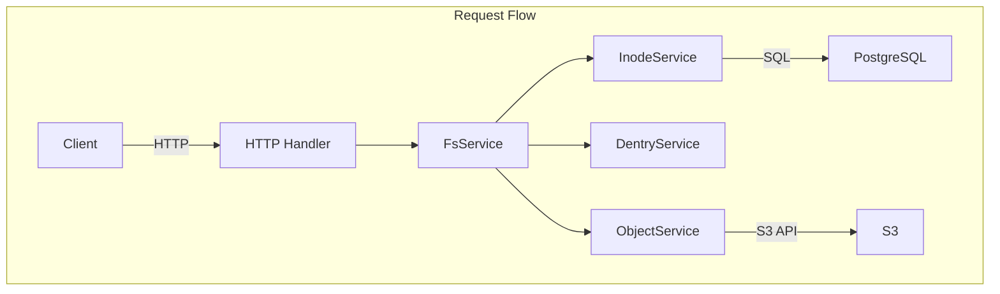

## Problem Awareness

S3 offers excellent durability and scalability, but it remains complex for developers to handle directly. It lacks directories, has rough permission management, and requires manual implementation for large file uploads.

Retrowin is a system that maintains S3's scalability while providing a POSIX filesystem interface. It stores inodes and dentries as JSON in PostgreSQL, allowing directory lookups without joins, and efficiently handles large files through a two-step upload process using temporary URLs. By adding a retro Windows XP-style UI, it seeks both technical challenge and fun.

## Core Design: Modern Reinterpretation of Inode and Dentry

The biggest design question was, "How to represent the hierarchical structure of a filesystem in a relational DB?" We borrowed the concepts of inode and dentry from Linux but reinterpreted them in a modern way.

The Inode table stores file metadata, while Dentry manages the mapping of file names and Inode IDs within a directory. An interesting decision was to store Dentry as JSON in the content column of Inode, rather than in a separate table. This allows directory lookups by reading only a single row, reducing latency, and leveraging PostgreSQL's JSONB indexing. The downside is that the entire JSON must be rewritten when modifying a directory, but since most directories contain fewer than hundreds of files, this overhead is minimal.



## Large File Upload: Temporary URL and Atomic Completion

Proxying files through the server to S3 creates bandwidth and memory bottlenecks. Retrowin solves this with a two-step upload process based on temporary URLs.

When a client requests an upload, the server creates a pending record in the DB and issues a temporary S3 URL. The client uploads directly to S3 using this URL. Upon completion, the server is notified, and within a PostgreSQL transaction, it atomically verifies S3 existence, transitions the status to active, creates an Inode, and links the Dentry. Idempotency keys are also supported to reuse existing records on retry of the same upload request.


### Core of Atomic Upload

```go
func (s *FsService) AtomicUpload(ctx context.Context, objectID string) error {
    return s.db.WithTx(ctx, func(tx *sql.Tx) error {
        // 1. Verify S3 Object Existence
        if err := s.s3.HeadObject(objectID); err != nil {
            return err
        }
        // 2. Activate Status
        if err := s.objectSvc.CompleteUpload(ctx, tx, objectID); err != nil {
            return err
        }
        // 3. Create Inode + Link Dentry
        inode, err := s.inodeSvc.Create(ctx, tx, objectID)
        if err != nil {
            return err
        }
        return s.dentrySvc.Link(ctx, tx, inode)
    })
}
```

All operations are performed atomically within the transaction, ensuring no data inconsistency even if a failure occurs midway.

## Authentication and Authorization: Following Standards

Permission management is vital for filesystems. By using Keycloak as an OIDC provider, we adhere to standardized authentication flows. PKCE is applied for secure authentication on mobile and desktop clients, and the OIDC client is lazily initialized, so server startup isn't halted if Keycloak is temporarily down.

File permissions follow the standard Unix permission bits, controlling read/write/execute access for owners, groups, and others, with root having full access.

| Subject | Read | Write | Execute |
| ------- | ---- | ----- | ------- |
| Owner   | ✅   | ✅    | ✅      |
| Group   | ✅   | ❌    | ✅      |
| Other   | ❌   | ❌    | ❌      |

## Cleaning Up Forgotten Files

Over time, pending files that haven't completed uploading or orphaned records that remain in the DB but are deleted from S3 can accumulate. A Kubernetes CronJob performs a two-step cleanup daily at 3 AM. It first removes expired pending objects older than 24 hours, then identifies and cleans up orphaned objects marked active in the DB but missing in S3.

## Trade-offs and Lessons Learned

JSON-based Dentry enhances lookup performance, but the in-memory lock for concurrent directory modifications limits horizontal scalability. Additionally, resolving symbolic links is recursive and lacks cycle detection, making it vulnerable to link loops. However, in single-user or small team environments, these trade-offs are acceptable, and the operational simplicity offers greater benefits.

In the security context, non-root execution, read-only root filesystem, and privilege escalation prevention are applied.

## Conclusion

Retrowin is an intriguing experiment combining the scalability of object storage with the familiarity of a POSIX filesystem. It incorporates elements like atomic uploads, OIDC authentication, and garbage collection, considering real operational environments, while actively utilizing modern tools in the Go ecosystem such as Ent ORM and ogen. The retro UI reflects the project's identity, pursuing both technical challenges and fun.
