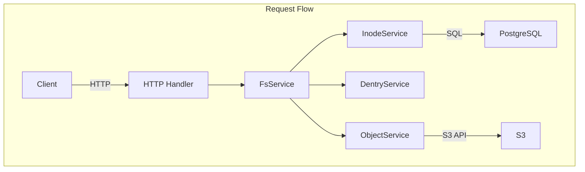
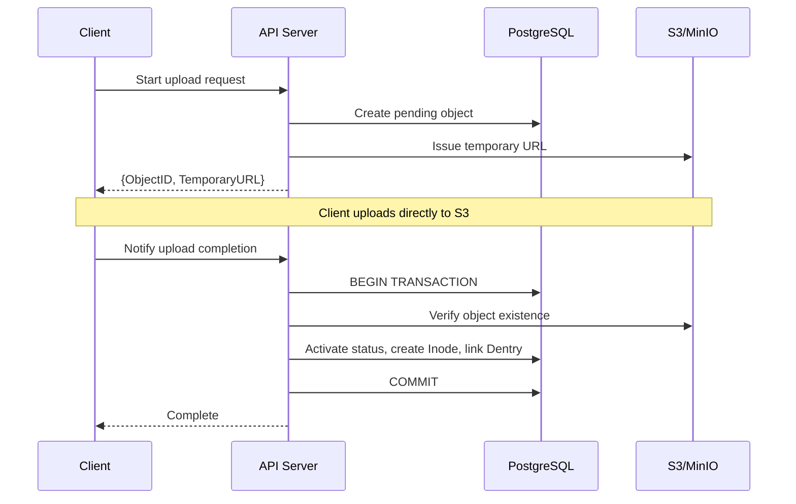

## Problem Awareness

S3 offers excellent durability and scalability, but it remains complex for developers to handle directly. It lacks directories, has coarse-grained permission management, and requires manual implementation for large file uploads.

Retrowin is a system that maintains S3's scalability while providing a POSIX filesystem interface. By storing inodes and dentries as JSON in PostgreSQL, directory lookups can be performed without joins, and large files are efficiently handled through a two-step upload process based on temporary URLs. Additionally, a retro UI styled after Windows XP adds both technical challenge and fun to the project.

## Core Design: Modern Interpretation of Inode and Dentry

The main design question was, "How to represent the hierarchical structure of a filesystem in a relational database?" We adopted the concepts of Linux's inode and dentry but reinterpreted them in a modern way.

The Inode table stores file metadata, while Dentry manages the mapping of file names to Inode IDs within directories. An interesting decision was to store Dentry as JSON in the content column of Inode rather than in a separate table. This allows for directory lookups by reading a single row without joins, minimizing latency and leveraging PostgreSQL's JSONB indexing. The downside is that the entire JSON must be rewritten when modifying a directory, but since most directories contain fewer than hundreds of files, this overhead is minimal.



## Large File Upload: Temporary URL and Atomic Completion

Proxying files through the server to S3 creates bandwidth and memory bottlenecks. Retrowin addresses this with a two-step upload process based on temporary URLs.

When a client requests an upload, the server creates a pending record in the database and issues a temporary URL for S3. The client uploads directly to S3 using this URL. Upon completion, the client notifies the server, which atomically verifies S3 existence, transitions the status to active, creates an Inode, and links the Dentry within a PostgreSQL transaction. Idempotency keys are supported to reuse existing records on retry of the same upload request.



### Core of Atomic Upload

```go
func (s *FsService) AtomicUpload(ctx context.Context, objectID string) error {
    return s.db.WithTx(ctx, func(tx *sql.Tx) error {
        // 1. Verify S3 object existence
        if err := s.s3.HeadObject(objectID); err != nil {
            return err
        }
        // 2. Activate status
        if err := s.objectSvc.CompleteUpload(ctx, tx, objectID); err != nil {
            return err
        }
        // 3. Create Inode + Link Dentry
        inode, err := s.inodeSvc.Create(ctx, tx, objectID)
        if err != nil {
            return err
        }
        return s.dentrySvc.Link(ctx, tx, inode)
    })
}
```

Since all operations are performed atomically within a transaction, there is no data inconsistency even if a failure occurs midway.

## Authentication and Authorization: Adhering to Standards

Permission management is crucial for a filesystem. We use Keycloak as an OIDC provider to follow standardized authentication flows. By applying PKCE, we ensure secure authentication for both mobile and desktop clients, and the OIDC client is lazily initialized so that the server startup is not halted even if Keycloak is temporarily unavailable.

File permissions follow the standard Unix permission bits, controlling read/write/execute access for the owner, group, and other users, with root having full access.

| Principal      | Read | Write | Execute |
| -------------- | ---- | ---- | ---- |
| Owner          | ✅   | ✅   | ✅   |
| Group          | ✅   | ❌   | ✅   |
| Other          | ❌   | ❌   | ❌   |

## Cleaning Up Forgotten Files

Over time, pending files that were not completed or orphaned records that remain in the database but are deleted from S3 can accumulate. A two-step cleanup is performed daily at 3 AM using a Kubernetes CronJob. First, expired objects pending for over 24 hours are removed, followed by cleaning up orphaned objects marked as active in the database but not present in S3.

## Trade-offs and Lessons Learned

JSON-based Dentry enhances lookup performance, but the in-memory lock for concurrent directory modifications limits horizontal scalability. Additionally, resolving symbolic links is recursive without cycle detection, making it vulnerable to link loops. However, in environments with a single user or small teams, these trade-offs are acceptable, and the operational simplicity they provide is a significant advantage.

In terms of security context, we applied non-root execution, read-only root filesystem, and privilege escalation prevention.

## Conclusion

Retrowin is an intriguing experiment combining the scalability of object storage with the familiarity of a POSIX filesystem. It incorporates elements like atomic uploads, OIDC authentication, and garbage collection, all tailored for real-world operational environments, while actively utilizing modern tools from the Go ecosystem like Ent ORM and ogen. The retro UI embodies the project's identity, pursuing both technical challenges and fun.
