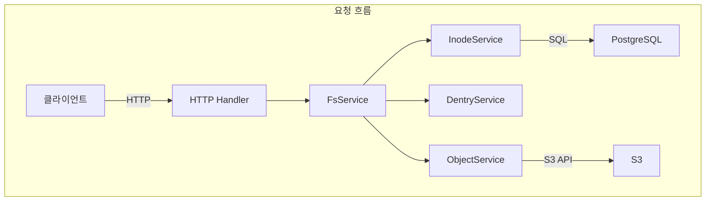
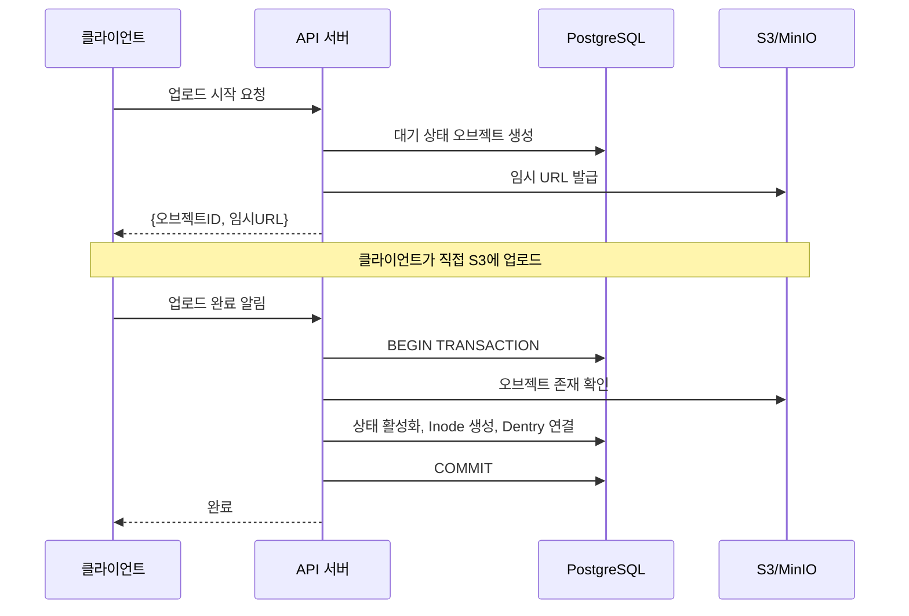

## Problem statement

While S3 is extremely durable and scalable
but it's still too complex for developers to handle directly.
There are no directories, permissions management is clunky, and
large file uploads have to be implemented manually.

Retrowin is a system that maintains the scalability of S3 while providing a
POSIX filesystem interface while maintaining the scalability of S3.
It stores inodes and dentry as JSON in PostgreSQL, allowing directory lookups without joins,
Two-stage uploads based on ephemeral URLs to efficiently handle large files.
Add to that a Windows XP-style retro UI
We wanted it to be both technically challenging and fun.

## Core design: modern reimagining of inode and dentry

Our biggest design question was
"How do we represent the hierarchical structure of a filesystem in a relational DB?"
We borrowed the Linux concepts of inode and dentry, but with a modern twist.

Inode tables store file metadata,
Dentry manages the mapping of file names to Inode IDs within a directory.
An interesting decision was to keep Dentry as a separate table, rather than in the
Inode's content column as JSON, rather than in a separate table.
This is low latency because directory lookups only need to read a single row without joins,
PostgreSQL's JSONB indexes can be utilized.
The downside is that you have to rewrite the entire JSON when modifying the directory,
since most directories have a few hundred files or less.
this overhead is negligible.

## Uploading large files: temporary URLs and atomic completion

Proxying files through the server to S3 is a bottleneck for
bandwidth and memory becomes a bottleneck.
Retrowin solves this problem with two-stage uploads based on temporary URLs.

When a client requests an upload
The server creates a pending status record in the DB and issues an S3 temporary URL.
The client uploads directly to S3 with this URL.
After completion, it notifies the server and within a PostgreSQL transaction, the server issues the
S3 existence check, toggle the status to active, create the inode, and connect to Dentry
atomically within a PostgreSQL transaction.
Also supports equality keys to retry the same upload request
reuse existing records on retries of the same upload request.

___code_block_1___

### Atomic Upload's core

Because everything is done atomically within the transaction,
so there are no data inconsistencies if something fails in the middle.

## Authentication and authorization: follow the standards

Filesystems are all about managing permissions.
With Keycloak as your OIDC provider, you can use
follow standardized authentication flows.
By enforcing PKCE, we're able to authenticate securely on mobile and desktop clients
secure authentication for mobile and desktop clients,
OIDC clients are lazily initialized
so if Keycloak dies briefly, the server doesn't stop starting.

File permissions follow standard Unix permission bits.
Read/write/execute permissions are controlled by owner, group, and other users.
root can do everything.

| Permission subject | Read | Write | Execute |
| -------------- | ---- | ---- | ---- | ---- |
| Owner | ✅ | ✅ | ✅ | ✅ |
| Group | ✅ | ❌ | ✅ | ✅ |
| 其他 (Other) | ❌ | ❌ | ❌ | ❌ | ❌ |

## Organize forgotten files

Over time, you may find pending files that never finished uploading, or files that have been deleted from S3 but not from the DB.
orphan records that are deleted from S3 but remain in the DB.
We use a Kubernetes CronJob to perform a two-step cleanup every day at 3am.
First, it removes expired objects that have been queued for more than 24 hours,
Next, it removes orphan records that show up as active in the DB but
S3 but don't exist in DB, and then it finds and cleans up orphaned objects.

## Tradeoffs and lessons learned

JSON-based Dentry improves lookup performance, but it also means that the
but locks for concurrent directory modifications are in-memory, which limits horizontal scaling
limiting horizontal scaling.
It is also recursive in resolving symbolic links and has no cycle detection, which makes it vulnerable to
making it vulnerable to link loops.
However, in a single-user or small team environment
these tradeoffs are acceptable
operational benefits of simplicity outweigh them.

Non-root execution in a security context,
read-only root filesystem, and no escalation of privileges.

## Closing

Retrowin is an interesting experiment that combines the scalability of object storage with the familiarity of
the scalability of object storage and the familiarity of POSIX filesystems.
It includes real-world production elements such as atomic uploads, OIDC authentication, and GC, while utilizing modern tools from the Go ecosystem such as Ent ORM and ogen.
while also leveraging modern tools from the Go ecosystem like Ent ORM and ogen.
The retro UI is a great representation of the project's identity, which is both technically challenging and fun.
the project's identity of being both technically challenging and fun.
