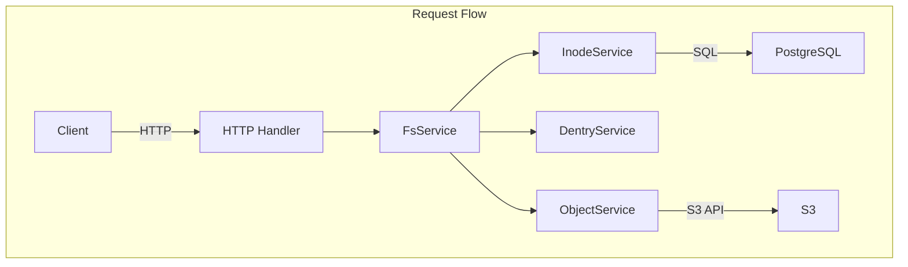
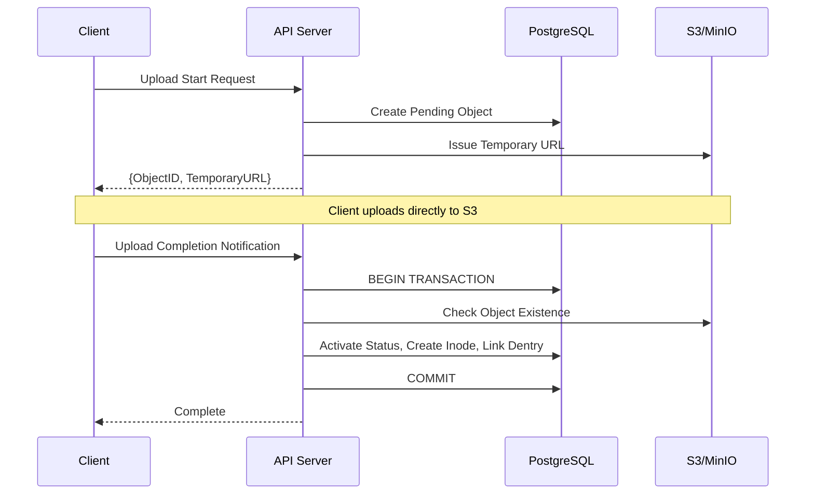

## Problem Awareness

S3 offers excellent durability and scalability, but it remains complex for developers to handle directly. It lacks directories, has coarse-grained permission management, and requires developers to implement large file uploads themselves.

Retrowin is a system that maintains the scalability of S3 while providing a POSIX filesystem interface. By storing inodes and dentries as JSON in PostgreSQL, directory lookups can be performed without joins, and large files are efficiently handled with a two-step upload process based on temporary URLs. Additionally, a retro UI in the style of Windows XP adds both technical challenges and fun.

## Core Design: Modern Reinterpretation of Inode and Dentry

The biggest design question was "How to represent the hierarchical structure of a filesystem in a relational DB?" We borrowed the concepts of inode and dentry from Linux but reinterpreted them in a modern way.

The Inode table stores file metadata, and Dentry manages the mapping of file names and Inode IDs within a directory. An interesting decision was to store Dentry as JSON in the content column of Inode rather than as a separate table. This allows directory lookups to read only a single row without joins, reducing latency and leveraging PostgreSQL's JSONB indexes. The downside is that the entire JSON must be rewritten when modifying a directory, but since most directories contain fewer than a few hundred files, this overhead is minimal.



## Large File Upload: Temporary URL and Atomic Completion

Proxying files through the server to S3 creates bandwidth and memory bottlenecks. Retrowin solves this with a two-step upload process based on temporary URLs.

When a client requests an upload, the server creates a pending record in the DB and issues a temporary S3 URL. The client uploads directly to S3 using this URL. Upon completion, the client notifies the server, which atomically performs S3 existence check, status activation, Inode creation, and Dentry linking within a PostgreSQL transaction. Idempotency keys are supported to reuse existing records on repeated upload requests.



### Core of Atomic Upload

```go
func (s *FsService) AtomicUpload(ctx context.Context, objectID string) error {
    return s.db.WithTx(ctx, func(tx *sql.Tx) error {
        // 1. Check S3 Object Existence
        if err := s.s3.HeadObject(objectID); err != nil {
            return err
        }
        // 2. Activate Status
        if err := s.objectSvc.CompleteUpload(ctx, tx, objectID); err != nil {
            return err
        }
        // 3. Create Inode + Link Dentry
        inode, err := s.inodeSvc.Create(ctx, tx, objectID)
        if err != nil {
            return err
        }
        return s.dentrySvc.Link(ctx, tx, inode)
    })
}
```

Since all operations are performed atomically within a transaction, there is no data inconsistency even if a failure occurs midway.

## Authentication and Authorization: Adhering to Standards

Permission management is crucial for filesystems. By using Keycloak as an OIDC provider, we adhere to standardized authentication flows. PKCE is applied to ensure secure authentication for both mobile and desktop clients, and OIDC clients are lazily initialized so that server startup is not halted even if Keycloak is temporarily down.

File permissions follow the standard Unix permission bits. Read, write, and execute permissions are controlled for the owner, group, and other users, with root having all permissions.

| Subject       | Read | Write | Execute |
| -------------- | ---- | ---- | ---- |
| Owner         | ✅   | ✅   | ✅   |
| Group         | ✅   | ❌   | ✅   |
| Other         | ❌   | ❌   | ❌   |

## Organizing Forgotten Files

Over time, pending files that were not completed or orphaned records that remain in the DB after being deleted from S3 can accumulate. A two-step cleanup is performed daily at 3 AM using a Kubernetes CronJob. First, expired objects pending for over 24 hours are removed, followed by cleaning up orphaned objects marked as active in the DB but not present in S3.

## Trade-offs and Lessons Learned

JSON-based Dentry enhances lookup performance, but the in-memory lock for concurrent directory modifications limits horizontal scaling. Additionally, resolving symbolic links is recursive without cycle detection, making it vulnerable to link loops. However, in single-user or small team environments, these trade-offs are acceptable, and the operational simplicity offers significant advantages.

In terms of security context, non-root execution, read-only root filesystem, and privilege escalation prevention are applied.

## Conclusion

Retrowin is an intriguing experiment that combines the scalability of object storage with the familiarity of a POSIX filesystem. It incorporates elements like atomic uploads, OIDC authentication, and garbage collection, all while considering real-world operational environments. The project actively utilizes modern tools from the Go ecosystem, such as Ent ORM and ogen. The retro UI reflects the project's identity of pursuing both technical challenges and fun.
