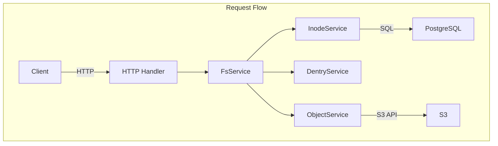

## Problem Awareness

While S3 offers excellent durability and scalability, it remains complex for developers to handle directly. It lacks directories, has coarse-grained permission management, and requires manual implementation for large file uploads.

Retrowin is a system that maintains S3's scalability while providing a POSIX filesystem interface. By storing Inodes and Dentries as JSON in PostgreSQL, it allows directory lookups without joins, and efficiently handles large files through a two-step upload process using temporary URLs. The addition of a retro Windows XP-style UI seeks to combine technical challenge with fun.

## Core Design: Modern Reinterpretation of Inode and Dentry

The primary design question was, "How can we represent the hierarchical structure of a filesystem in a relational DB?" We borrowed the concepts of Linux's inode and dentry but reinterpreted them in a modern way.

The Inode table stores file metadata, while Dentry manages the mapping of file names to Inode IDs within a directory. An interesting decision was to store Dentry as JSON in the content column of the Inode, rather than in a separate table. This allows directory lookups to read only a single row without joins, reducing latency and enabling the use of PostgreSQL's JSONB indexes. The downside is that modifying a directory requires rewriting the entire JSON, but since most directories contain fewer than a few hundred files, this overhead is minimal.



## Large File Upload: Temporary URL and Atomic Completion

Proxying files through the server to S3 can create bandwidth and memory bottlenecks. Retrowin addresses this with a two-step upload process using temporary URLs.

When a client requests an upload, the server creates a pending record in the DB and issues a temporary S3 URL. The client uploads directly to S3 using this URL. Upon completion, the client notifies the server, which then atomically verifies the S3 object's existence, activates the status, creates the Inode, and links the Dentry within a PostgreSQL transaction. Idempotency keys are supported to reuse existing records on retry of the same upload request.


### Key to Atomic Upload

```go
func (s *FsService) AtomicUpload(ctx context.Context, objectID string) error {
    return s.db.WithTx(ctx, func(tx *sql.Tx) error {
        // 1. Verify S3 Object Existence
        if err := s.s3.HeadObject(objectID); err != nil {
            return err
        }
        // 2. Activate Status
        if err := s.objectSvc.CompleteUpload(ctx, tx, objectID); err != nil {
            return err
        }
        // 3. Create Inode + Link Dentry
        inode, err := s.inodeSvc.Create(ctx, tx, objectID)
        if err != nil {
            return err
        }
        return s.dentrySvc.Link(ctx, tx, inode)
    })
}
```

All operations are performed atomically within the transaction, ensuring no data inconsistency even if a failure occurs midway.

## Authentication and Authorization: Adhering to Standards

Permission management is crucial in a filesystem. We use Keycloak as an OIDC provider to follow standardized authentication flows. PKCE is applied to ensure secure authentication on both mobile and desktop clients, and OIDC clients are lazily initialized to prevent server startup from halting if Keycloak is temporarily unavailable.

File permissions follow the standard Unix permission bits, controlling read/write/execute access for the owner, group, and others, with root having full access.

| Principal      | Read | Write | Execute |
| -------------- | ---- | ---- | ---- |
| Owner          | ✅   | ✅   | ✅   |
| Group          | ✅   | ❌   | ✅   |
| Other          | ❌   | ❌   | ❌   |

## Cleaning Up Forgotten Files

Over time, pending files that were never completed or orphaned records that remain in the DB after being deleted from S3 can accumulate. A two-step cleanup is performed daily at 3 AM using a Kubernetes CronJob. First, expired objects pending for over 24 hours are removed, followed by cleaning up orphaned objects marked as active in the DB but missing from S3.

## Trade-offs and Lessons Learned

While JSON-based Dentry improves lookup performance, the in-memory lock for concurrent directory modifications limits horizontal scalability. Additionally, resolving symbolic links is recursive and lacks cycle detection, making it vulnerable to link loops. However, in environments with single users or small teams, these trade-offs are acceptable, and the simplicity offers significant operational advantages.

In terms of security context, we applied non-root execution, read-only root filesystem, and privilege escalation prevention.

## Conclusion

Retrowin is an intriguing experiment that combines the scalability of object storage with the familiarity of a POSIX filesystem. It incorporates elements like atomic uploads, OIDC authentication, and garbage collection, all tailored for real-world operational environments, while actively leveraging modern tools from the Go ecosystem such as Ent ORM and ogen. The retro UI embodies the project's identity, pursuing both technical challenges and enjoyment.
