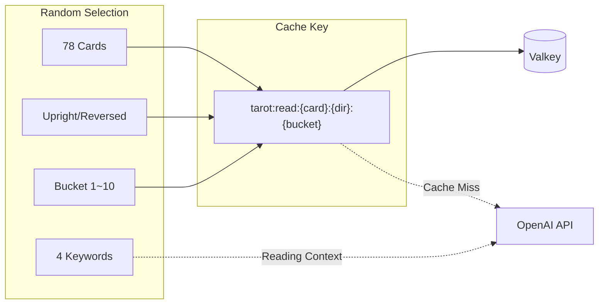
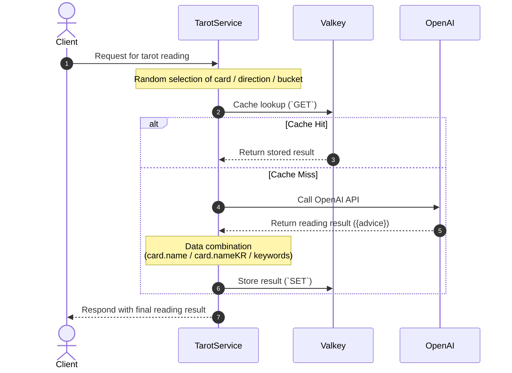
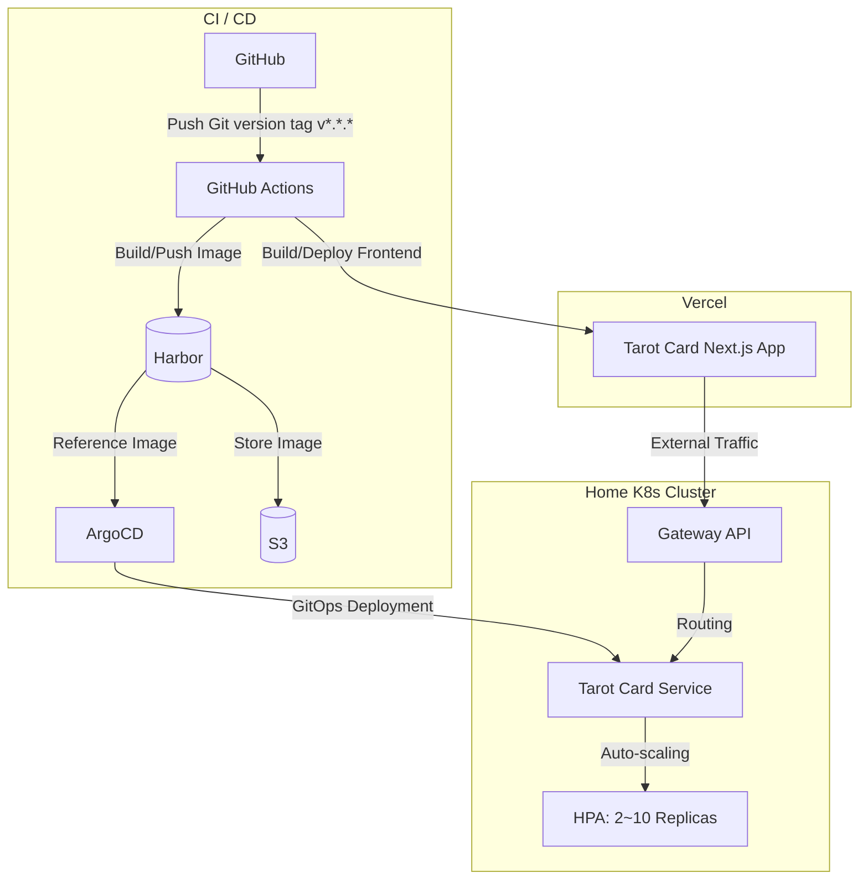

## Problem Awareness

The advantage of AI-generated content is its novelty, but repeatedly calling the API for the same input can quickly accumulate costs. This is also true for tarot card services. Although we use the OpenAI API for card readings, calling the API for every request isn't practical due to cost and response time issues.

A simple cache using only the card and direction as keys is insufficient because users expect different readings even if they draw the same card. To bridge this gap, we introduced a **caching strategy using a bucket system**.

---

## Buckets: Balancing Diversity and Efficiency

The core idea is simple. By combining 78 cards, upright/reversed directions, and 10 buckets, we create **1,560 unique cache keys** and store AI-generated readings for each key.

```
78 cards × 2 directions × 10 buckets = 1,560 unique combinations
```

Each time a user makes a request, one of these combinations is randomly selected. The cache key is in the form `tarot:read:{card}:{direction}:{bucket}`, and subsequent requests with the same key are immediately returned from Valkey. The OpenAI API is only called when the cache is missed.

We added one more mechanism. The server randomly selects 4 keywords for each request and provides them as context to the AI. This allows for different readings based on keywords, even with the same card, direction, and bucket.



The entire flow can be represented in a sequence diagram as follows:



---

## Deployment

The frontend is operated on Vercel, and the backend is run on a home Kubernetes cluster.



The deployment pipeline automatically starts **as soon as a new version tag (`v*.*.*`) is pushed to GitHub**. GitHub Actions build the image based on the tag and push it to the in-house container registry, Harbor. ArgoCD detects changes through GitOps settings and automatically synchronizes the cluster state. Additionally, the frontend is directly built and deployed to Vercel via GitHub Actions.

The backend automatically scales from 2 to 10 replicas through HPA based on traffic, and external user requests are safely routed through the internal Gateway API.

---

## Room for Improvement

Currently, it's a simple service accessible to anyone without login, but we are considering adding a login feature to store user-specific reading history and provide a personalized experience.

---

## Conclusion

The tarot card service is a small project, but it involves solving a practical problem of balancing AI generation and caching. The caching strategy using a bucket system offers a realistic compromise between cost and diversity, with plenty of room for future improvements.
