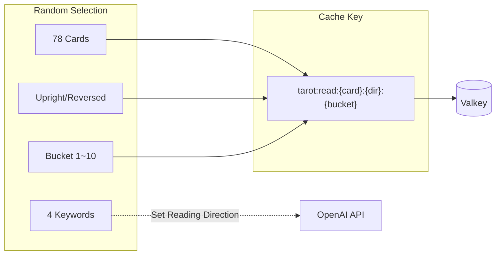
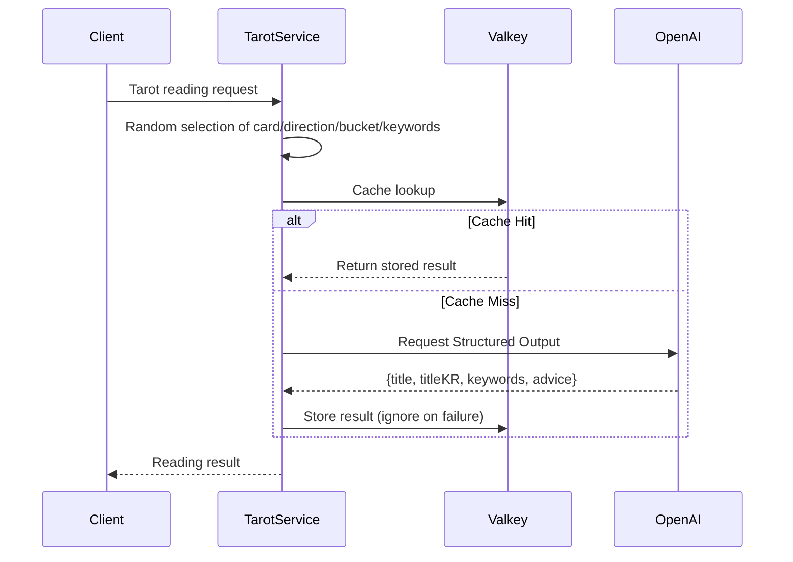

## Problem Awareness

AI-generated content is always fresh, but repeatedly calling the API with the same input can accumulate costs. Tarot readings are particularly susceptible to this. Users find it engaging when different interpretations arise from the same cards. However, constantly invoking the OpenAI API can lead to a cost explosion.

Tarot Core addresses this dilemma with a bucket system. By generating cache keys for 1,560 unique combinations (78 cards x 2 directions x 10 buckets), the same combination is immediately returned from Valkey. This approach enforces JSON response formats with Structured Outputs, effectively managing both costs and latency.

## Buckets: Balancing Diversity and Efficiency

With 78 cards x 2 directions x 10 buckets, there are 1,560 unique combinations. Each time a user makes a request, one of these combinations is randomly selected. The cache key follows the format `tarot:read:{card}:{direction}:{bucket}`, and subsequent requests with the same key are instantly returned from Valkey. The OpenAI API is only called when the cache is empty.

Keywords are not included in the cache key. Even within the same bucket, if different keywords are selected, the AI generates readings in a different context. This design saves cache space while preventing monotony.



## Structured Outputs: Consistency in Response Format

One of the most challenging aspects of using the OpenAI API is ensuring consistency in response formats. Tarot Core effectively addresses this issue with the Structured Outputs API. By passing a Zod schema, the OpenAI API is forced to return JSON formats, eliminating client-side parsing errors.

```typescript
export const ReadResponseSchema = z.object({
  title: z.string().min(1), // English card name
  titleKR: z.string().min(1), // Korean card name
  keywords: z.array(z.string()).min(1),
  advice: z.string().min(1), // Advice message
});
```

System prompts include constraints like "cold and natural like a fortune teller" and "no special characters." User messages are delivered in JSON format with card information and four keywords, allowing the AI to grasp the context.

Even in the event of a cache server failure, the service remains uninterrupted. All cache calls are wrapped in try/catch blocks, treating lookup failures as cache misses and quietly ignoring storage failures. When Valkey is unavailable, it gracefully falls back to direct OpenAI calls.



## Module Design and Deployment

The design is intentionally simple. There is no database; the card deck and keyword pool are hardcoded in memory. The NestJS module structure consists of ConfigModule → ValkeyModule (global) → TarotModule, with TarotService handling all business logic. This simplicity reduces code volume and facilitates testing.

Configuration is managed in two layers: YAML files and environment variables. Basic settings are loaded with js-yaml and overridden by six environment variables, including OPENAI_API_KEY. Zod schemas handle default values and validation simultaneously.

The Dockerfile employs a three-stage multi-stage build, and the Helm Chart operates with two default replicas, automatically scaling from 2 to 10 via HPA. Security contexts include non-root execution, seccomp profile application, and removal of all capabilities.

## Areas for Improvement

Currently, keywords are not included in the cache key, which means that if only the keywords differ within the same bucket, a cache hit might result in an unintended reading. While this is by design, the lack of cache warming leads to concentrated OpenAI calls during cold starts. In the future, pre-generating popular combinations is under consideration.

## Conclusion

Tarot Core showcases the balance between caching and AI generation, reliable response formats created with Structured Outputs, and modern deployment using NestJS and Kubernetes. It stands out as a design that considers both cost and performance in a real operational environment, beyond just a simple toy.
