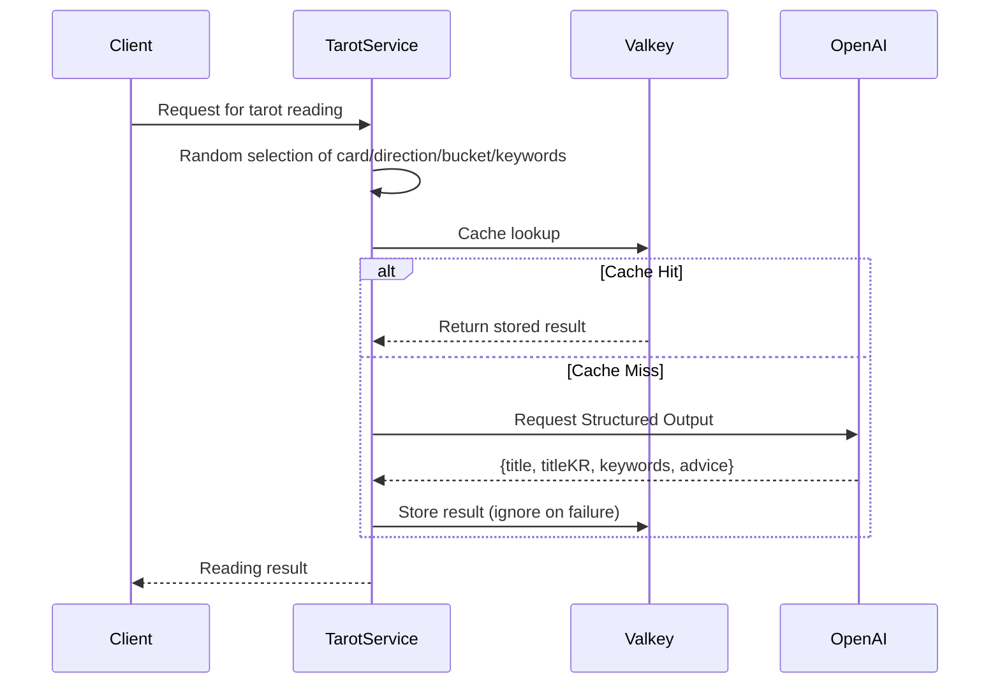

## Problem Awareness

Content created by AI is always new, but calling the API with the same input repeatedly incurs costs. Tarot reading is especially like this. Even if the same card appears, different interpretations should be provided each time to keep users entertained. However, calling the OpenAI API every time will soon lead to a cost explosion.

Tarot Core solves this dilemma with a bucket system. By generating cache keys with 78 cards x 2 directions x 10 buckets = 1,560 unique combinations, the same combination is immediately returned from Valkey. This enforces a JSON response format with Structured Outputs, addressing both cost and latency.

## Buckets: Balancing Diversity and Efficiency

78 cards x 2 directions x 10 buckets = 1,560 unique combinations. Each time a user makes a request, one of these combinations is randomly selected. The cache key is in the form `tarot:read:{card}:{direction}:{bucket}`, and subsequent requests with the same key are immediately returned from Valkey. The OpenAI API is only called when there is no cache.

Keywords are not included in the cache key. Even if the same bucket is selected, different keywords can lead AI to generate readings in different contexts. This design saves cache space while preventing monotony.


## Structured Outputs: Consistency in Response Format

The most troublesome aspect of using the OpenAI API is the consistency of the response format. Tarot Core completely blocks this issue with the Structured Outputs API. By providing a Zod schema, the OpenAI API enforces a JSON format, eliminating client-side parsing errors.

```typescript
export const ReadResponseSchema = z.object({
  title: z.string().min(1), // English card name
  titleKR: z.string().min(1), // Korean card name
  keywords: z.array(z.string()).min(1),
  advice: z.string().min(1), // Advice message
});
```

The system prompt includes constraints like "cold and natural like a fortune teller" and "no special characters allowed." Card information and 4 keywords are delivered as JSON in the user message, allowing AI to understand the context.

Even in the event of a cache server failure, the service is not interrupted. All cache calls are wrapped in try/catch, treating lookup failures as cache misses and quietly ignoring storage failures. When Valkey is down, it gracefully falls back to direct OpenAI calls.



## Module Design and Deployment

The design is intentionally simple. There is no database, and the card deck and keyword pool are all hardcoded in memory. The NestJS module structure consists of ConfigModule → ValkeyModule (global) → TarotModule, with TarotService handling all business logic. This simplicity reduces code volume and makes testing easier.

Configuration is managed in two layers: YAML files and environment variables. Basic settings are loaded with js-yaml and overwritten by 6 environment variables, including OPENAI_API_KEY. Zod schemas handle default values and validation simultaneously.

The Dockerfile uses a three-stage multi-stage build, and the Helm Chart operates with 2 replicas by default, automatically scaling from 2 to 10 with HPA. In the security context, it runs non-root, applies a seccomp profile, and removes all capabilities.

## Room for Improvement

Currently, keywords are not included in the cache key, so if only keywords differ within the same bucket, a cache hit may result in an unintended reading. This is intentional by design, but without cache warming, OpenAI calls are concentrated during cold starts. We are considering pre-generating popular combinations in the future.

## Conclusion

Tarot Core demonstrates a balance between caching and AI generation, reliable response formats created with Structured Outputs, and modern deployment using NestJS and Kubernetes. It stands out as a design that considers both cost and performance in a real operational environment, beyond just being a simple toy.
