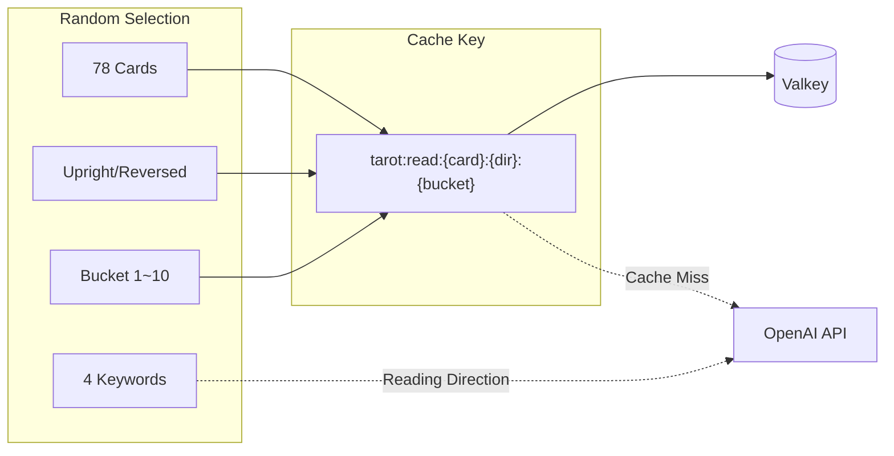
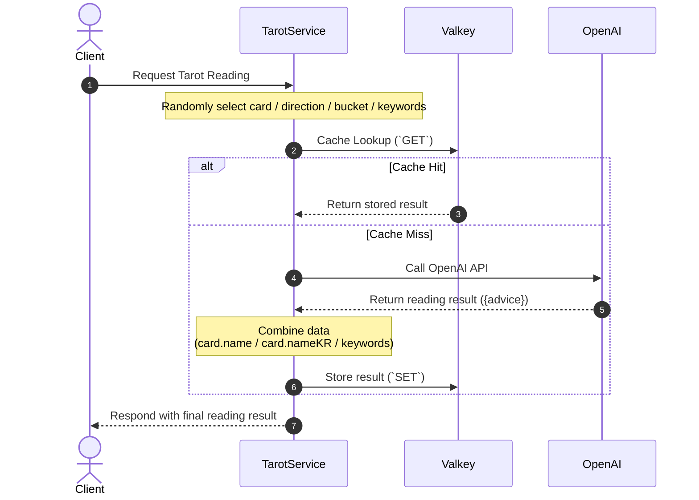
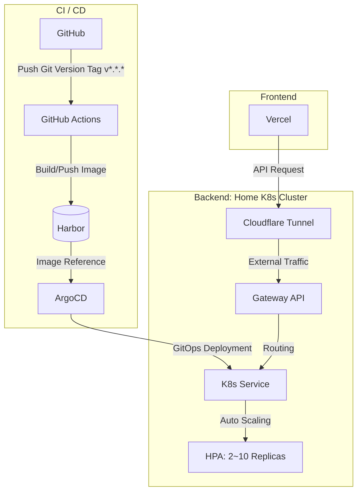

## Problem Awareness

The advantage of AI-generated content is that it's always new, but calling the API repeatedly for the same input can quickly accumulate costs. This is also true for tarot card services. Although we use the OpenAI API for card readings, due to cost and response time issues, it's not practical to call the API for every request.

A simple cache using only the card and direction as keys is insufficient. Users expect different readings even if they draw the same card. To bridge this gap, we introduced a **caching strategy using a bucket system**.

---

## Buckets: Balancing Diversity and Efficiency

The core idea is simple. By combining 78 cards, upright/reversed directions, and 10 buckets, we create **1,560 unique cache keys** and store AI-generated readings for each key.

```
78 cards × 2 directions × 10 buckets = 1,560 unique combinations
```

Each time a user makes a request, one of these combinations is randomly selected. The cache key is in the form `tarot:read:{card}:{direction}:{bucket}`, and subsequent requests with the same key are immediately returned from Valkey. The OpenAI API is only called when there is a cache miss.

We've added one more mechanism. The server randomly selects 4 keywords for each request and provides them to the AI as context. This allows for different readings even with the same card, direction, and bucket, depending on the keywords.



The entire flow can be represented in a sequence diagram as follows.



---

## Deployment

The frontend is operated on Vercel, and the backend is run on a home Kubernetes cluster.



The deployment pipeline automatically starts **as soon as a new version tag (`v*.*.*`) is pushed to GitHub**. GitHub Actions builds the image based on the tag and pushes it to the in-house container registry, Harbor. ArgoCD detects changes through GitOps settings and automatically synchronizes the cluster state.

The backend automatically scales from 2 to 10 replicas based on traffic via HPA, and user requests coming from outside are safely routed through the Cloudflare Tunnel to the internal Gateway API.

---

## Areas for Improvement

There is an intentional trade-off in the current design. Since keywords are not included in the cache key, even if only the keywords differ in the same bucket, a cache hit may return an unintended reading. This design choice prioritizes cache efficiency over diversity.

Another challenge is the cold start. Without cache warming in the current structure, initial requests may concentrate OpenAI calls. We plan to mitigate this by pre-generating popular combinations in the future.

Currently, the service is simple and available to anyone without login, but we are considering adding a login feature to save user-specific reading history and provide a personalized experience.

---

## Conclusion

The tarot card service is a small project, but it involves solving practical problems of balancing AI generation and caching. The caching strategy using a bucket system offers a realistic compromise between cost and diversity, with ample room for future improvements.
