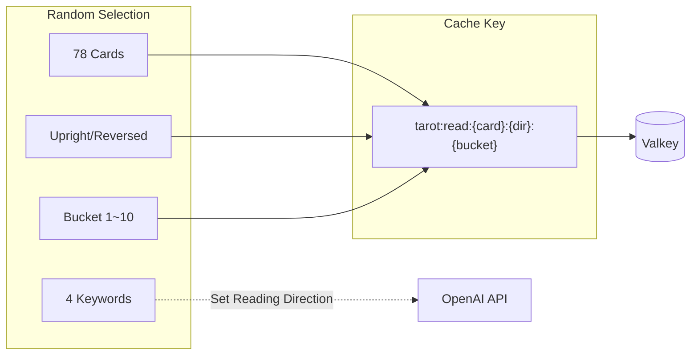
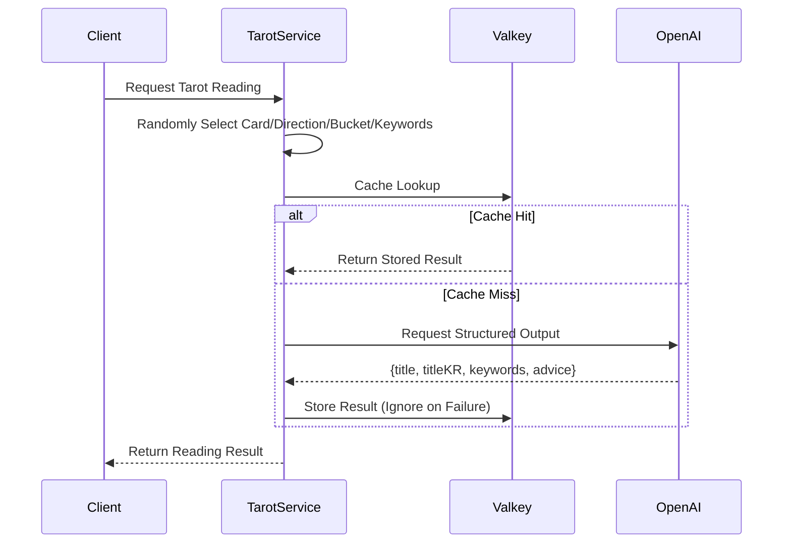

## Problem Awareness

Content generated by AI is always new, but calling the API for the same input repeatedly accumulates costs. This is especially true for tarot readings. Even if the same card appears, a different interpretation should be provided each time to keep users engaged. However, calling the OpenAI API every time would quickly lead to a cost explosion.

Tarot Core solves this dilemma with a bucket system. By generating cache keys with 78 cards x 2 directions x 10 buckets = 1,560 unique combinations, the same combination is instantly returned from Valkey. This approach enforces JSON response formats with Structured Outputs, optimizing both costs and latency.

## Buckets: Balancing Diversity and Efficiency

78 cards x 2 directions x 10 buckets = 1,560 unique combinations. Each time a user makes a request, one of these combinations is randomly selected. The cache key is in the form `tarot:read:{card}:{direction}:{bucket}`, and subsequent requests with the same key are instantly returned from Valkey. The OpenAI API is only called when the cache is empty.

Keywords are not included in the cache key. Even within the same bucket, if different keywords are selected, the AI generates readings in different contexts. This design saves cache space while preventing monotony.



## Structured Outputs: Consistency in Response Format

One of the most challenging aspects of using the OpenAI API is ensuring consistency in response format. Tarot Core addresses this issue at its root with the Structured Outputs API. By providing a Zod schema, the OpenAI API enforces a JSON format, eliminating client-side parsing errors.

```typescript
export const ReadResponseSchema = z.object({
  title: z.string().min(1), // English card name
  titleKR: z.string().min(1), // Korean card name
  keywords: z.array(z.string()).min(1),
  advice: z.string().min(1), // Advice message
});
```

The system prompt includes constraints such as "cold and natural like a fortune teller" and "no special characters allowed." Card information and four keywords are delivered in JSON within the user message, allowing the AI to understand the context.

Even in the event of a cache server failure, the service remains uninterrupted. All cache calls are wrapped in try/catch, treating lookup failures as cache misses and quietly ignoring storage failures. When Valkey is unavailable, it gracefully falls back to direct OpenAI calls.



## Module Design and Deployment

The design is intentionally simple. There is no database, and the card deck and keyword pool are all hardcoded in memory. The NestJS module structure consists of ConfigModule → ValkeyModule (global) → TarotModule, with TarotService handling all business logic. This simplicity reduces code volume and facilitates testing.

Configuration is managed in two layers: YAML files and environment variables. Basic settings are loaded with js-yaml and overridden by six environment variables, including OPENAI_API_KEY. Zod schemas handle both default values and validation simultaneously.

The Dockerfile uses a three-stage multi-stage build, and the Helm Chart operates with a default of two replicas, automatically scaling from 2 to 10 via HPA. In the security context, non-root execution, seccomp profile application, and removal of all capabilities are implemented.

## Areas for Improvement

Currently, keywords are not included in the cache key, so if only the keywords differ within the same bucket, a cache hit could result in an unintended reading. While this is by design, the lack of cache warming results in concentrated OpenAI calls during cold starts. We are considering pre-generating popular combinations in the future.

## Conclusion

Tarot Core demonstrates a balance between caching and AI generation, reliable response formats created with Structured Outputs, and modern deployment using NestJS and Kubernetes. It stands out as a design that considers both cost and performance in a real operational environment, beyond just a simple toy.
