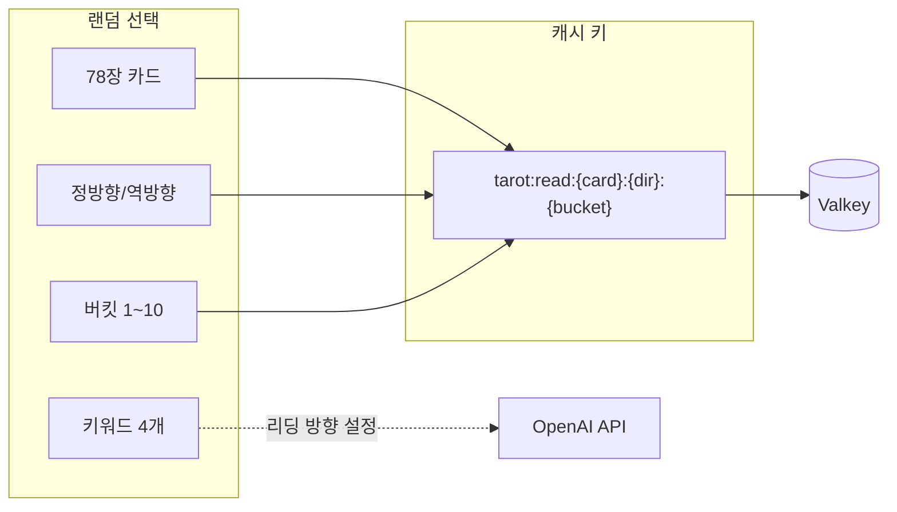
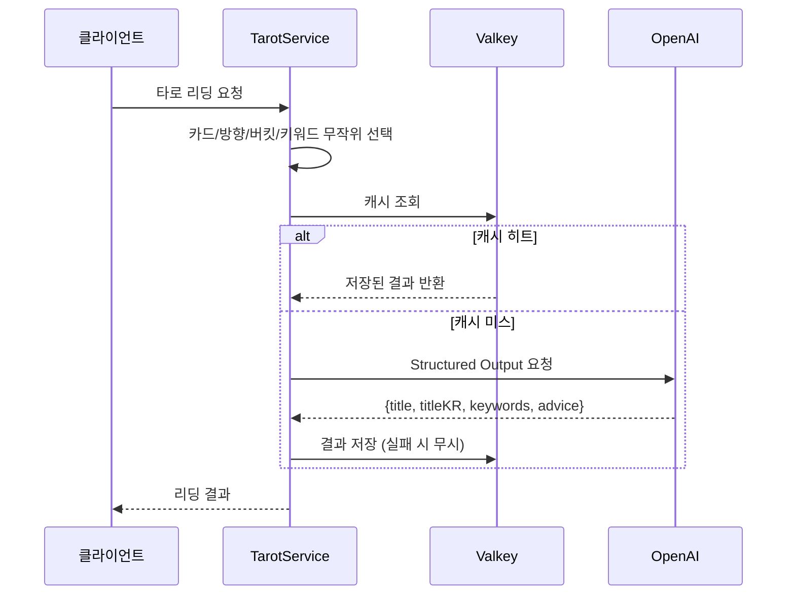

## Problem statement

AI-generated content is new every time.
calling the API for the same input every time adds up.
This is especially true for tarot readings.
The same card should give a different interpretation every time.
users have fun,
calling the OpenAI API every time is a costly mistake.

Tarot Core solved this dilemma with a bucket system.
By creating a cache key with 78 cards x 2 directions x 10 buckets = 1,560 unique combinations.
The same combinations are returned immediately by Valkey, and the
Structured Outputs to enforce a JSON response format to
Capture both cost and latency.

## Buckets: Balancing variety and efficiency

78 cards x 2 directions x 10 buckets = 1,560 unique combinations.
One of these is randomly selected each time a user makes a request.
The cache key is of the form `tarot:read:{card}:{direction}:{bucket}`,
Subsequent requests with the same key will be returned immediately by Valkey.
It only calls the OpenAI API when it is not in the cache.

Keywords are not included in the cache key.
If a different keyword is selected, even for the same bucket
AI will generate different contextualized leads.
This is a design that saves cache space while preventing monotony.



## Structured Outputs: Consistency in response formatting

One of the biggest headaches when using the OpenAI API is the consistency of the
is the consistency of the response format.
Tarot Core eliminates this problem with the Structured Outputs API.
When you pass in a Zod schema, the OpenAI API enforces a JSON format, eliminating client-side parsing errors.
eliminating client-side parsing errors.

```typescript
export const ReadResponseSchema = z.object({
  title: z.string().min(1), // 영어 카드명
  titleKR: z.string().min(1), // 한글 카드명
  keywords: z.array(z.string()).min(1),
  advice: z.string().min(1), // 조언 메시지
});
```

The system prompt says "as cold and natural as a fortune teller",
and "no special characters".
In the user message, the card information and four keywords are passed as JSON so that the
AI to get context.

Service is uninterrupted in the event of a cache server failure.
All cache calls are wrapped in try/catch.
Failed lookups are treated as cache misses
store failures are quietly ignored.
When Valkey dies, it responds gracefully with a direct call to OpenAI.



## Design and deploy modules

The design is intentionally simple.
There is no database, and the card deck and keyword pool are
are all hardcoded in memory.
The NestJS module structure consists of ConfigModule → ValkeyModule (global) → TarotModule,
TarotService is responsible for all business logic.
This simplicity reduces the amount of code and makes testing easy.

Settings are managed in two layers: a YAML file and environment variables.
Load the default settings in js-yaml and set the
OPENAI_API_KEY and overwrite them with six environment variables.
Zod schema handles defaults and validation at the same time.

Dockerfile uses a three-stage multi-stage build,
Helm Chart runs with 2 replicas by default, and
automatically scales from 2 to 10 via HPA.
Running non-root in security context, applying seccomp profile,
removed all capabilities.

## Room for improvement.

Current cache key does not contain keywords
Different keywords in the same bucket
Cache hits can result in unintended leads being sent out.
This is by design.
There is no cache warming, which concentrates OpenAI calls during cold starts.
In the future, we are considering pre-generating popular combinations.

## Closing

Tarot Core balances caching and AI generation,
reliable response formats with Structured Outputs,
and a modern deployment utilizing NestJS and Kubernetes.
Not just a toy
Designed for both cost and performance in real-world production environments.
