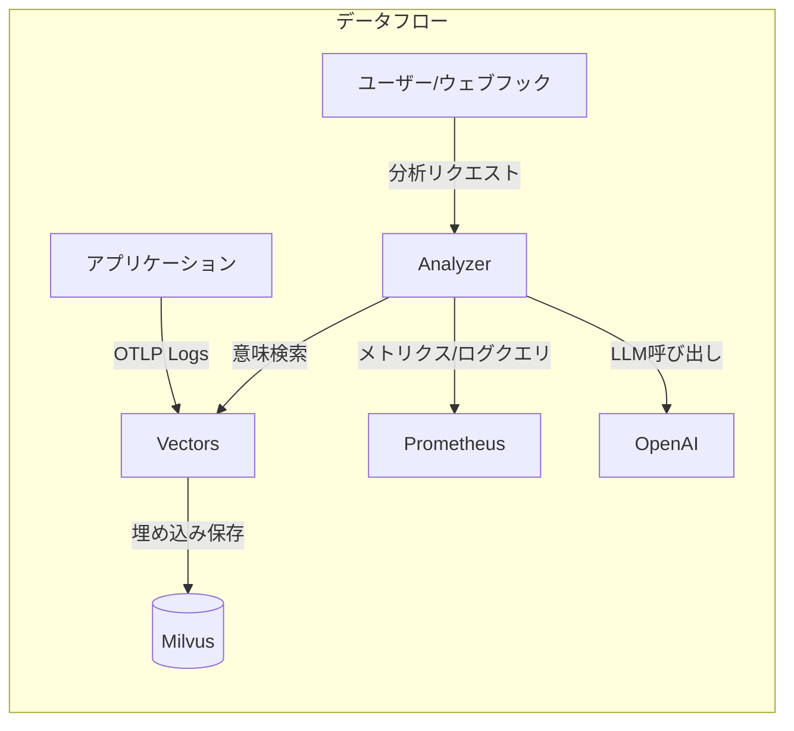
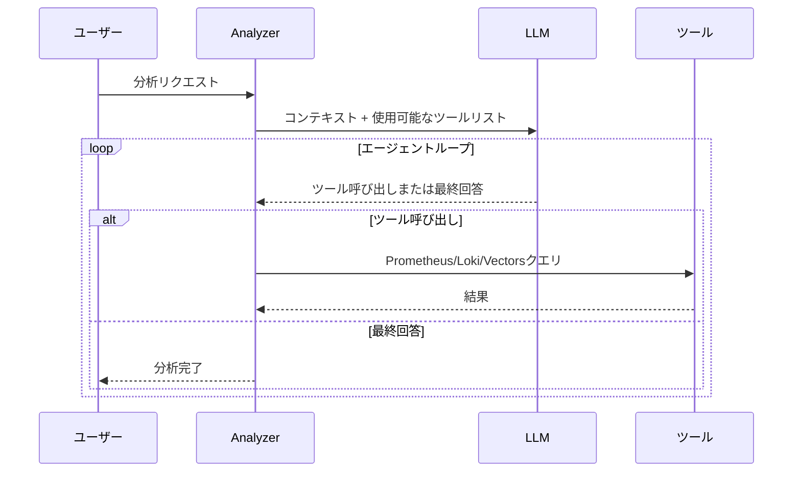

```markdown
## 問題意識

夜中に鳴るPagerDutyのアラート。「CPU 90%超過」。
眠りから覚めてダッシュボードを確認すると、昨日から動いていたバッチ作業が原因で、
30分後には自動的に下がる予定です。
このような偽アラートが積み重なると、本当の問題が来たときに鈍感になってしまいます。

Meerkatはこの問題を根本的に解決するために始まりました。
ルールベースのアラートの代わりにAIエージェントが直接ログとメトリクスを読み、
PrometheusやLokiなどのツールを呼び出して原因を推論します。
ログはベクトル化して意味検索が可能な形で保存し、
AnalyzerとVectorsの2つのサービスに分離して独立して拡張できます。

## 核心設計: 2つのサービス、2つの責任

MeerkatはAnalyzerとVectorsの2つのサービスで構成されています。
この分離は意図的な設計です。

**Vectors**はログを受け取り、意味のある形で保存することに専念します。
OpenTelemetry OTLPで入ってきたログをテンプレート抽出で重複を除去し、
OpenAIの埋め込みを経てMilvusにベクトルとして保存します。
1つのサービスが1日に数万件のログを残しても、実際には数十個の固有テンプレートだけがベクトル化されるため、
保存コストと検索効率が大幅に改善されます。

**Analyzer**はAI分析とワーカー管理に専念します。
HTTP APIでリクエストを受け取り、非同期ワーカープールで処理し、
必要に応じてVectorsに意味検索を依頼します。
2つのサービスはgRPCで通信し、それぞれ独立してスケールアウトできます。



### テンプレート抽出の効果

テンプレート抽出はログの重複を除去する核心技術です。
例えば「User 123 logged in」と「User 456 logged in」は同じテンプレート「User * logged in」として抽出されます。
これにより、ログの多様性を維持しつつ、ベクトル化する固有項目の数を大幅に減らすことができます。

テンプレート抽出方式は以下の通りです。

| フィルターモード     | 動作                         | 使用例                       |
| ------------------- | ---------------------------- | ----------------------------- |
| **all**             | すべてのログをベクトル化     | 小規模サービス、開発環境      |
| **severity**        | 指定レベル以上のみ処理       | 運用環境、エラー中心モニタリング |
| **template** (デフォルト) | Drainアルゴリズムで重複除去 | 大規模サービス、コスト最適化    |

3つのモードを提供し、サービスの規模や要求に応じて選択できるようにしました。
allモードはすべてのログをベクトル化しますがコストがかかり、
severityモードはエラーや警告などの重要なログのみを処理してコストを削減します。
templateモードはDrainアルゴリズムでログをテンプレートとして抽出し、保存スペースと検索効率を最大化します。

## AIがツールを使用するということ

Analyzerの核心はLLMにツールを提供し、自ら使用させることです。
Prometheus、Loki、VictoriaLogsクエリとVectors意味検索、
4つのツールを提供します。

「エラースパイクを分析して」というリクエストが来ると、このような流れになります。
まずVectorsで該当サービスの最近のエラーログを検索し、
Prometheusでエラー率の推移を確認した後、
Lokiで特定のエラーメッセージの頻度を分析します。
そして総合して「Redis接続タイムアウトによるエラースパイク、
14:23に開始され14:45に自動復旧」といった結論を導きます。

ツールの結果は3万文字に制限し、
エラーはクエリ文法エラー、接続失敗、クエリ失敗に分類します。
LLMが「これは私のクエリが間違っているので修正して再試行」または
「Prometheusが応答しないのでLokiに行こう」といった判断をするのです。



## 運用環境での考慮

ワーカープールはバッファードチャネルサイズ1000、ワーカー10個で構成されています。
キューが満杯になると429エラーを即座に返してバックプレッシャーを提供します。
同一トリガーとクエリに対する重複分析は
5分ウィンドウ内で自動ブロックされます。

デプロイはHelm Chartで管理し、
ConfigMapには設定とシステムプロンプトを、
SecretにはAPIキーとDBパスワードを分離して保存します。
ただしワーカープールのキューはインメモリーチャネルであるため、
サーバー再起動時にqueued作業が失われるという限界があります。
将来的には持続性キューの適用を計画しています。

## 結びに

Meerkatは単にLLM APIを呼び出すことを超えました。
ツールを使用するAIエージェントアーキテクチャと意味ベースのログ検索、
非同期ワーカープールを組み合わせて
実際の運用環境で使用できるプラットフォームを作りました。
ルールベースのアラートが限界に達したチームに
自然言語一言でインフラ状況を把握できる新しいインフラ可視性を提示すること、
それがこのプロジェクトが追求する価値です。
```
