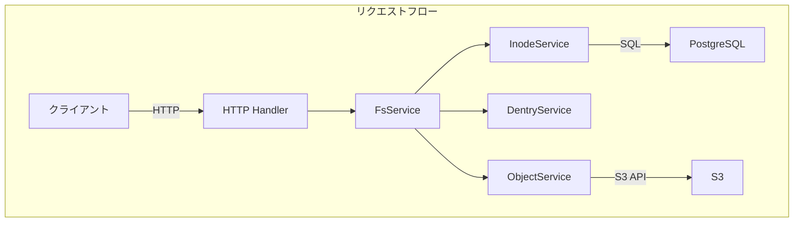
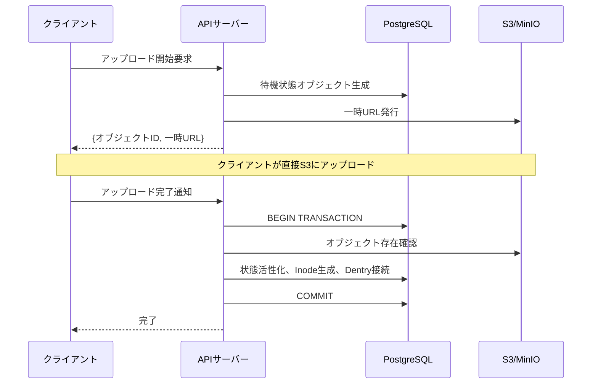

```markdown
## 問題意識

S3は優れた耐久性と拡張性を提供しますが、
開発者が直接扱うには依然として複雑です。
ディレクトリがなく、権限管理が粗く、
大容量ファイルのアップロードは自分で実装しなければなりません。

RetrowinはS3の拡張性を維持しながら
POSIXファイルシステムインターフェースを提供するシステムです。
InodeとDentryをPostgreSQLにJSONとして保存し、ジョインなしでディレクトリの照会が可能で、
一時URLベースの2段階アップロードで大容量ファイルも効率的に処理します。
ここにWindows XPスタイルのレトロUIを加え、
技術的挑戦と楽しさを同時に追求しました。

## 核心設計: inodeとdentryの現代的再解釈

最大の設計の質問は
「ファイルシステムの階層構造をリレーショナルDBにどう表現するか？」でした。
Linuxのinodeとdentryの概念を借用しましたが、現代的に再解釈しました。

Inodeテーブルはファイルメタデータを保存し、
Dentryはディレクトリ内のファイル名とInode IDのマッピングを管理します。
興味深い決定はDentryを別のテーブルではなく
InodeのcontentカラムにJSONとして保存したことです。
ディレクトリ照会時にジョインなしで単一のrowだけを読めばよいので遅延時間が短く、
PostgreSQLのJSONBインデックスを活用できます。
欠点はディレクトリ修正時に全体のJSONを書き直さなければならないことですが、
ほとんどのディレクトリは数百個以下のファイルを持つため、
このオーバーヘッドは微々たるものです。



## 大容量ファイルアップロード: 一時URLとアトミック完了

サーバーを経由してS3にファイルをプロキシすると
帯域幅とメモリがボトルネックになります。
Retrowinは一時URLベースの2段階アップロードでこの問題を解決します。

クライアントがアップロードを要求すると、
サーバーはDBに待機状態のレコードを生成し、S3一時URLを発行します。
クライアントはこのURLで直接S3にアップロードします。
完了後、サーバーに通知するとPostgreSQLトランザクション内で
S3存在確認、状態活性化転換、Inode生成、Dentry接続を
アトミックに実行します。
冪等性キーもサポートしており、同じアップロード要求の再試行時に
既存のレコードを再利用します。



### Atomic Uploadの核心

```go
func (s *FsService) AtomicUpload(ctx context.Context, objectID string) error {
    return s.db.WithTx(ctx, func(tx *sql.Tx) error {
        // 1. S3オブジェクト存在確認
        if err := s.s3.HeadObject(objectID); err != nil {
            return err
        }
        // 2. 状態活性化
        if err := s.objectSvc.CompleteUpload(ctx, tx, objectID); err != nil {
            return err
        }
        // 3. Inode生成 + Dentry接続
        inode, err := s.inodeSvc.Create(ctx, tx, objectID)
        if err != nil {
            return err
        }
        return s.dentrySvc.Link(ctx, tx, inode)
    })
}
```

トランザクション内で全ての作業がアトミックに実行されるため、
途中で失敗してもデータが不一致になることはありません。

## 認証と権限: 標準に従う

ファイルシステムは権限管理が命です。
KeycloakをOIDCプロバイダーとして使用し、
標準化された認証フローに従います。
PKCEを適用してモバイルとデスクトップクライアントでも
安全に認証できるようにし、
OIDCクライアントは遅延初期化され、
Keycloakが一時的にダウンしてもサーバーの起動が止まりません。

ファイル権限は標準Unix permission bitに従います。
所有者、グループ、その他のユーザー別に読み/書き/実行権限を制御し、
rootは全ての作業が可能です。

| 権限主体       | 読み | 書き | 実行 |
| -------------- | ---- | ---- | ---- |
| 所有者 (Owner) | ✅   | ✅   | ✅   |
| グループ (Group) | ✅   | ❌   | ✅   |
| その他 (Other) | ❌   | ❌   | ❌   |

## ガベージコレクション

時間が経つとアップロードが完了していない待機ファイルや
S3では削除されたがDBには残っている孤立レコードが発生します。
Kubernetes CronJobで毎日午前3時に2段階クリーンアップを実行します。
まず24時間以上待機している期限切れオブジェクトを削除し、
次にDBには活性として表示されているが
S3に存在しない孤立オブジェクトを探して整理します。

## トレードオフと教訓

JSONベースのDentryは照会性能を高めますが、
ディレクトリ同時修正のためのロックがインメモリベースであるため、
水平拡張時に限界があります。
また、シンボリックリンク解決が再帰的でサイクル検出がないため、
リンクループに脆弱です。
しかし、単一ユーザーや小規模チーム環境では
このようなトレードオフが受け入れ可能であり、
シンプルさがもたらす運用上の利点が大きいです。

## 結びに

Retrowinはオブジェクトストレージの拡張性と
POSIXファイルシステムの親しみやすさを結合した興味深い実験です。
アトミックアップロード、OIDC認証、GCまで実際の運用環境を考慮した要素を含みながらも
Ent ORMやogenのようなGoエコシステムの現代的ツールを積極的に活用しました。
レトロUIは技術的挑戦と楽しさを同時に追求する
このプロジェクトのアイデンティティをよく示しています。
```
