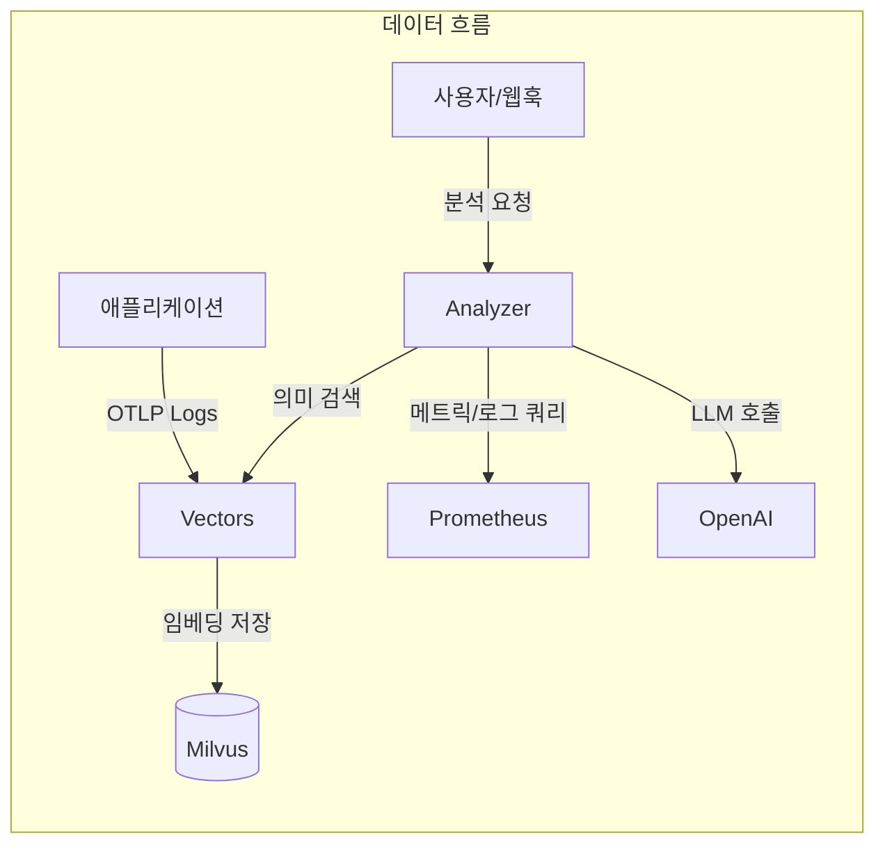
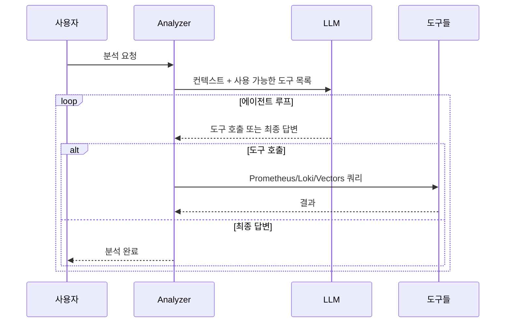

## 문제의식

밤중에 울리는 PagerDuty 알림. "CPU 90% 초과".
잠에서 깨어 대시보드를 확인했더니 어제부터 돌던 배치 작업이 원인이었고,
30분 뒤면 자동으로 낮아질 예정입니다.
이런 거짓 알림이 쌓이면 진짜 문제가 왔을 때 둔감해지죠.

Meerkat은 이 문제를 근본적으로 해결하고자 시작했습니다.
규칙 기반 알림 대신 AI Agent가 직접 로그와 메트릭을 읽고
Prometheus, Loki 등의 도구를 호출하며 원인을 추론합니다.
로그는 벡터화하여 의미 검색이 가능하게 저장하고,
Analyzer와 Vectors 두 서비스로 분리하여 독립적으로 확장할 수 있습니다.

## 핵심 설계: 두 개의 서비스, 두 가지 책임

Meerkat은 Analyzer와 Vectors 두 서비스로 구성됩니다.
이 분리는 의도적인 설계입니다.

**Vectors**는 로그를 받아 의미 있게 저장하는 일에만 집중합니다.
OpenTelemetry OTLP로 들어온 로그를 템플릿 추출로 중복을 제거하고,
OpenAI 임베딩을 거쳐 Milvus에 벡터로 저장합니다.
한 서비스가 하루 수만 건의 로그를 남겨도 실제로는 수십 개의 고유 템플릿만 벡터화되기 때문에
저장 비용과 검색 효율이 크게 개선됩니다.

**Analyzer**는 AI 분석과 워커 관리에만 집중합니다.
HTTP API로 요청을 받아 비동기 워커 풀에서 처리하고,
필요하면 Vectors에 의미 검색을 요청합니다.
두 서비스는 gRPC로 통신하며 각자 독립적으로 스케일 아웃할 수 있습니다.

### 템플릿 추출이 주는 효과

템플릿 추출은 로그의 중복을 제거하는 핵심 기술입니다.
예를 들어 "User 123 logged in"과 "User 456 logged in"은 같은 템플릿 "User \* logged in"으로 추출됩니다.
이렇게 하면 로그의 다양성은 유지하면서도 벡터화할 고유 항목의 수를 크게 줄일 수 있습니다.

템플릿 추출 방식은 다음과 같습니다.

| 필터 모드           | 동작                         | 사용 사례                     |
| ------------------- | ---------------------------- | ----------------------------- |
| **all**             | 모든 로그를 벡터화           | 소규모 서비스, 개발 환경      |
| **severity**        | 지정 레벨 이상만 처리        | 운영 환경, 에러 중심 모니터링 |
| **template** (기본) | Drain 알고리즘으로 중복 제거 | 대규모 서비스, 비용 최적화    |

3가지 모드를 제공하여 서비스 규모와 요구에 맞게 선택할 수 있도록 했습니다.
all 모드는 모든 로그를 벡터화하지만 비용이 많이 들고,
severity 모드는 에러나 경고 같은 중요한 로그만 처리하여 비용을 줄입니다.
template 모드는 Drain 알고리즘으로 로그를 템플릿으로 추출하여 저장 공간과 검색 효율을 극대화합니다.

## AI가 도구를 사용한다는 것

Analyzer의 핵심은 LLM에게 도구를 제공하고 스스로 사용하게 하는 것입니다.
Prometheus, Loki, VictoriaLogs 쿼리와 Vectors 의미 검색,
네 가지 도구를 제공합니다.

"에러 스파이크를 분석해줘"라는 요청이 오면 이런 흐름이 됩니다.
먼저 Vectors에서 해당 서비스의 최근 에러 로그를 검색하고,
Prometheus에서 에러율 추이를 확인한 뒤,
Loki에서 특정 에러 메시지의 빈도를 분석합니다.
그리고 종합해서 "Redis 연결 타임아웃으로 인한 에러 스파이크,
14:23에 시작되어 14:45에 자동 복구됨" 같은 결론을 도출합니다.

도구 결과는 3만 자로 제한하고,
에러는 쿼리 문법 오류, 연결 실패, 쿼리 실패로 분류합니다.
LLM이 "이건 내 쿼리가 틀렸으니 고쳐서 다시" 또는
"Prometheus가 응답이 없으니 Loki로 가자" 같은 판단을 하게 하는 것이죠.

## 운영 환경에서의 고려

워커 풀은 버퍼드 채널 크기 1000, 워커 10개로 구성되어 있습니다.
큐가 가득 차면 429 에러를 즉시 반환하여 백프레셔를 제공합니다.
동일한 트리거와 질의에 대한 중복 분석은
5분 윈도우 내에서 자동 차단됩니다.

배포는 Helm Chart로 관리하며,
ConfigMap에는 설정과 시스템 프롬프트를,
Secret에는 API 키와 DB 비밀번호를 분리해서 저장합니다.
다만 워커 풀의 큐가 인메모리 채널이라
서버 재시작 시 queued 작업이 유실된다는 한계가 있습니다.
향후에는 지속성 큐 적용을 계획하고 있습니다.

## 마치며

Meerkat은 단순히 LLM API를 호출하는 것을 넘어섰습니다.
도구를 사용하는 AI Agent 아키텍처와 의미 기반 로그 검색,
비동기 워커 풀을 결합하여
실제 운영 환경에서 쓸 수 있는 플랫폼을 만들었습니다.
규칙 기반 알림이 한계에 부딪힌 팀에게
자연어 한마디로 인프라 상황을 파악할 수 있는 새로운 인프라 가시성을 제시하는 것,
그것이 이 프로젝트가 추구하는 가치입니다.
