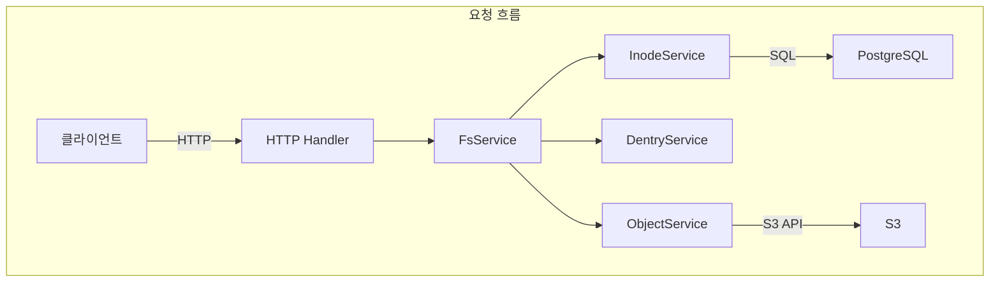
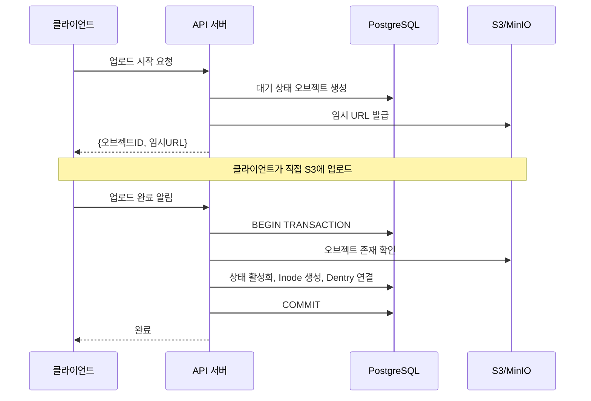

## 문제의식

S3는 뛰어난 내구성과 확장성을 제공하지만
개발자가 직접 다루기에는 여전히 복잡합니다.
디렉토리가 없고 권한 관리가 거칠며
대용량 파일 업로드는 직접 구현해야 하죠.

Retrowin은 S3의 확장성을 유지하면서
POSIX 파일시스템 인터페이스를 제공하는 시스템입니다.
Inode와 Dentry를 PostgreSQL에 JSON으로 저장하여 조인 없이 디렉토리 조회가 가능하고,
임시 URL 기반 2단계 업로드로 대용량 파일도 효율적으로 처리합니다.
여기에 Windows XP 스타일의 레트로 UI를 더해
기술적 도전과 재미를 동시에 추구했습니다.

## 핵심 설계: inode와 dentry의 현대적 재해석

가장 큰 설계 질문은
"파일시스템의 계층 구조를 관계형 DB에 어떻게 표현할 것인가?"였습니다.
Linux의 inode와 dentry 개념을 차용했지만 현대적으로 재해석했습니다.

Inode 테이블은 파일 메타데이터를 저장하고,
Dentry는 디렉토리 내 파일 이름과 Inode ID의 매핑을 관리합니다.
흥미로운 결정은 Dentry를 별도 테이블이 아닌
Inode의 content 컬럼에 JSON으로 저장한 것입니다.
디렉토리 조회 시 조인 없이 단일 row만 읽으면 되므로 지연 시간이 짧고,
PostgreSQL의 JSONB 인덱스를 활용할 수 있습니다.
단점은 디렉토리 수정 시 전체 JSON을 다시 써야 한다는 것인데,
대부분의 디렉토리는 수백 개 이하의 파일을 가지므로
이 오버헤드는 미미합니다.



## 대용량 파일 업로드: 임시 URL과 원자적 완료

서버를 거쳐 S3로 파일을 프록시하면
대역폭과 메모리가 병목이 됩니다.
Retrowin은 임시 URL 기반 2단계 업로드로 이 문제를 해결합니다.

클라이언트가 업로드를 요청하면
서버는 DB에 대기 상태 레코드를 생성하고 S3 임시 URL을 발급합니다.
클라이언트는 이 URL로 직접 S3에 업로드합니다.
완료 후 서버에 알리면 PostgreSQL 트랜잭션 내에서
S3 존재 확인, 상태 활성화 전환, Inode 생성, Dentry 연결을
원자적으로 수행합니다.
멱등성 키도 지원하여 동일한 업로드 요청의 재시도 시
기존 레코드를 재사용합니다.



### Atomic Upload의 핵심

```go
func (s *FsService) AtomicUpload(ctx context.Context, objectID string) error {
    return s.db.WithTx(ctx, func(tx *sql.Tx) error {
        // 1. S3 오브젝트 존재 확인
        if err := s.s3.HeadObject(objectID); err != nil {
            return err
        }
        // 2. 상태 활성화
        if err := s.objectSvc.CompleteUpload(ctx, tx, objectID); err != nil {
            return err
        }
        // 3. Inode 생성 + Dentry 연결
        inode, err := s.inodeSvc.Create(ctx, tx, objectID)
        if err != nil {
            return err
        }
        return s.dentrySvc.Link(ctx, tx, inode)
    })
}
```

트랜잭션 내에서 모든 작업이 원자적으로 수행되므로,
중간에 실패했더라도 데이터가 불일치되는 일은 없습니다.

## 인증과 권한: 표준을 따르기

파일시스템은 권한 관리가 생명입니다.
Keycloak을 OIDC 프로바이더로 사용하여
표준화된 인증 흐름을 따릅니다.
PKCE를 적용하여 모바일과 데스크톱 클라이언트에서도
안전하게 인증할 수 있게 했고,
OIDC 클라이언트는 지연 초기화되어
Keycloak이 잠깐 죽어도 서버 기동이 멈추지 않습니다.

파일 권한은 표준 Unix permission bit를 따릅니다.
소유자, 그룹, 기타 사용자별로 읽기/쓰기/실행 권한을 제어하며
root는 모든 작업이 가능합니다.

| 권한 주체      | 읽기 | 쓰기 | 실행 |
| -------------- | ---- | ---- | ---- |
| 소유자 (Owner) | ✅   | ✅   | ✅   |
| 그룹 (Group)   | ✅   | ❌   | ✅   |
| 기타 (Other)   | ❌   | ❌   | ❌   |

## Garbage Collection

시간이 지나면 업로드가 완료되지 않은 대기 파일이나
S3에서는 삭제되었지만 DB에는 남아있는 고아 레코드가 생깁니다.
Kubernetes CronJob으로 매일 새벽 3시에 2단계 클린업을 수행합니다.
먼저 24시간 이상 대기인 만료 오브젝트를 제거하고,
다음으로 DB에는 활성으로 표시되지만
S3에 존재하지 않는 고아 오브젝트를 찾아 정리합니다.

## 트레이드오프와 교훈

JSON 기반 Dentry는 조회 성능을 높이지만
디렉토리 동시 수정을 위한 락이 인메모리 기반이라
수평 확장 시 한계가 있습니다.
또한 심볼릭 링크 해결이 재귀적이면서 사이클 감지가 없어
링크 루프에 취약합니다.
하지만 단일 사용자나 소규모 팀 환경에서는
이런 트레이드오프가 수용 가능하며
단순함이 주는 운영 이점이 더 큽니다.

## 마치며

Retrowin은 오브젝트 스토리지의 확장성과
POSIX 파일시스템의 익숙함을 결합한 흥미로운 실험입니다.
원자적 업로드, OIDC 인증, GC까지 실제 운영 환경을 고려한 요소들을 포함하면서도
Ent ORM과 ogen 같은 Go 생태계의 현대적 도구들을 적극 활용했습니다.
레트로 UI는 기술적 도전과 재미를 동시에 추구하는
이 프로젝트의 정체성을 잘 보여줍니다.
