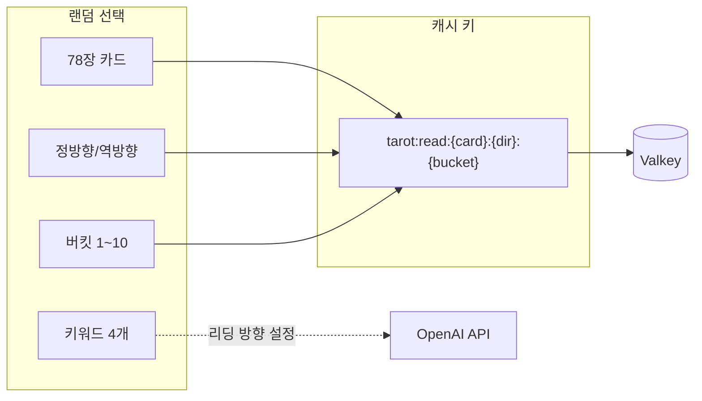
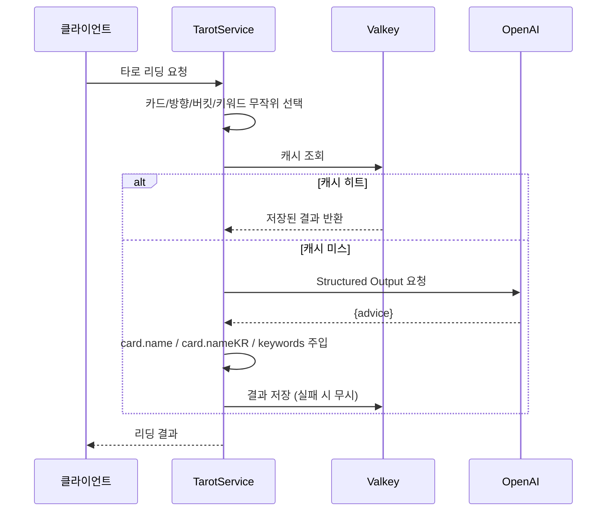

## 문제의식

AI가 만드는 콘텐츠는 매번 새롭지만
같은 입력에 매번 API를 호출하면 비용이 쌓입니다.
타로카드 서비스에서도 카드 리딩을 위해 OpenAI API를 사용하지만
비용과 응답 속도 문제로 매번 호출할 수는 없습니다.
하지만 사용자는 매번 다른 리딩을 기대하기 때문에
단순히 카드와 방향을 키로 하는 캐시로는 부족합니다.

이 문제를 해결하기 위해 타로카드는 버킷 시스템과 Structured Outputs를 활용한 캐싱 전략을 도입했습니다.
78장의 카드와 정방향/역방향, 그리고 10개의 버킷을 조합하여 1,560개의 고유 캐시 키를 생성하고, 각 키에 대해 AI가 생성한 리딩을 저장합니다.
서버에서 4개 키워드를 무작위로 선택해 AI에게 맥락으로 제공하며,
같은 카드와 방향, 버킷이라도 키워드에 따라 다른 리딩이 나올 수 있도록 설계했습니다.

## 버킷: 다양성과 효율의 균형

78장 카드 x 2 방향 x 10 버킷 = 1,560개 고유 조합.
사용자가 요청할 때마다 이 중 하나가 무작위로 선택됩니다.
캐시 키는 `tarot:read:{card}:{direction}:{bucket}` 형태이며,
동일 키의 후속 요청은 Valkey에서 즉시 반환됩니다.
캐시에 없을 때만 OpenAI API를 호출합니다.



## Structured Outputs: 응답 형식의 일관성

OpenAI API 사용 시 가장 골치 아픈 것은
응답 형식의 일관성입니다.
타로카드는 Structured Outputs API로 이 문제를 원천 차단합니다.
Zod 스키마를 전달하면 OpenAI API가 JSON 형식을 강제하여
클라이언트 측 파싱 오류를 없앱니다.

```typescript
export const llmReadResponseSchema = z.object({
  advice: z.string().min(1), // 조언 메시지
});

export const readResponseSchema = z.object({
  title: z.string().min(1), // 서버에서 주입
  titleKR: z.string().min(1), // 서버에서 주입
  keywords: z.array(z.string()).min(1), // 서버에서 주입
  advice: z.string().min(1),
});
```

시스템 프롬프트에는 "점술가처럼 차갑고 자연스럽게",
"특수 문자 사용 금지" 같은 제약을 두었습니다.
사용자 메시지에는 카드 정보와 4개 키워드가 JSON으로 전달되어
AI가 맥락을 파악합니다.

캐시 서버 장애 시에도 서비스는 중단되지 않습니다.
모든 캐시 호출은 try/catch로 감싸져 있어
조회 실패 시 캐시 미스로 처리되고
저장 실패는 조용히 무시됩니다.
Valkey가 다울 때도 OpenAI 직접 호출로 우아하게 대응합니다.



## 모듈 설계와 배포

의도적으로 단순하게 설계했습니다.
데이터베이스가 없고 카드 덱과 키워드 풀은
모두 메모리 내 하드코딩입니다.
NestJS 모듈 구조는 ConfigModule → ValkeyModule(전역) → TarotModule로 구성되며,
TarotService가 모든 비즈니스 로직을 담당합니다.
이 단순함은 코드량을 줄이고 테스트를 쉽게 만듭니다.

설정은 YAML 파일과 환경 변수 두 레이어로 관리합니다.
js-yaml로 기본 설정을 로드하고
OPENAI_API_KEY 등 6개 환경 변수로 덮어씁니다.
Zod 스키마로 기본값과 유효성 검증을 동시에 처리합니다.

Dockerfile은 세 단계 멀티 스테이지 빌드를 사용하고,
Helm Chart는 기본 2개 레플리카로 운영되며
HPA를 통해 2~10개로 자동 확장됩니다.
보안 컨텍스트에서는 비루트 실행, seccomp 프로필 적용,
모든 capabilities 제거를 했습니다.

## 개선의 여지

현재 캐시 키에 키워드가 포함되지 않아
같은 버킷에서 키워드만 다른 경우
캐시 히트가 발생하면 의도와 다른 리딩이 나갈 수 있습니다.
이는 설계상 의도이지만
캐시 워밍이 없어 콜드 스타트 시 OpenAI 호출이 집중됩니다.
향후에는 인기 조합의 사전 생성을 고려하고 있습니다.

## 마치며

타로카드는 캐싱과 AI 생성의 균형,
Structured Outputs로 만든 신뢰할 수 있는 응답 형식,
그리고 NestJS와 Kubernetes를 활용한 현대적 배포를 보여줍니다.
단순한 장난감이 아닌
실제 운영 환경에서 비용과 성능을 모두 고려한 설계가 돋보입니다.
