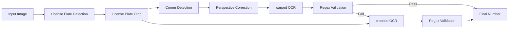
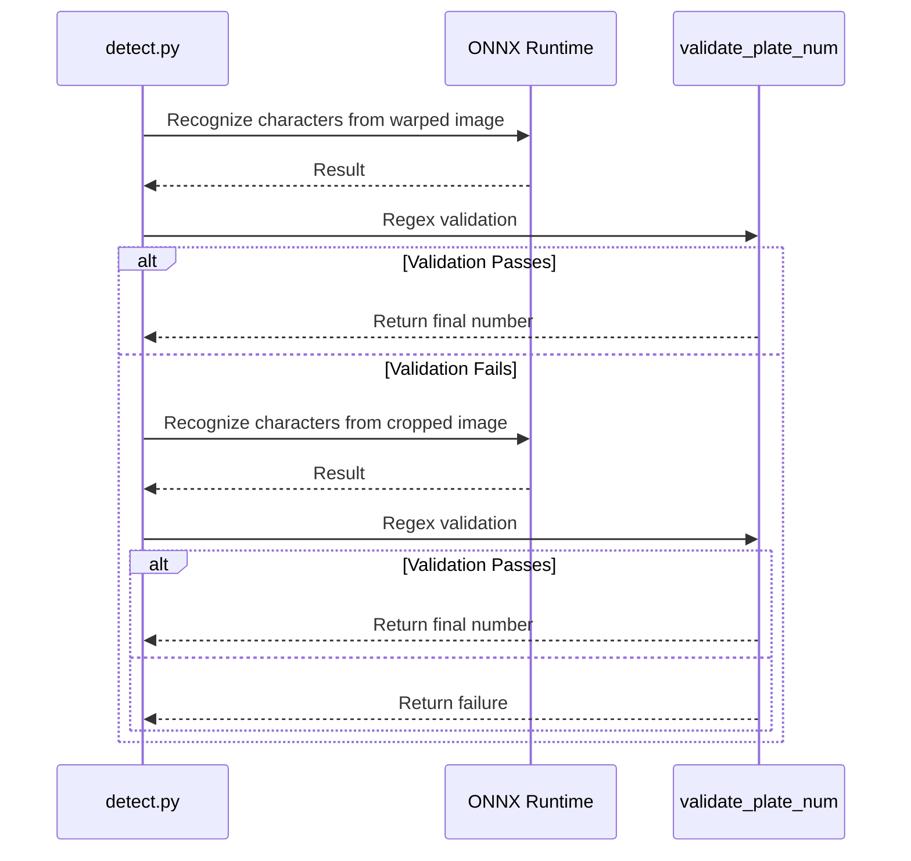

## Problem Awareness

Traditional OCR works well on clean documents but is vulnerable to blurry and tilted images like license plates. Recognition rates plummet when character spacing is irregular or partially obscured. Additionally, Korean car license plates have diverse character arrangements and a mix of region names and numbers, posing limitations for general OCR models.

This project takes the perspective of viewing characters as objects rather than text. Using YOLO-based object detection, each character is independently found, and OCR is performed on both the original and corrected images for double verification. NMS and extremum-based line fitting separate region names and numbers, operating robustly even in environments where traditional OCR fails.

## Three-Step Pipeline: The Art of Division of Labor

The entire flow is controlled by the `get_num()` function in `detect.py`. Three ONNX models handle their specialized fields.

| Step | Model                | Role                                                   |
| ---- | -------------------- | ------------------------------------------------------ |
| 1    | `plate_detect_v1`    | Detect license plate area in the entire image          |
| 2    | `vertex_detect_v1`   | Detect four corners and perform perspective correction |
| 3    | `syllable_detect_v1` | Detect individual characters with 75 classes           |

The first model finds one license plate area in the entire image. It selects the most reliable among multiple candidates and crops it. The second model finds the four corners in the cropped image and performs perspective correction. The third model detects individual characters as objects with 75 classes. Unlike traditional OCR that reads text lines, it finds the position of each character within the license plate, allowing recognition even if character spacing is irregular or partially obscured.

All models run with ONNX Runtime, and the PyInstaller binary minimizes size by excluding torch or ultralytics.



## Validation and Fallback: Balancing Stability and Efficiency

Perspective transformation is not always perfect. Corner detection may fail or encounter tilted license plates.

This project **prioritizes OCR on warped images**, returning results immediately if regex validation passes. Only upon failure does it fallback to perform additional OCR on the original cropped image.

```python
def get_num(img):
    cropped = plate_detector.detect_and_crop(img)
    warped = vertex_detector.detect_and_warp(cropped)

    # Step 1: Prioritize OCR on warped image
    if warped is not None:
        res = syllable_detector.get_num_from_img(warped)
        result = validate_plate_num(res, mask=False)
        if result:
            return result

    # Step 2: Fallback - OCR on cropped image
    if cropped is not None:
        res = syllable_detector.get_num_from_img(cropped)
        result = validate_plate_num(res, mask=False)
        if result:
            return result

    return None

def validate_plate_num(plate_num, mask=True):
    """Regex validation + mask application on single OCR result"""
    if plate_num is None:
        plate_num = ''

    m = re.fullmatch(PLATE_REGEX, plate_num)
    if m is None:
        return None

    if mask:
        plate_num = re.search(OUTPUT_REGEX, plate_num).group()

    return plate_num
```

This method processes with a single OCR if warping succeeds and falls back to the cropped image only if it fails, reducing unnecessary inference while maintaining stability.

After character detection, duplicate bounding boxes are removed with NMS, and lines are drawn based on the left and right endpoints to separate region names and number areas. Region names are corrected by comparing them with a hardcoded list of valid regions like Seoul, Gyeonggi, and Busan.



## User-Friendly GUI Design

What should be done if some images fail detection during batch processing? Ignoring them lowers data quality, and stopping the entire process reduces efficiency.

The PySide6-based GUI automatically pauses on detection failure and displays the image on the screen. Processing stops until the user manually inputs the license plate number and presses the confirm button. This hybrid approach achieves 100% coverage while maintaining batch processing efficiency. Results are automatically saved to result.xlsx via openpyxl, and progress is visualized with a progress bar.

## Deployment: Ready for Field Use

A single executable file is generated using PyInstaller. Large libraries like torch, tensorflow, and matplotlib are explicitly excluded to minimize binary size. All ONNX models are automatically downloaded from the Hugging Face Hub and stored in the local cache to prevent re-downloading.

GitHub Actions automatically builds releases for Linux, macOS, and Windows upon pushing v\* tags and uploads them to GitHub Releases. Users can extract and run immediately.

## Trade-offs and Design Philosophy

YOLO-based character detection is strong against irregular spacing and occlusion but may have lower fine recognition rates for small characters compared to traditional OCR. To compensate, the mechanism prioritizes OCR on warped images, immediately returning results if regex validation passes, and falls back to cropped images only if it fails. An NMS threshold of 0.3 balances duplicate removal and omission prevention on license plates with overlapping characters.

The modal input method of the GUI may seem somewhat outdated but is a practical choice for handling edge cases where full automation is impossible in real operational environments. Balancing data quality and processing efficiency is the core philosophy of this project.

## Conclusion

This project aims to be a tool usable in real-world scenarios beyond a simple deep learning demo. The modularization of the three-step model pipeline, prioritization and fallback of warped image processing, usability of the PySide6 GUI, and cross-platform deployment using PyInstaller and GitHub Actions showcase a design considering the entire lifecycle. It is a case that maximizes the potential of object detection in the narrow domain of license plate recognition.
