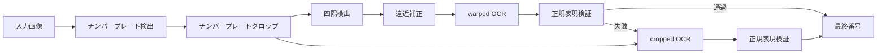
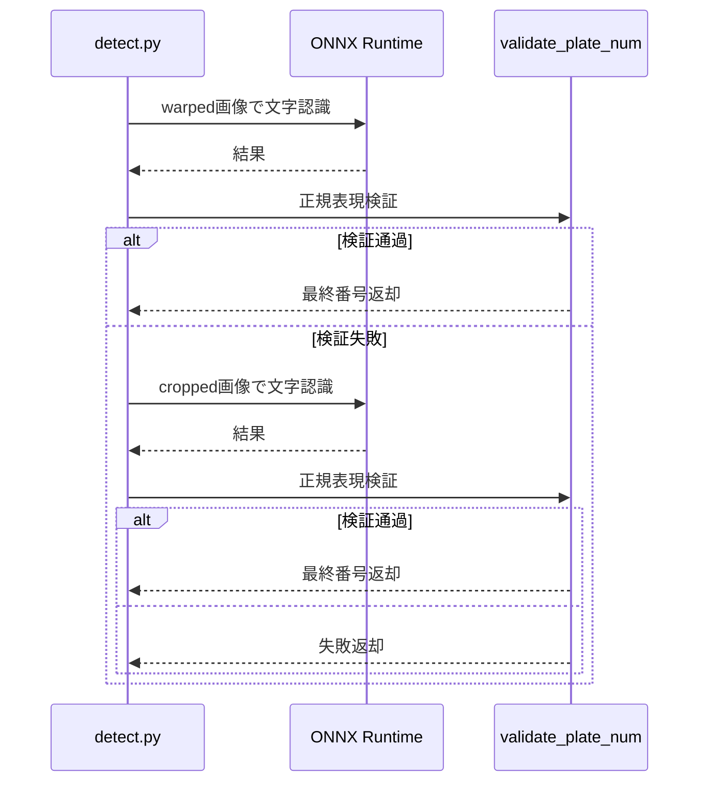

## 問題意識

従来のOCRは、きれいな文書ではよく機能しますが、ナンバープレートのようにぼやけて傾いた画像では弱いです。文字の間隔が不規則であったり、一部が隠れていると認識率が急落します。また、韓国の自動車ナンバープレートは文字の配置が多様で、地域名と数字が混在しているため、一般的なOCRモデルでは限界がありました。

このプロジェクトは、文字をテキストではなくオブジェクトとして見る観点を取りました。YOLOベースのオブジェクト検出で各文字を独立して見つけ、元の画像と補正画像の両方にOCRを実行して二重検証します。NMSと極端点ベースのラインフィッティングで地域名と数字を分離し、従来のOCRが失敗する環境でも堅牢に動作します。

## 3段階パイプライン: 分業の美学

全体の流れは`detect.py`の`get_num()`関数一つで制御します。3つのONNXモデルが各自の専門分野を担当します。

| 段階 | モデル               | 役割                                 |
| ---- | -------------------- | ------------------------------------ |
| 1    | `plate_detect_v1`    | 全体画像からナンバープレート領域検出 |
| 2    | `vertex_detect_v1`   | 四隅を検出後、遠近補正               |
| 3    | `syllable_detect_v1` | 75クラスで個別文字検出               |

最初のモデルは全体画像からナンバープレート領域を一つ見つけます。複数の候補から信頼度が最も高いものを選んでクロップします。2番目のモデルはクロップされた画像から四隅を見つけ、遠近補正を行います。3番目のモデルは75クラスで個別文字をオブジェクトとして検出します。従来のOCRのようにテキストラインを読むのではなく、ナンバープレート内で各文字の位置を見つけるため、文字間隔が不規則であったり一部が隠れていても残りを認識できます。

すべてのモデルはONNX Runtimeで実行され、PyInstallerバイナリにはtorchやultralyticsを含まず、サイズを最小化しました。



## 検証とフォールバック: 安定性と効率のバランス

遠近変換が常に完璧ではありません。四隅検出が失敗したり、傾いたナンバープレートに直面することがあります。

このプロジェクトは**warped画像を優先的にOCR**し、正規表現検証を通過すれば即座に結果を返します。失敗した場合にのみ元のcropped画像でフォールバックして追加OCRを行います。

```python
def get_num(img):
    cropped = plate_detector.detect_and_crop(img)
    warped = vertex_detector.detect_and_warp(cropped)

    # Step 1: warped画像優先OCR
    if warped is not None:
        res = syllable_detector.get_num_from_img(warped)
        result = validate_plate_num(res, mask=False)
        if result:
            return result

    # Step 2: fallback - cropped画像OCR
    if cropped is not None:
        res = syllable_detector.get_num_from_img(cropped)
        result = validate_plate_num(res, mask=False)
        if result:
            return result

    return None

def validate_plate_num(plate_num, mask=True):
    """単一OCR結果に対するregex検証 + mask適用"""
    if plate_num is None:
        plate_num = ''

    m = re.fullmatch(PLATE_REGEX, plate_num)
    if m is None:
        return None

    if mask:
        plate_num = re.search(OUTPUT_REGEX, plate_num).group()

    return plate_num
```

この方式は、warpingが成功すればOCR1回で処理し、失敗したときのみcropped画像でフォールバックします。不要な推論を減らしつつも安定性を維持する設計です。

文字検出後にはNMSで重複バウンディングボックスを除去し、左右の端点を基準に線を引いて地域名と数字領域を分離します。地域名はソウル、京畿、釜山などハードコーディングされた有効地域リストと比較して校正します。



## ユーザーを考慮したGUI設計

バッチ処理中に一部の画像が検出失敗した場合、どうすればよいでしょうか？無視して進めるとデータ品質が低下し、全体を中断すると効率が低下します。

PySide6ベースのGUIは、検出失敗時に自動的に一時停止し、該当画像を画面に表示します。ユーザーが直接ナンバープレート番号を入力し、確認ボタンを押すまで処理を止めます。これは100%カバレッジを達成しつつもバッチ処理の効率を維持するハイブリッドアプローチです。結果はopenpyxlを通じてresult.xlsxに自動保存され、進行状況はプログレスバーで視覚化されます。

## デプロイ: 現場で即使用

PyInstallerで単一実行ファイルを生成します。torch、tensorflow、matplotlibのような大型ライブラリを明示的に除外し、バイナリサイズを最小化しました。すべてのONNXモデルはHugging Face Hubから自動ダウンロードされ、ローカルキャッシュに保存されて再ダウンロードを防ぎます。

GitHub Actionsはv\*タグプッシュ時にLinux、macOS、Windows用リリースを自動でビルドし、GitHub Releasesにアップロードします。ユーザーは解凍してすぐに実行できます。

## トレードオフと設計哲学

YOLOベースの文字検出は不規則な間隔や隠れに強いですが、小さな文字の細かい認識率は従来のOCRより低い可能性があります。これを補うためにwarped画像を優先的にOCRし、正規表現検証を通過すれば即座に返却し、失敗した場合にのみcropped画像でフォールバックするメカニズムを導入しました。NMS閾値0.3は文字間の重なりが多いナンバープレートで重複除去と欠落防止のバランス点です。

GUIのモーダル入力方式はやや古風に見えるかもしれませんが、実際の運用環境で完全自動化が不可能なエッジケースを処理するための実用的選択です。データ品質と処理効率のバランスを取ることがこのプロジェクトの核心哲学です。

## 結びに

このプロジェクトは単なるディープラーニングデモを超え、実際の現場で使用可能なツールを目指しています。3段階モデルパイプラインのモジュール化、warped画像優先処理とフォールバックの安定性、PySide6 GUIの使いやすさ、そしてPyInstallerとGitHub Actionsを活用したクロスプラットフォームデプロイまで、全体ライフサイクルを考慮した設計が際立っています。ナンバープレート認識という狭いドメインでオブジェクト検出の潜在力を最大限に発揮した事例です。
