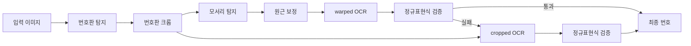
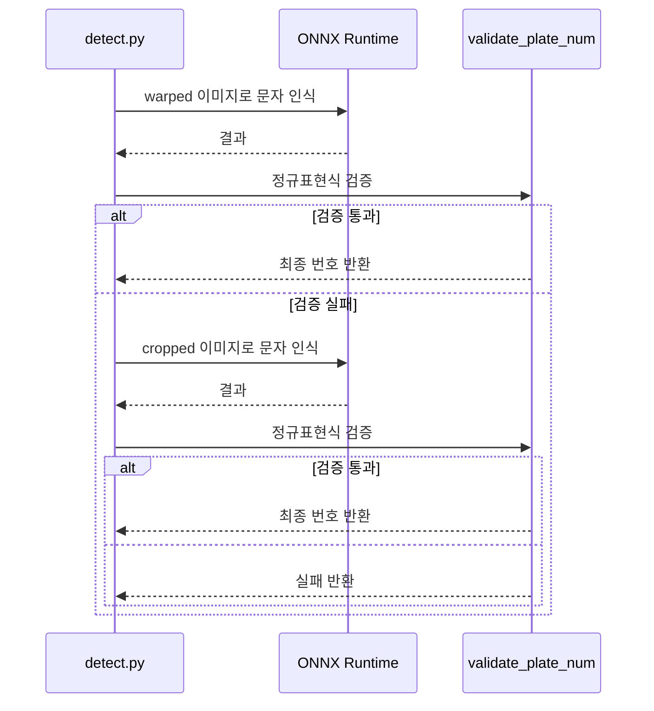

## 문제의식

전통적인 OCR은 깔끔한 문서에서는 잘 작동하지만
번호판처럼 흐릿하고 기울어진 이미지에서는 취약합니다.
문자 간격이 불규칙하거나 일부가 가려지면 인식률이 급락하죠.
또한 한국 자동차 번호판은 문자들의 배열이 다양하고
지역명과 숫자가 혼합되어 있어 일반적인 OCR 모델로는 한계가 있었습니다.

이 프로젝트는 문자를 텍스트가 아닌 객체로 보는 관점을 취했습니다.
YOLO 기반 객체 탐지로 각 문자를 독립적으로 찾고
원본과 보정 이미지 두 버전에 각각 OCR을 수행하여 이중 검증합니다.
NMS와 극단점 기반 라인 피팅으로 지역명과 숫자를 분리하며
전통 OCR이 실패하는 환경에서도 견고하게 작동합니다.

## 3단계 파이프라인: 분업의 미학

전체 흐름은 `detect.py`의 `get_num()` 함수 하나로 제어합니다.
세 개의 ONNX 모델이 각자의 전문 분야를 담당합니다.

| 단계 | 모델                 | 역할                             |
| ---- | -------------------- | -------------------------------- |
| 1    | `plate_detect_v1`    | 전체 이미지에서 번호판 영역 탐지 |
| 2    | `vertex_detect_v1`   | 네 모서리 탐지 후 원근 보정      |
| 3    | `syllable_detect_v1` | 75개 클래스로 개별 문자 탐지     |

첫 번째 모델은 전체 이미지에서 번호판 영역 하나를 찾습니다.
여러 후보 중 신뢰도가 가장 높은 것을 선택해 크롭합니다.
두 번째 모델은 크롭된 이미지에서 네 모서리를 찾아
원근 보정을 수행합니다.
세 번째 모델은 75개 클래스로 개별 문자를 객체로 탐지합니다.
전통 OCR처럼 텍스트 라인을 읽는 것이 아니라
번호판 내에서 각 문자의 위치를 찾기 때문에
문자 간격이 불규칙하거나 일부가 가려져도
나머지는 인식할 수 있습니다.

모든 모델은 ONNX Runtime으로 실행되며
PyInstaller 바이너리에는 torch나 ultralytics를 포함하지 않아
크기를 최소화했습니다.



## 검증과 fallback: 안정성과 효율의 균형

원근 변환이 항상 완벽하지는 않습니다.
모서리 탐지가 실패하거나 기울어진 번호판을 마주할 수 있습니다.

이 프로젝트는 **warped 이미지를 우선적으로 OCR**하고,
정규표현식 검증을 통과하면 즉시 결과를 반환합니다.
실패할 경우에만 원본 cropped 이미지로 fallback하여
추가 OCR을 수행합니다.

```python
def get_num(img):
    cropped = plate_detector.detect_and_crop(img)
    warped = vertex_detector.detect_and_warp(cropped)

    # Step 1: warped 이미지 우선 OCR
    if warped is not None:
        res = syllable_detector.get_num_from_img(warped)
        result = validate_plate_num(res, mask=False)
        if result:
            return result

    # Step 2: fallback - cropped 이미지 OCR
    if cropped is not None:
        res = syllable_detector.get_num_from_img(cropped)
        result = validate_plate_num(res, mask=False)
        if result:
            return result

    return None

def validate_plate_num(plate_num, mask=True):
    """단일 OCR 결과에 대해 regex 검증 + mask 적용"""
    if plate_num is None:
        plate_num = ''

    m = re.fullmatch(PLATE_REGEX, plate_num)
    if m is None:
        return None

    if mask:
        plate_num = re.search(OUTPUT_REGEX, plate_num).group()

    return plate_num
```

이 방식은 warping이 성공하면 OCR 1회로 처리하고,
실패할 때만 cropped 이미지로 fallback합니다.
불필요한 추론을 줄이면서도 안정성을 유지하는 설계입니다.

문자 탐지 후에는 NMS로 중복 바울딩 박스를 제거하고,
좌우 끝점을 기준으로 선을 그어
지역명과 숫자 영역을 분리합니다.
지역명은 서울, 경기, 부산 등
하드코딩된 유효 지역 목록과 비교하여 교정합니다.



## 사용자를 배려한 GUI 설계

배치 처리 중 일부 이미지가 검출 실패하면 어떻게 해야 할까요?
무시하고 넘어가면 데이터 품질이 떨어지고
전체를 중단하면 효율성이 떨어집니다.

PySide6 기반 GUI는 검출 실패 시 자동으로 일시 정지하고
해당 이미지를 화면에 보여줍니다.
사용자가 직접 번호판 번호를 입력하고
확인 버튼을 누를 때까지 처리를 멈춥니다.
이는 100% 커버리지를 달성하면서도
배치 처리의 효율성을 유지하는 하이브리드 접근법입니다.
결과는 openpyxl을 통해 result.xlsx로 자동 저장되며
진행 상황은 프로그레스 바로 시각화됩니다.

## 배포: 현장에서 바로 쓰기

PyInstaller로 단일 실행 파일을 생성합니다.
torch, tensorflow, matplotlib 같은 대형 라이브러리를
명시적으로 제외해 바이너리 크기를 최소화했습니다.
모든 ONNX 모델은 Hugging Face Hub에서 자동 다운로드되며
로컬 캐시에 저장되어 재다운로드를 방지합니다.

GitHub Actions는 v\* 태그 푸시 시
Linux, macOS, Windows용 릴리스를 자동으로 빌드하여
GitHub Releases에 업로드합니다.
사용자는 압축을 풀고 바로 실행할 수 있습니다.

## 트레이드오프와 설계 철학

YOLO 기반 문자 탐지는 불규칙한 간격과 가림에 강하지만
작은 문자의 세밀한 인식률은 전통 OCR보다 낮을 수 있습니다.
이를 보완하기 위해 warped 이미지를 우선적으로 OCR하고
정규표현식 검증을 통과하면 즉시 반환하며,
실패할 경우에만 cropped 이미지로 fallback하는 메커니즘을 도입했습니다.
NMS 임계값 0.3은 문자 간 겹침이 많은 번호판에서
중복 제거와 누락 방지의 균형점입니다.

GUI의 모달 입력 방식은 다소 구식으로 보일 수 있지만
실제 운영 환경에서 완전 자동화가 불가능한
엣지 케이스를 처리하기 위한 실용적 선택입니다.
데이터 품질과 처리 효율성의 균형을 맞추는 것이
이 프로젝트의 핵심 철학입니다.

## 마치며

이 프로젝트는 단순한 딥러닝 데모를 넘어
실제 현장에서 사용 가능한 도구를 지향합니다.
3단계 모델 파이프라인의 모듈화, warped 이미지 우선 처리와 fallback의 안정성,
PySide6 GUI의 사용성,
그리고 PyInstaller와 GitHub Actions를 활용한
크로스 플랫폼 배포까지 전체 라이프사이클을 고려한 설계가 돋보입니다.
번호판 인식이라는 좁은 도메인에서
객체 탐지의 잠재력을 최대한 발휘한 사례입니다.
