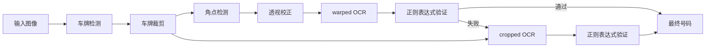
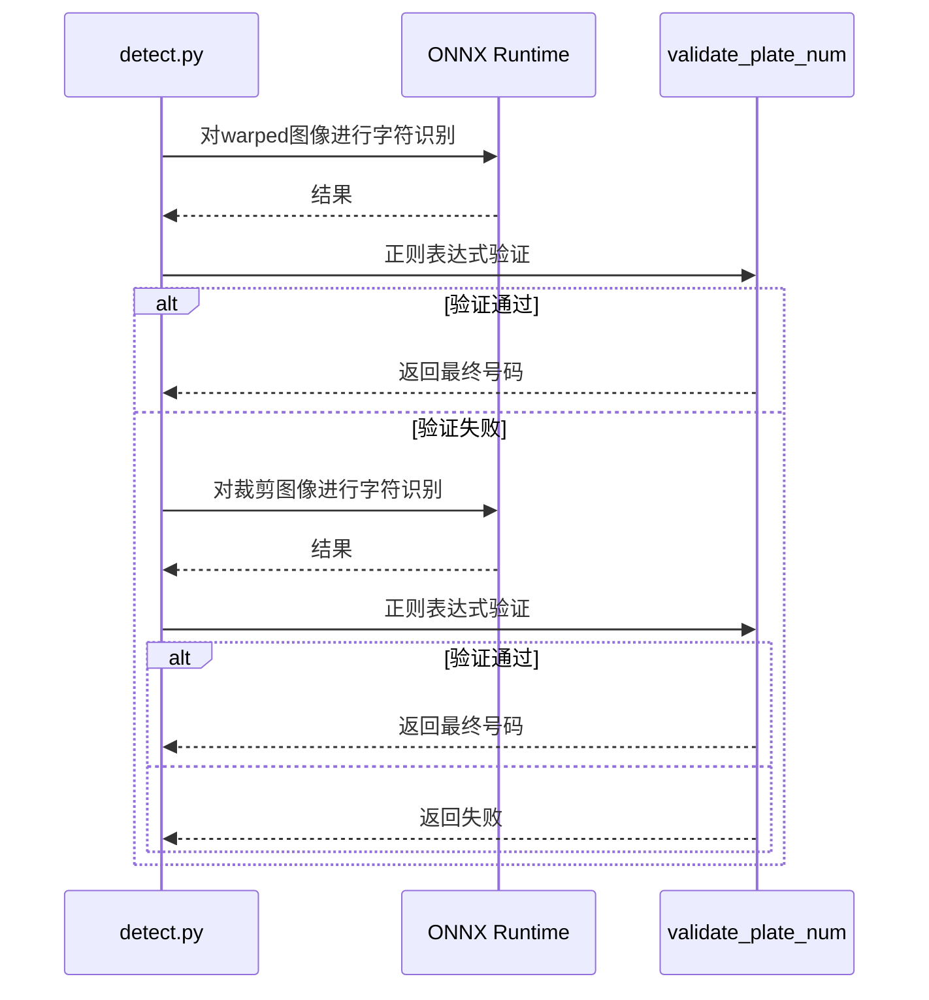

## 问题意识

传统的OCR在清晰的文档上表现良好，但在模糊和倾斜的车牌图像上则显得脆弱。当字符间距不规则或部分被遮挡时，识别率急剧下降。此外，韩国汽车车牌的字符排列多样，且混合了地区名和数字，这对一般的OCR模型来说是一个挑战。

本项目采用了将字符视为对象而非文本的视角。通过基于YOLO的对象检测独立识别每个字符，并对原始和校正图像分别进行OCR以进行双重验证。通过NMS和极端点线拟合分离地区名和数字，即使在传统OCR失效的环境中也能稳健运行。

## 三阶段流水线：分工的美学

整个流程由`detect.py`中的`get_num()`函数控制。三个ONNX模型各司其职。

| 阶段 | 模型                 | 角色                       |
| ---- | -------------------- | -------------------------- |
| 1    | `plate_detect_v1`    | 从整体图像中检测车牌区域   |
| 2    | `vertex_detect_v1`   | 检测四个角点后进行透视校正 |
| 3    | `syllable_detect_v1` | 以75个类别检测单个字符     |

第一个模型从整体图像中找到一个车牌区域。从多个候选中选择置信度最高的进行裁剪。第二个模型从裁剪的图像中找到四个角点并进行透视校正。第三个模型以75个类别检测单个字符。与传统OCR读取文本行不同，它在车牌内找到每个字符的位置，因此即使字符间距不规则或部分被遮挡，其他字符仍可识别。

所有模型均通过ONNX Runtime执行，PyInstaller二进制文件不包含torch或ultralytics，以最小化大小。



## 验证与回退：稳定性与效率的平衡

透视变换并不总是完美的。角点检测可能失败或遇到倾斜的车牌。

本项目**优先对warped图像进行OCR**，若通过正则表达式验证则立即返回结果。若失败，仅在此时对原始裁剪图像进行回退OCR。

```python
def get_num(img):
    cropped = plate_detector.detect_and_crop(img)
    warped = vertex_detector.detect_and_warp(cropped)

    # Step 1: 优先对warped图像进行OCR
    if warped is not None:
        res = syllable_detector.get_num_from_img(warped)
        result = validate_plate_num(res, mask=False)
        if result:
            return result

    # Step 2: 回退 - 对裁剪图像进行OCR
    if cropped is not None:
        res = syllable_detector.get_num_from_img(cropped)
        result = validate_plate_num(res, mask=False)
        if result:
            return result

    return None

def validate_plate_num(plate_num, mask=True):
    """对单个OCR结果进行正则验证+掩码应用"""
    if plate_num is None:
        plate_num = ''

    m = re.fullmatch(PLATE_REGEX, plate_num)
    if m is None:
        return None

    if mask:
        plate_num = re.search(OUTPUT_REGEX, plate_num).group()

    return plate_num
```

这种方法在warping成功时仅需一次OCR处理，失败时才对裁剪图像进行回退。设计上减少了不必要的推理，同时保持了稳定性。

字符检测后，通过NMS去除重复边界框，并根据左右端点绘制线条分离地区名和数字区域。地区名与硬编码的有效地区列表（如首尔、京畿、釜山等）进行比较以进行校正。



## 以用户为中心的GUI设计

批处理过程中如果某些图像检测失败该怎么办？忽略会降低数据质量，停止整个过程则降低效率。

基于PySide6的GUI在检测失败时自动暂停并显示该图像。处理会暂停，直到用户手动输入车牌号码并点击确认按钮。这是一种在实现100%覆盖率的同时保持批处理效率的混合方法。结果通过openpyxl自动保存为result.xlsx，进度通过进度条可视化。

## 部署：现场即用

通过PyInstaller生成单个可执行文件。显式排除torch、tensorflow、matplotlib等大型库以最小化二进制文件大小。所有ONNX模型从Hugging Face Hub自动下载，并存储在本地缓存中以防止重新下载。

GitHub Actions在推送v\*标签时自动构建Linux、macOS、Windows版本并上传到GitHub Releases。用户只需解压即可运行。

## 权衡与设计哲学

基于YOLO的字符检测在不规则间距和遮挡方面表现强劲，但对小字符的细节识别率可能低于传统OCR。为弥补这一点，采用了优先对warped图像进行OCR并通过正则表达式验证后立即返回的机制，失败时才对裁剪图像进行回退。NMS阈值0.3在字符重叠较多的车牌中实现了去重和防止遗漏的平衡。

GUI的模态输入方式可能显得有些过时，但在实际操作环境中处理无法完全自动化的边缘情况时是一个实用选择。平衡数据质量和处理效率是本项目的核心哲学。

## 结语

本项目不仅仅是一个简单的深度学习演示，而是一个旨在实际场景中可用的工具。三阶段模型流水线的模块化设计、优先处理warped图像和回退的稳定性、PySide6 GUI的可用性，以及利用PyInstaller和GitHub Actions实现的跨平台部署，展示了对整个生命周期的全面考虑。这是一个在车牌识别这一狭窄领域中充分发挥对象检测潜力的案例。
