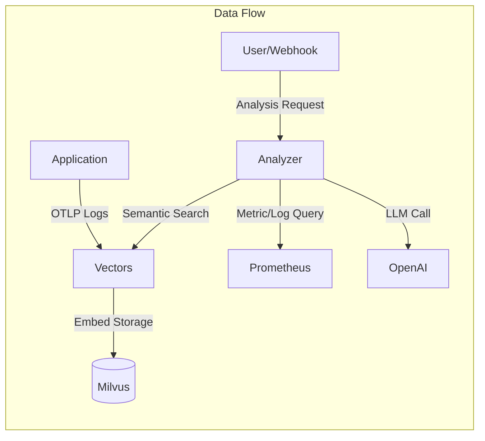
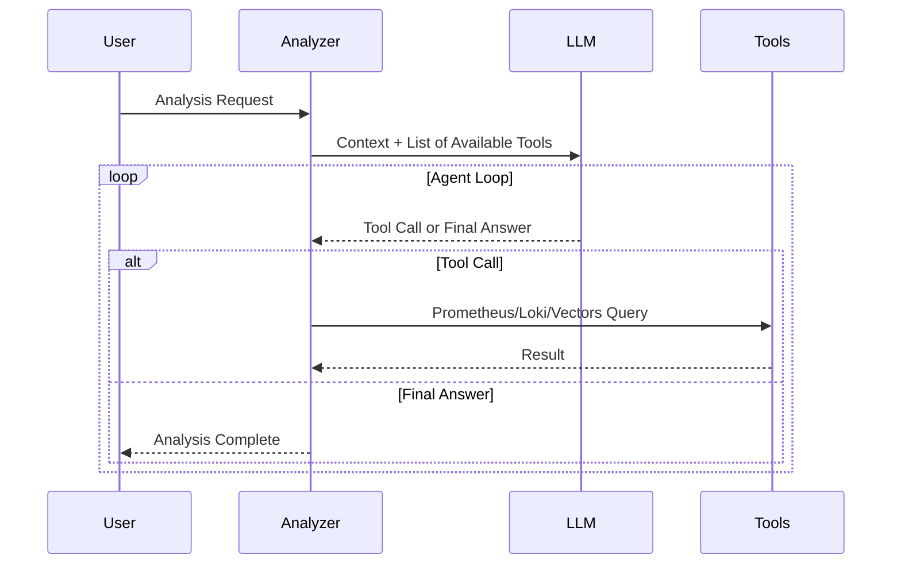

## Problem Awareness

A PagerDuty alert rings in the middle of the night. "CPU exceeds 90%."
You wake up and check the dashboard, only to find that a batch job running since yesterday is the cause, and it will automatically decrease in 30 minutes.
Accumulating such false alerts can desensitize you when a real issue arises.

Meerkat was initiated to fundamentally solve this problem.
Instead of rule-based alerts, an AI Agent directly reads logs and metrics, calls tools like Prometheus and Loki, and infers the cause.
Logs are vectorized for semantic search and stored, and the system is divided into two independently scalable services: Analyzer and Vectors.

## Core Design: Two Services, Two Responsibilities

Meerkat consists of two services: Analyzer and Vectors.
This separation is an intentional design.

**Vectors** focuses solely on meaningfully storing logs.
Logs coming in via OpenTelemetry OTLP are deduplicated through template extraction and stored as vectors in Milvus after OpenAI embedding.
Even if a service logs tens of thousands of entries a day, only a few dozen unique templates are vectorized, significantly improving storage costs and search efficiency.

**Analyzer** focuses solely on AI analysis and worker management.
It processes requests via HTTP API in an asynchronous worker pool and requests semantic searches from Vectors if necessary.
The two services communicate via gRPC and can scale out independently.

### The Effect of Template Extraction

Template extraction is a key technology for removing log duplication.
For example, "User 123 logged in" and "User 456 logged in" are extracted as the same template "User \* logged in."
This maintains log diversity while significantly reducing the number of unique items to be vectorized.

The template extraction method is as follows:

| Filter Mode            | Operation                        | Use Case                               |
| ---------------------- | -------------------------------- | -------------------------------------- |
| **all**                | Vectorize all logs               | Small-scale service, dev env           |
| **severity**           | Process only above a level       | Production, error-focused              |
| **template** (default) | Deduplicate with Drain algorithm | Large-scale service, cost optimization |

Three modes are provided to choose according to service scale and requirements.
The all mode vectorizes all logs but is costly,
the severity mode processes only important logs like errors or warnings to reduce costs.
The template mode extracts logs into templates using the Drain algorithm to maximize storage space and search efficiency.

## What It Means for AI to Use Tools

The core of Analyzer is to provide tools to the LLM and let it use them autonomously.
It offers four tools: Prometheus, Loki, VictoriaLogs queries, and Vectors semantic search.

When a request like "Analyze the error spike" comes in, the flow is as follows.
First, it searches for recent error logs of the service in Vectors,
checks the error rate trend in Prometheus,
analyzes the frequency of specific error messages in Loki,
and synthesizes to conclude something like "Error spike due to Redis connection timeout, started at 14:23 and auto-recovered at 14:45."

Tool results are limited to 30,000 characters,
and errors are classified into query syntax errors, connection failures, and query failures.
The LLM makes judgments like "This query is wrong, let's fix it and retry" or "Prometheus is unresponsive, let's switch to Loki."

## Considerations in Production Environment

The worker pool is configured with a buffered channel size of 1000 and 10 workers.
If the queue is full, a 429 error is immediately returned to provide backpressure.
Duplicate analyses for the same trigger and query are automatically blocked within a 5-minute window.

Deployment is managed with Helm Chart,
with ConfigMap storing configurations and system prompts,
and Secret storing API keys and DB passwords separately.
However, since the worker pool's queue is an in-memory channel,
queued tasks are lost upon server restart.
There are plans to apply a persistent queue in the future.

## Conclusion

Meerkat has gone beyond merely calling LLM APIs.
By combining an AI Agent architecture that uses tools, semantic-based log search, and an asynchronous worker pool,
we have created a platform usable in real operational environments.
For teams hitting the limits of rule-based alerts,
it offers a new infrastructure visibility where infrastructure situations can be understood with a single natural language phrase.
This is the value this project aims to pursue.
