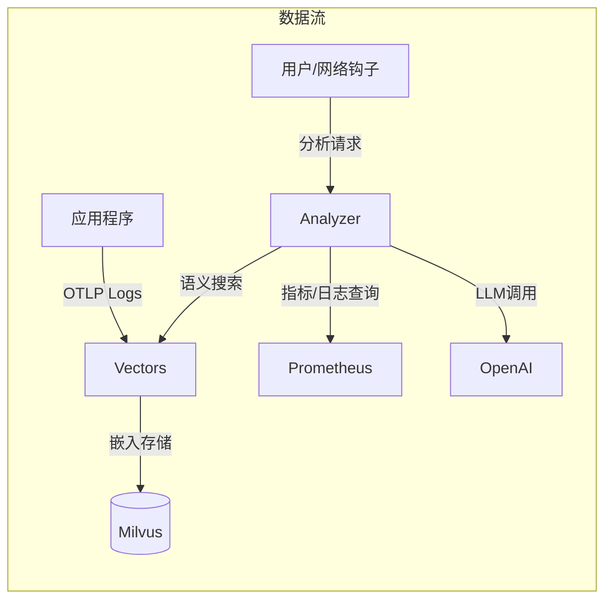
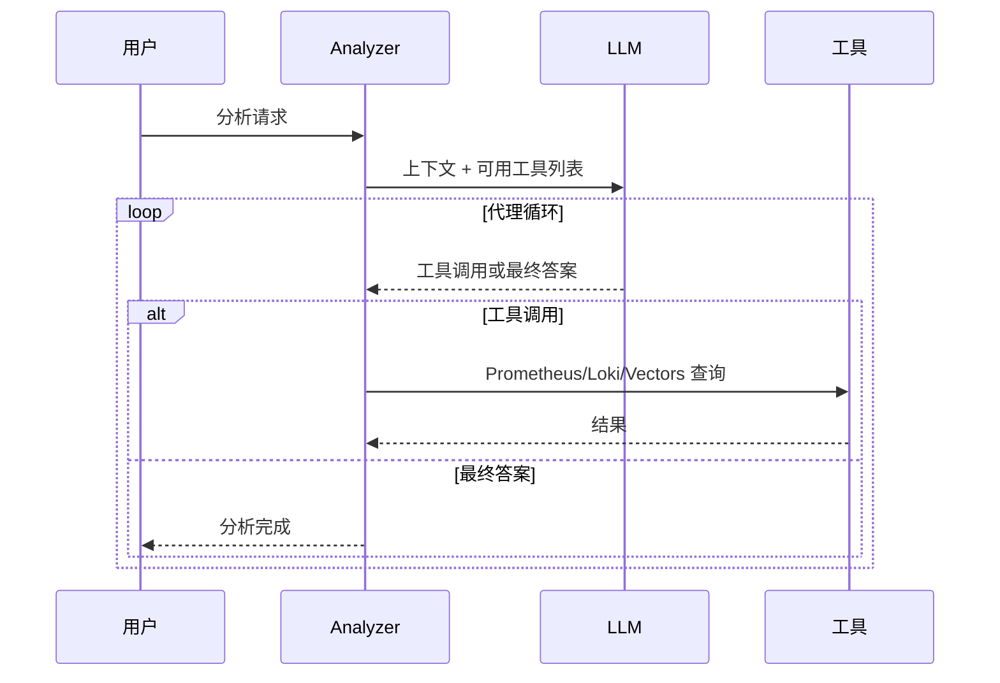

## 问题意识

深夜响起的PagerDuty警报。"CPU超过90%"。
从睡梦中醒来查看仪表板，发现是从昨天开始运行的批处理作业导致的，
预计30分钟后会自动下降。
这样的虚假警报积累起来会导致在真正出现问题时变得迟钝。

Meerkat旨在从根本上解决这个问题。
取代基于规则的警报，AI代理直接读取日志和指标，
调用Prometheus、Loki等工具推断原因。
日志被矢量化以便进行语义搜索存储，
并分为Analyzer和Vectors两个服务以独立扩展。

## 核心设计：两个服务，两种责任

Meerkat由Analyzer和Vectors两个服务组成。
这种分离是有意的设计。

**Vectors**专注于接收日志并有意义地存储。
通过OpenTelemetry OTLP接收的日志进行模板提取以消除重复，
通过OpenAI嵌入存储为Milvus中的矢量。
即使一个服务每天留下数万条日志，实际上只有几十个唯一模板被矢量化，
因此存储成本和搜索效率大大提高。

**Analyzer**专注于AI分析和工作管理。
通过HTTP API接收请求，在异步工作池中处理，
必要时请求Vectors进行语义搜索。
两个服务通过gRPC通信，并且可以各自独立扩展。

### 模板提取的效果

模板提取是消除日志重复的核心技术。
例如，“User 123 logged in”和“User 456 logged in”被提取为相同的模板“User \* logged in”。
这样可以在保持日志多样性的同时，大大减少需要矢量化的唯一项的数量。

模板提取方式如下：

| 过滤模式            | 操作                  | 使用案例               |
| ------------------- | --------------------- | ---------------------- |
| **all**             | 矢量化所有日志        | 小规模服务，开发环境   |
| **severity**        | 仅处理指定级别以上    | 运营环境，错误中心监控 |
| **template** (默认) | 使用Drain算法消除重复 | 大规模服务，成本优化   |

提供3种模式以便根据服务规模和需求进行选择。
all模式矢量化所有日志，但成本较高，
severity模式仅处理错误或警告等重要日志以降低成本。
template模式使用Drain算法将日志提取为模板，最大化存储空间和搜索效率。

## AI使用工具的意义

Analyzer的核心是为LLM提供工具并让其自行使用。
提供Prometheus、Loki、VictoriaLogs查询和Vectors语义搜索四种工具。

当收到“分析错误峰值”的请求时，流程如下。
首先在Vectors中搜索该服务的最近错误日志，
然后在Prometheus中查看错误率趋势，
最后在Loki中分析特定错误消息的频率。
综合得出“由于Redis连接超时导致的错误峰值，
于14:23开始，14:45自动恢复”等结论。

工具结果限制在3万字符，
错误分为查询语法错误、连接失败、查询失败。
让LLM做出“这是我的查询错误，修正后重试”或
“Prometheus无响应，转向Loki”等判断。

## 运营环境中的考虑

工作池由缓冲通道大小1000，10个工作者组成。
队列满时立即返回429错误以提供背压。
相同触发器和查询的重复分析在
5分钟窗口内自动阻止。

部署由Helm Chart管理，
ConfigMap中存储设置和系统提示，
Secret中分离存储API密钥和数据库密码。
但工作池的队列是内存通道，
服务器重启时排队的任务会丢失。
未来计划应用持久性队列。

## 结语

Meerkat不仅仅是调用LLM API。
结合使用工具的AI代理架构和基于语义的日志搜索，
异步工作池，打造了可在实际运营环境中使用的平台。
为遇到基于规则警报瓶颈的团队提供
通过自然语言一句话了解基础设施状况的新型基础设施可视性，
这正是该项目追求的价值。
