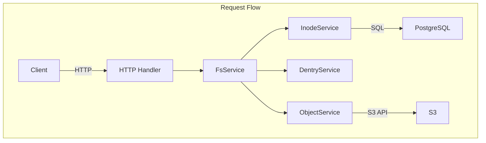
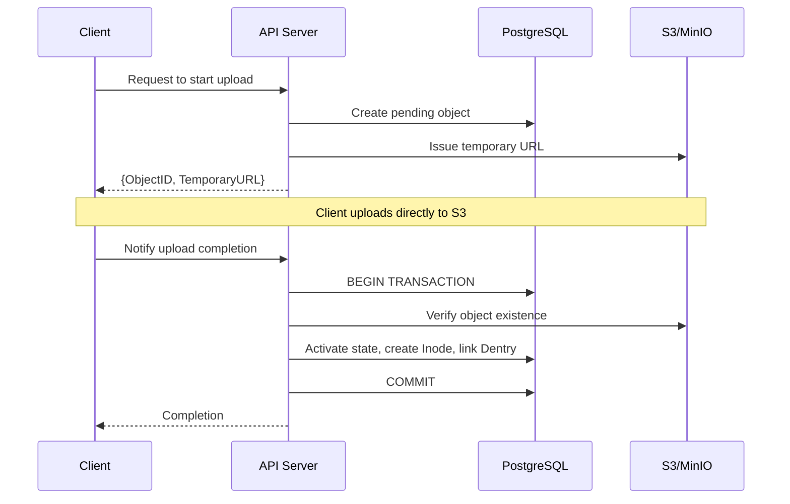

## Problem Awareness

S3 offers excellent durability and scalability, but it remains complex for developers to handle directly. It lacks directories, has coarse-grained permission management, and requires manual implementation for large file uploads.

Retrowin is a system that provides a POSIX filesystem interface while maintaining the scalability of S3. By storing inodes and dentries as JSON in PostgreSQL, it allows directory lookups without joins and efficiently handles large files with a two-step upload based on temporary URLs. Additionally, it incorporates a retro UI in the style of Windows XP, pursuing both technical challenges and fun.

## Core Design: Modern Reinterpretation of Inode and Dentry

The biggest design question was "How to represent the hierarchical structure of a filesystem in a relational DB?" We borrowed the concepts of inode and dentry from Linux but reinterpreted them in a modern way.

The Inode table stores file metadata, and Dentry manages the mapping of file names and Inode IDs within directories. An interesting decision was to store Dentry as JSON in the content column of Inode rather than a separate table. This allows directory lookups by reading only a single row without joins, reducing latency and leveraging PostgreSQL's JSONB indexing. The downside is that the entire JSON must be rewritten when modifying a directory, but this overhead is minimal as most directories contain fewer than hundreds of files.



## Large File Upload: Temporary URL and Atomic Completion

Proxying files through the server to S3 can create bandwidth and memory bottlenecks. Retrowin solves this problem with a two-step upload based on temporary URLs.

When a client requests an upload, the server creates a pending record in the DB and issues a temporary S3 URL. The client uploads directly to S3 using this URL. Upon completion, the server is notified, and it atomically verifies S3 existence, transitions the state to active, creates an Inode, and links a Dentry within a PostgreSQL transaction. It also supports idempotency keys to reuse existing records on retrying the same upload request.



### Core of Atomic Upload

```go
func (s *FsService) AtomicUpload(ctx context.Context, objectID string) error {
    return s.db.WithTx(ctx, func(tx *sql.Tx) error {
        // 1. Verify S3 object existence
        if err := s.s3.HeadObject(objectID); err != nil {
            return err
        }
        // 2. Activate state
        if err := s.objectSvc.CompleteUpload(ctx, tx, objectID); err != nil {
            return err
        }
        // 3. Create Inode + Link Dentry
        inode, err := s.inodeSvc.Create(ctx, tx, objectID)
        if err != nil {
            return err
        }
        return s.dentrySvc.Link(ctx, tx, inode)
    })
}
```

All operations are performed atomically within the transaction, ensuring no data inconsistency even if a failure occurs midway.

## Authentication and Authorization: Following Standards

In a filesystem, permission management is crucial. We use Keycloak as an OIDC provider to follow standardized authentication flows. By applying PKCE, we ensure secure authentication for both mobile and desktop clients, and the OIDC client is lazily initialized so that server startup isn't halted if Keycloak is temporarily down.

File permissions follow the standard Unix permission bits. Read/write/execute permissions are controlled for the owner, group, and other users, with root having permission for all operations.

| Principal | Read | Write | Execute |
| --------- | ---- | ----- | ------- |
| Owner     | ✅   | ✅    | ✅      |
| Group     | ✅   | ❌    | ✅      |
| Other     | ❌   | ❌    | ❌      |

## Garbage Collection

Over time, there can be pending files that haven't completed uploading or orphaned records remaining in the DB after deletion from S3. A Kubernetes CronJob performs a two-step cleanup every day at 3 AM. First, it removes expired pending objects older than 24 hours, then it cleans up orphaned objects marked as active in the DB but not existing in S3.

## Trade-offs and Lessons Learned

JSON-based Dentry enhances lookup performance, but the in-memory lock for concurrent directory modifications limits horizontal scalability. Additionally, resolving symbolic links is recursive without cycle detection, making it vulnerable to link loops. However, these trade-offs are acceptable in single-user or small team environments, and the operational simplicity offers greater benefits.

## Conclusion

Retrowin is an intriguing experiment that combines the scalability of object storage with the familiarity of a POSIX filesystem. It incorporates elements like atomic uploads, OIDC authentication, and GC, considering real-world operational environments while actively utilizing modern tools from the Go ecosystem like Ent ORM and ogen. The retro UI reflects the project's identity of pursuing both technical challenges and fun.
