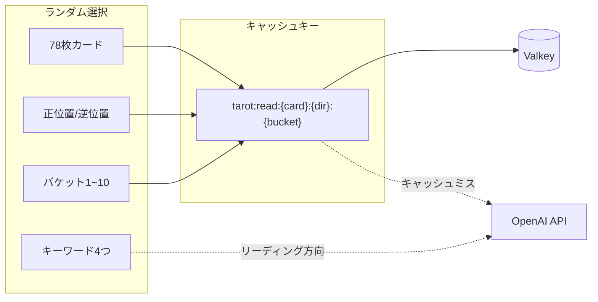
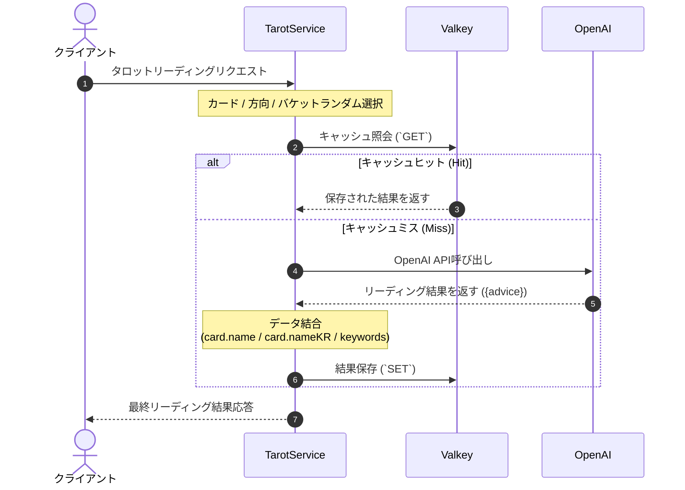
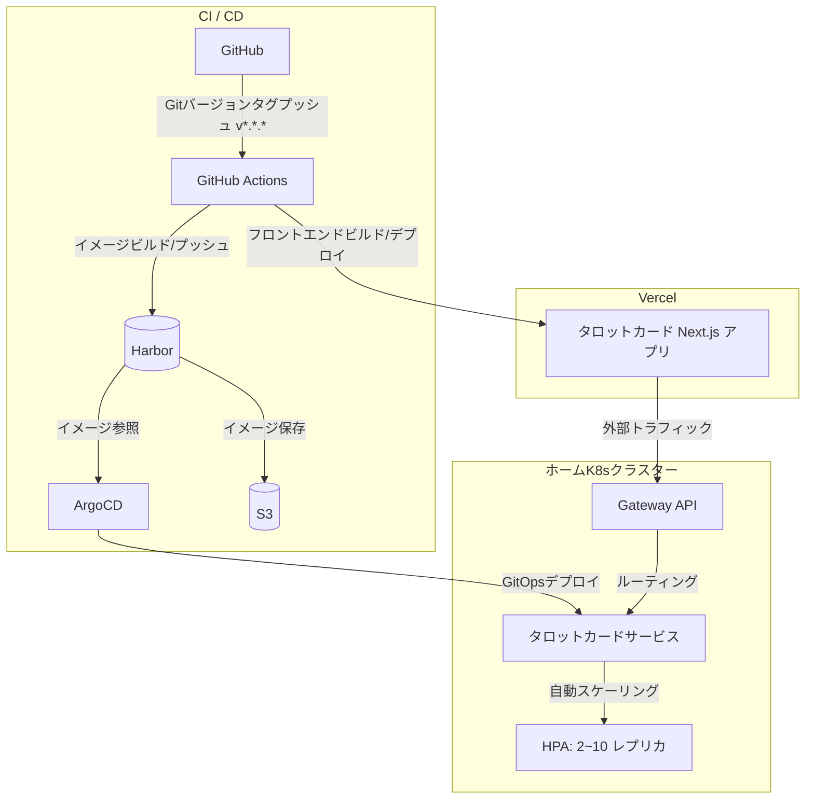

## 問題意識

AIが生成するコンテンツは毎回新しいという点が利点ですが、同じ入力に対して毎回APIを呼び出すとコストがすぐに積み上がります。タロットカードサービスも同様です。カードリーディングのためにOpenAI APIを使用していますが、コストと応答速度の問題からすべてのリクエストにAPIを呼び出すのは現実的ではありません。

とはいえ、単純にカードと方向だけをキーとするキャッシュでは不十分です。ユーザーは同じカードを引いても毎回異なるリーディングを期待するからです。このギャップを埋めるために導入したのが**バケットシステムを活用したキャッシュ戦略**です。

---

## バケット: 多様性と効率のバランス

核心となるアイデアはシンプルです。78枚のカード、正位置/逆位置、そして10個のバケットを組み合わせて**1,560個のユニークなキャッシュキー**を作り、各キーに対してAIが生成したリーディングを保存しておくというものです。

```
78枚 × 2方向 × 10バケット = 1,560個のユニークな組み合わせ
```

ユーザーがリクエストするたびにこの組み合わせの中から一つがランダムに選ばれます。キャッシュキーは`tarot:read:{card}:{direction}:{bucket}`の形式で、同じキーで入ってくる後続のリクエストはValkeyから即座に返されます。キャッシュにない場合のみOpenAI APIを呼び出します。

ここにもう一つ仕掛けを加えました。サーバーはリクエストごとにキーワード4つをランダムに選んでAIに文脈として一緒に渡します。これにより、同じカードと方向、バケットでもキーワードによって異なるリーディングが生まれる可能性があります。



全体の流れをシーケンス図で表すと次のようになります。



---

## デプロイ

フロントエンドはVercelで、バックエンドはホームKubernetesクラスターで運用します。



デプロイパイプラインはGitHubに**新しいバージョンタグ(`v*.*.*`)がプッシュされると即座に**自動で開始されます。GitHub Actionsがそのタグを基にイメージをビルドし、インハウスコンテナレジストリであるHarborにプッシュすると、ArgoCDがGitOps設定を通じて変更を検知し、クラスターの状態を自動で同期します。また、フロントエンドはGitHub ActionsからVercelへ直接ビルドおよびデプロイが行われます。

バックエンドはHPAを通じてトラフィックに応じて2~10個のレプリカに自動スケーリングされ、外部からのユーザーのリクエストは内部Gateway APIへ安全にルーティングされます。

---

## 改善の余地

現在はログインなしで誰でも利用できる簡単なサービスですが、ログイン機能を追加し、ユーザーごとのリーディング履歴保存とパーソナライズされた体験を提供することも構想中です。

---

## 結びに

タロットカードサービスは小さなプロジェクトですが、AI生成とキャッシュのバランスという実質的な問題を解決していく過程が含まれています。バケットシステムを活用したキャッシュ戦略は、コストと多様性の間で現実的な妥協点を提供し、今後の改善の余地も十分に残されています。
