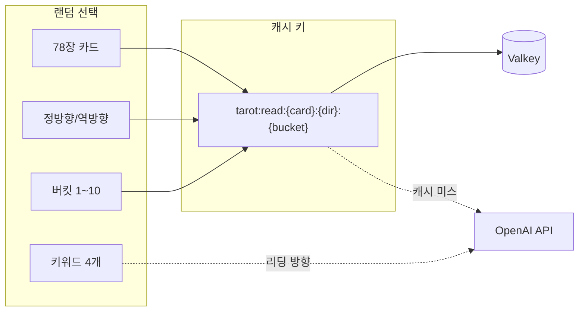
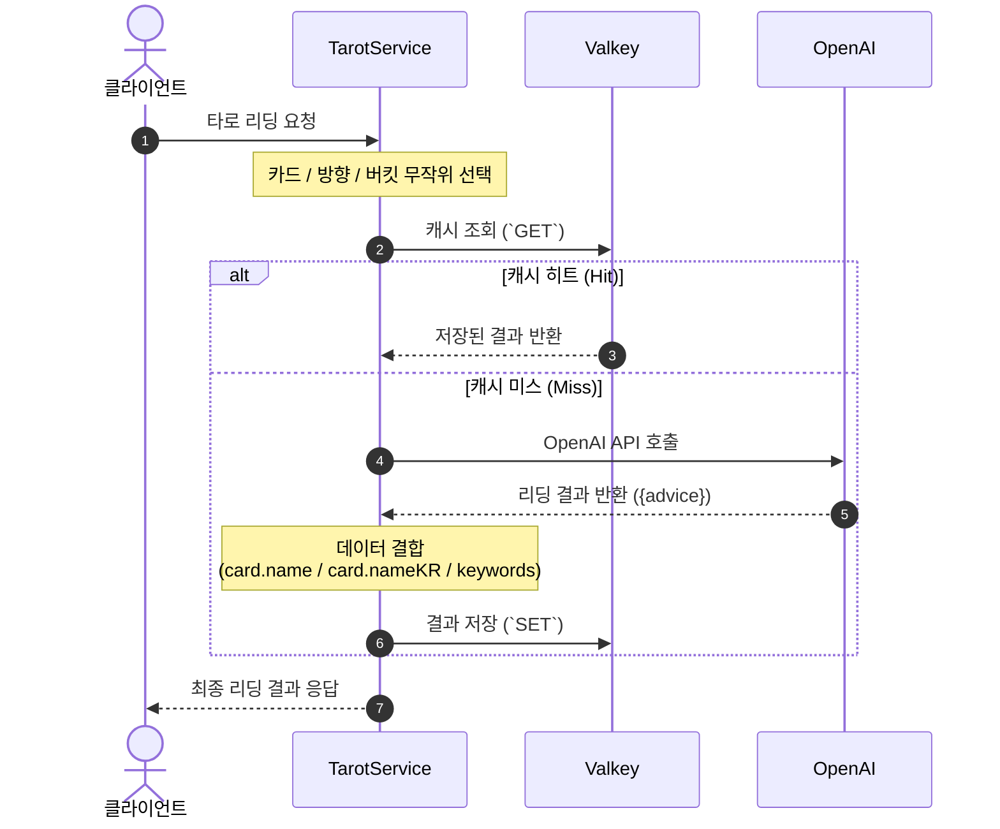
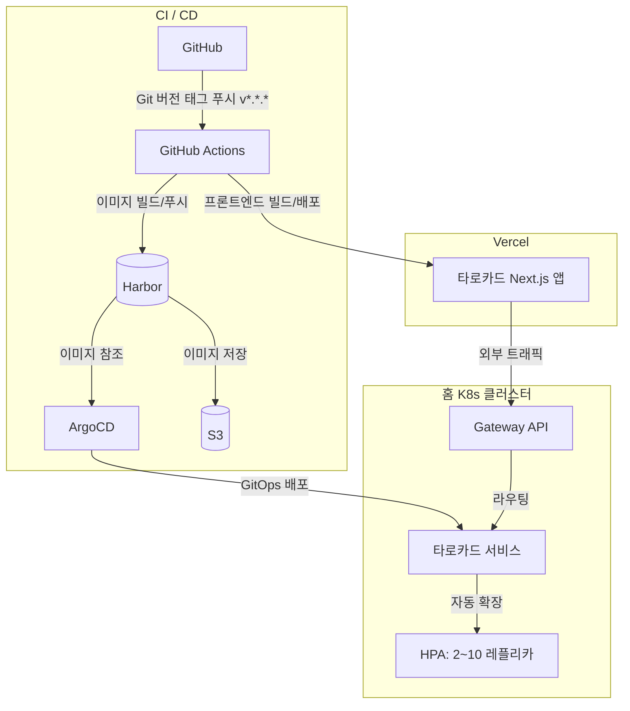

## 문제의식

AI가 생성하는 콘텐츠는 매번 새롭다는 게 장점이지만, 같은 입력에 대해 매번 API를 호출하다 보면 비용이 금세 쌓입니다. 타로카드 서비스도 마찬가지입니다.
카드 리딩을 위해 OpenAI API를 사용하고 있지만, 비용과 응답 속도 문제 때문에 모든 요청에 API를 호출하는 건 현실적이지 않습니다.

그렇다고 단순히 카드와 방향만을 키로 삼는 캐시로는 부족합니다. 사용자는 같은 카드를 뽑더라도 매번 다른 리딩을 기대하기 때문입니다.
이 간극을 좁히기 위해 도입한 것이 **버킷 시스템을 활용한 캐싱 전략**입니다.

---

## 버킷: 다양성과 효율의 균형

핵심 아이디어는 간단합니다. 78장의 카드, 정방향/역방향, 그리고 10개의 버킷을 조합해 **1,560개의 고유 캐시 키**를 만들고, 각 키에 대해 AI가 생성한 리딩을 저장해 두는 것입니다.

```
78장 × 2방향 × 10버킷 = 1,560개 고유 조합

```

사용자가 요청할 때마다 이 조합 중 하나가 무작위로 선택됩니다. 캐시 키는 `tarot:read:{card}:{direction}:{bucket}` 형태이며, 동일한 키로 들어오는 후속 요청은 Valkey에서 즉시 반환됩니다.
캐시에 없을 때만 OpenAI API를 호출합니다.

여기에 한 가지 장치를 더했습니다. 서버는 요청마다 키워드 4개를 무작위로 선택해 AI에게 맥락으로 함께 전달합니다.
덕분에 같은 카드와 방향, 버킷이라도 키워드에 따라 결이 다른 리딩이 나올 수 있습니다.



전체 흐름을 시퀀스 다이어그램으로 나타내면 다음과 같습니다.



---

## 배포

프론트엔드는 Vercel로, 백엔드는 홈 Kubernetes 클러스터에서 운영합니다.



배포 파이프라인은 GitHub에 **새로운 버전 태그(`v*.*.*`)가 푸시되는 즉시** 자동으로 시작됩니다.
GitHub Actions가 해당 태그를 기반으로 이미지를 빌드해 인하우스 컨테이너 레지스트리인 Harbor에 푸시하면,
ArgoCD가 GitOps 설정을 통해 변경사항을 감지하고 클러스터 상태를 자동으로 동기화합니다.
또한 프론트엔드는 GitHub Actions에서 Vercel로 직접 빌드 및 배포가 이루어집니다.

백엔드는 HPA를 통해 트래픽에 따라 2~10개 레플리카로 자동 확장되며,
외부에서 들어오는 유저의 요청은 내부 Gateway API로 안전하게 라우팅됩니다.

---

## 개선의 여지

현재는 로그인 없이 누구나 이용할 수 있는 간단한 서비스이지만,
로그인 기능을 추가해 유저별 리딩 히스토리 저장과 개인화된 경험을 제공하는 것도 구상 중입니다.

---

## 마치며

타로카드 서비스는 작은 프로젝트지만, AI 생성과 캐싱의 균형이라는 실질적인 문제를 풀어가는 과정이 담겨 있습니다.
버킷 시스템을 활용한 캐싱 전략은 비용과 다양성 사이에서 현실적인 타협점을 제공하며, 향후 개선 여지도 충분히 남겨두었습니다.
