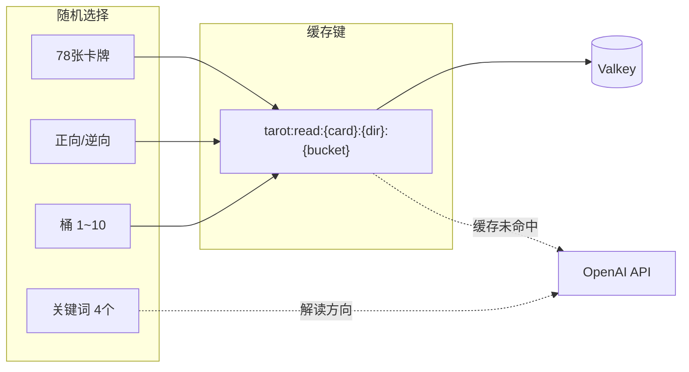
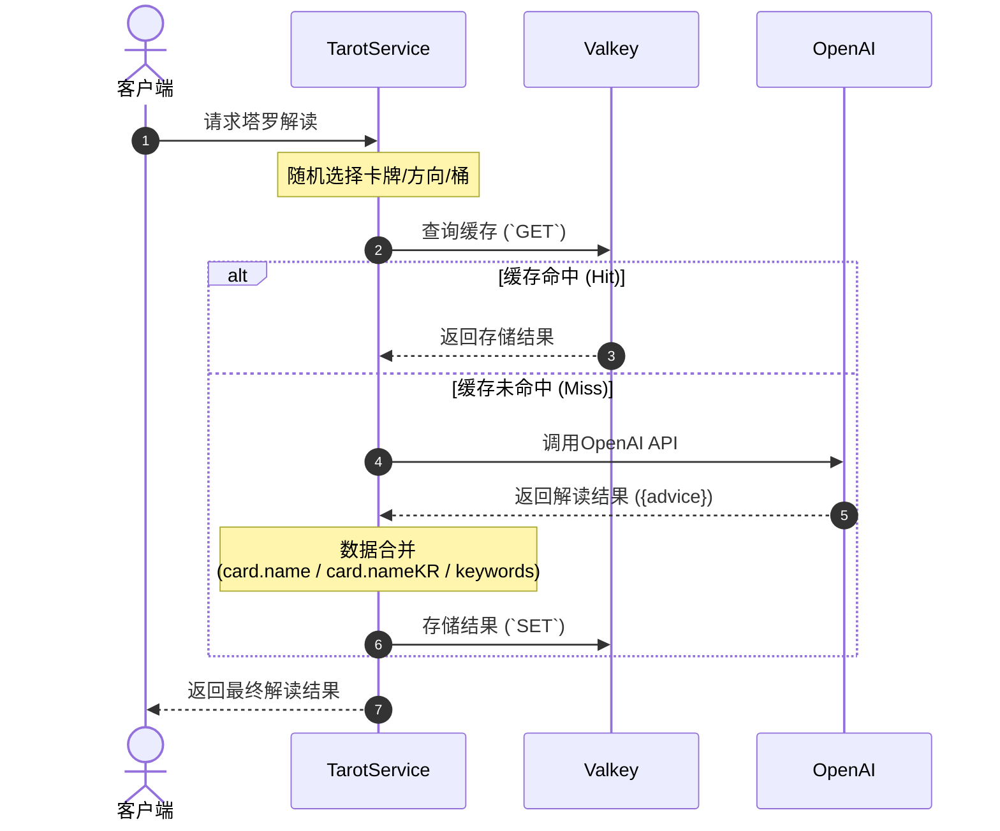
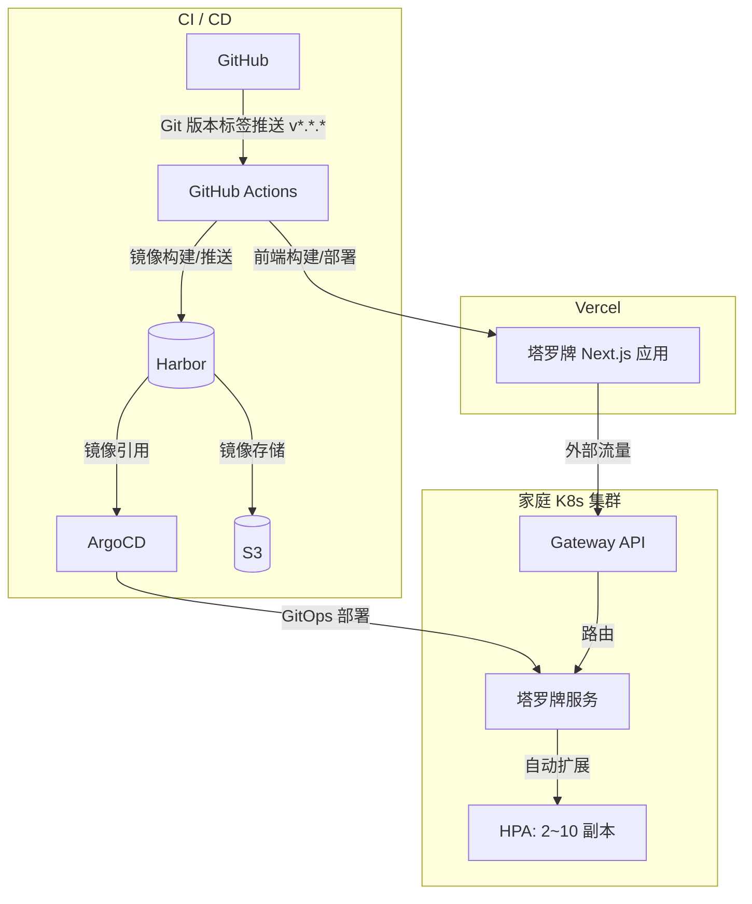

## 问题意识

AI生成的内容每次都是新的，这是它的优势，但如果对相同的输入每次都调用API，成本会迅速累积。塔罗牌服务也是如此。虽然使用OpenAI API进行牌面解读，但由于成本和响应速度问题，不可能对每个请求都调用API。

然而，仅仅使用卡牌和方向作为缓存键是不够的。用户即使抽到相同的牌，也期望每次都有不同的解读。为缩小这个差距，我们引入了**利用桶系统的缓存策略**。

---

## 桶：多样性与效率的平衡

核心理念很简单。通过组合78张牌、正逆方向和10个桶，创建**1,560个唯一缓存键**，并为每个键存储AI生成的解读。

```
78张 × 2方向 × 10桶 = 1,560个唯一组合
```

每当用户请求时，从这些组合中随机选择一个。缓存键的形式为`tarot:read:{card}:{direction}:{bucket}`，后续相同键的请求会立即从Valkey返回。只有在缓存中不存在时才调用OpenAI API。

此外，我们还增加了一项措施。服务器在每次请求时随机选择4个关键词，并将其作为上下文传递给AI。因此，即使是相同的卡牌、方向和桶，依据关键词也可能产生不同的解读。



用时序图表示整个流程如下。



---

## 部署

前端使用Vercel，后端在家庭Kubernetes集群上运行。



部署流水线在**新的版本标签(`v*.*.*`)推送到GitHub时**自动启动。GitHub Actions基于该标签构建镜像并推送到内部容器注册表Harbor，ArgoCD通过GitOps配置检测到变更并自动同步集群状态。此外，前端通过GitHub Actions直接构建并部署到Vercel。

后端通过HPA根据流量自动扩展至2~10个副本，外部用户请求通过内部Gateway API安全路由。

---

## 改进空间

目前是无需登录的简单服务，但计划增加登录功能，以便保存用户的解读历史并提供个性化体验。

---

## 结语

塔罗牌服务虽然是个小项目，但它包含了解决AI生成与缓存平衡的实际问题。利用桶系统的缓存策略在成本和多样性之间提供了现实的折中方案，并为未来的改进留下了足够的空间。
