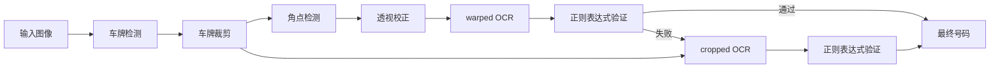
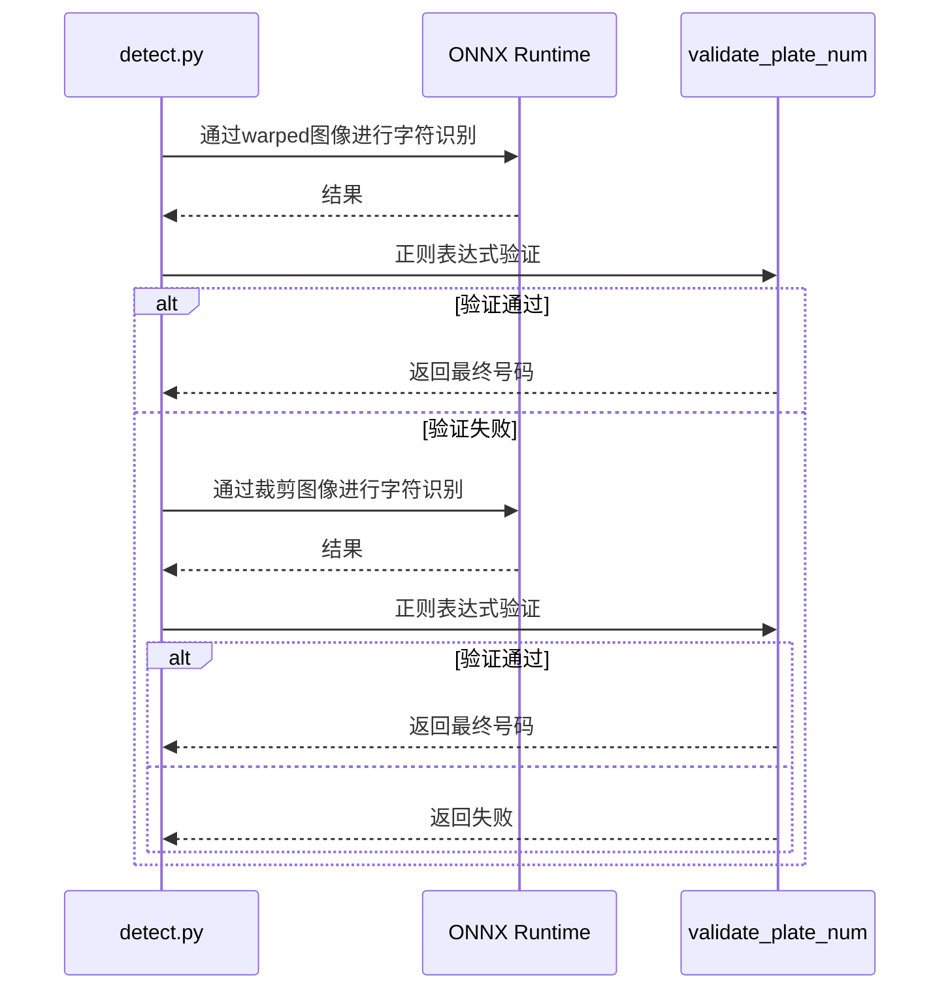

## 问题意识

传统的OCR在清晰的文档上效果很好，但在处理如车牌这样模糊且倾斜的图像时则显得脆弱。当字符间距不规则或部分被遮挡时，识别率会急剧下降。此外，韩国汽车车牌的字符排列多样，且混合了地区名和数字，普通的OCR模型对此存在局限。

这个项目采用了将字符视为对象而非文本的视角。通过基于YOLO的对象检测独立识别每个字符，并对原始和校正图像分别进行OCR以进行双重验证。通过NMS和极端点基于线拟合分离地区名和数字，即使在传统OCR失败的环境中也能稳健运行。

## 三阶段流水线：分工的美学

整体流程通过`detect.py`中的`get_num()`函数进行控制。三个ONNX模型各自负责其专业领域。

| 阶段 | 模型                 | 角色                             |
| ---- | -------------------- | -------------------------------- |
| 1    | `plate_detect_v1`    | 从整体图像中检测车牌区域         |
| 2    | `vertex_detect_v1`   | 检测四个角点后进行透视校正       |
| 3    | `syllable_detect_v1` | 以75个类别检测单个字符           |

第一个模型从整体图像中找到一个车牌区域，从多个候选中选择置信度最高的进行裁剪。第二个模型在裁剪的图像中找到四个角点并进行透视校正。第三个模型以75个类别检测单个字符。不同于传统OCR读取文本行，它在车牌内寻找每个字符的位置，因此即使字符间距不规则或部分被遮挡，其余部分也能被识别。

所有模型均通过ONNX Runtime运行，PyInstaller二进制文件不包含torch或ultralytics，以最小化大小。



## 验证与回退：稳定性与效率的平衡

透视变换并不总是完美的。角点检测可能失败或遇到倾斜的车牌。

该项目**优先对warped图像进行OCR**，如果通过正则表达式验证，则立即返回结果。只有在失败时才回退到原始裁剪图像进行额外的OCR。

```python
def get_num(img):
    cropped = plate_detector.detect_and_crop(img)
    warped = vertex_detector.detect_and_warp(cropped)

    # Step 1: 优先对warped图像进行OCR
    if warped is not None:
        res = syllable_detector.get_num_from_img(warped)
        result = validate_plate_num(res, mask=False)
        if result:
            return result

    # Step 2: 回退 - 对裁剪图像进行OCR
    if cropped is not None:
        res = syllable_detector.get_num_from_img(cropped)
        result = validate_plate_num(res, mask=False)
        if result:
            return result

    return None

def validate_plate_num(plate_num, mask=True):
    """对单次OCR结果进行正则验证 + 应用掩码"""
    if plate_num is None:
        plate_num = ''

    m = re.fullmatch(PLATE_REGEX, plate_num)
    if m is None:
        return None

    if mask:
        plate_num = re.search(OUTPUT_REGEX, plate_num).group()

    return plate_num
```

这种方式在warping成功时仅需一次OCR处理，失败时才回退到裁剪图像。设计上减少了不必要的推理，同时保持了稳定性。

字符检测后，通过NMS去除重复的边界框，并根据左右端点绘制线条分离地区名和数字区域。地区名如首尔、京畿、釜山等与硬编码的有效地区列表进行比较校正。



## 用户友好的GUI设计

批处理过程中如果某些图像检测失败该怎么办？忽略会降低数据质量，停止整个过程则会降低效率。

基于PySide6的GUI在检测失败时会自动暂停，并在屏幕上显示相关图像。用户可以手动输入车牌号码，并在点击确认按钮前暂停处理。这是一种在实现100%覆盖率的同时保持批处理效率的混合方法。结果通过openpyxl自动保存为result.xlsx，进度通过进度条可视化。

## 部署：现场直接使用

通过PyInstaller生成单个可执行文件。显式排除torch、tensorflow、matplotlib等大型库以最小化二进制文件大小。所有ONNX模型会从Hugging Face Hub自动下载，并缓存到本地以防止重新下载。

GitHub Actions在推送v\*标签时自动构建Linux、macOS、Windows版本，并上传到GitHub Releases。用户只需解压即可直接运行。

## 权衡与设计哲学

基于YOLO的字符检测在处理不规则间距和遮挡方面表现出色，但在小字符的细节识别率上可能不如传统OCR。为此，我们优先对warped图像进行OCR，并在通过正则表达式验证时立即返回结果，失败时才回退到裁剪图像。NMS阈值0.3在字符重叠较多的车牌中实现了去重与防漏的平衡。

GUI的模态输入方式可能显得有些过时，但在实际操作环境中，完全自动化无法处理的边缘情况，这是一种实用的选择。平衡数据质量和处理效率是该项目的核心哲学。

## 结语

该项目不仅是一个简单的深度学习演示，更是一个可在实际场景中使用的工具。三阶段模型流水线的模块化设计、优先处理warped图像与回退机制的稳定性、PySide6 GUI的用户友好性，以及利用PyInstaller和GitHub Actions进行跨平台部署的设计都令人印象深刻。在车牌识别这一狭窄领域中，充分发挥了对象检测的潜力。
