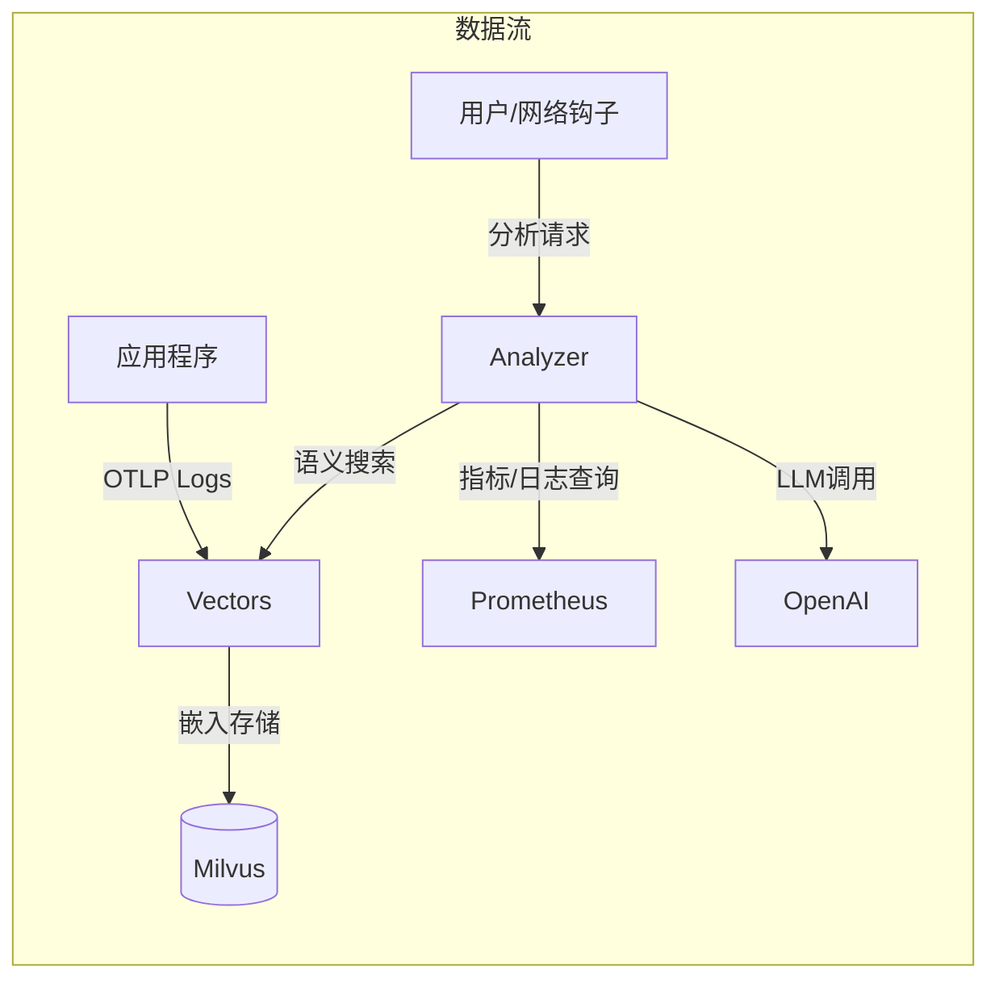
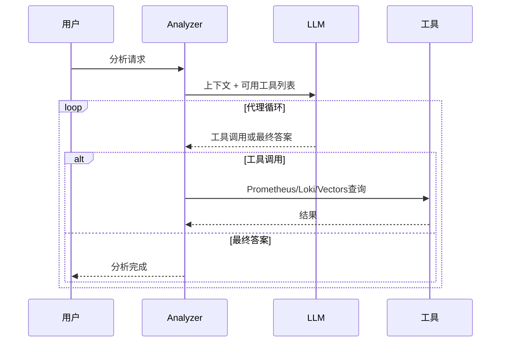

## 问题意识

半夜响起的PagerDuty警报。“CPU超过90%。”
从睡梦中醒来查看仪表盘，发现是从昨天开始运行的批处理作业导致的，
预计30分钟后会自动降低。
这样的虚假警报积累多了，真正的问题来临时就会变得麻木。

Meerkat正是为了从根本上解决这个问题而开始的。
AI Agent直接读取日志和指标，代替基于规则的警报，
并调用Prometheus、Loki等工具进行原因推断。
日志被向量化存储以便进行语义搜索，
并分为Analyzer和Vectors两个服务以独立扩展。

## 核心设计：两个服务，两种责任

Meerkat由Analyzer和Vectors两个服务组成。
这种分离是有意的设计。

**Vectors**专注于接收日志并进行有意义的存储。
通过OpenTelemetry OTLP接收的日志通过模板提取去重，
经过OpenAI嵌入后以向量形式存储在Milvus中。
即使一个服务每天留下数万条日志，实际上只有几十个唯一模板被向量化，
因此存储成本和搜索效率大大提高。

**Analyzer**专注于AI分析和工作管理。
通过HTTP API接收请求，在异步工作池中处理，
如有需要会请求Vectors进行语义搜索。
两个服务通过gRPC通信，并且可以各自独立进行横向扩展。

### 模板提取的效果

模板提取是去除日志重复的核心技术。
例如，“User 123 logged in”和“User 456 logged in”会被提取为相同的模板“User * logged in”。
这样可以保持日志的多样性，同时大大减少需要向量化的唯一项数量。

模板提取方式如下：

| 过滤模式           | 操作                         | 使用案例                     |
| ------------------- | ---------------------------- | ----------------------------- |
| **all**             | 向量化所有日志               | 小规模服务，开发环境          |
| **severity**        | 处理指定级别以上的日志       | 运营环境，以错误为中心的监控 |
| **template** (默认) | 使用Drain算法去重            | 大规模服务，成本优化          |

提供3种模式以便根据服务规模和需求进行选择。
all模式会向量化所有日志，但成本较高，
severity模式仅处理错误或警告等重要日志以降低成本。
template模式使用Drain算法提取日志模板，最大化存储空间和搜索效率。

## AI使用工具的意义

Analyzer的核心是为LLM提供工具并让其自行使用。
提供Prometheus、Loki、VictoriaLogs查询和Vectors语义搜索四种工具。

收到“分析错误峰值”的请求时，流程如下。
首先在Vectors中搜索该服务的最近错误日志，
然后在Prometheus中查看错误率趋势，
最后在Loki中分析特定错误消息的频率。
综合得出“由于Redis连接超时导致的错误峰值，
于14:23开始，14:45自动恢复”这样的结论。

工具结果限制为3万字符，
错误分为查询语法错误、连接失败、查询失败。
让LLM做出“这是我的查询错误，修正后重试”或
“Prometheus无响应，转向Loki”等判断。

## 运营环境中的考虑

工作池由1000大小的缓冲通道和10个工作者组成。
队列满时立即返回429错误以提供背压。
对相同触发器和查询的重复分析
在5分钟窗口内自动阻止。

部署由Helm Chart管理，
ConfigMap中存储配置和系统提示，
Secret中分离存储API密钥和数据库密码。
但由于工作池的队列是内存通道，
服务器重启时排队的任务会丢失。
未来计划应用持久化队列。

## 结束语

Meerkat不仅仅是调用LLM API。
结合使用工具的AI Agent架构和基于语义的日志搜索，
以及异步工作池，
打造了一个可在实际运营环境中使用的平台。
为遇到规则基于警报瓶颈的团队
提供了一种通过自然语言一句话了解基础设施状况的新型基础设施可视性，
这正是该项目追求的价值。
