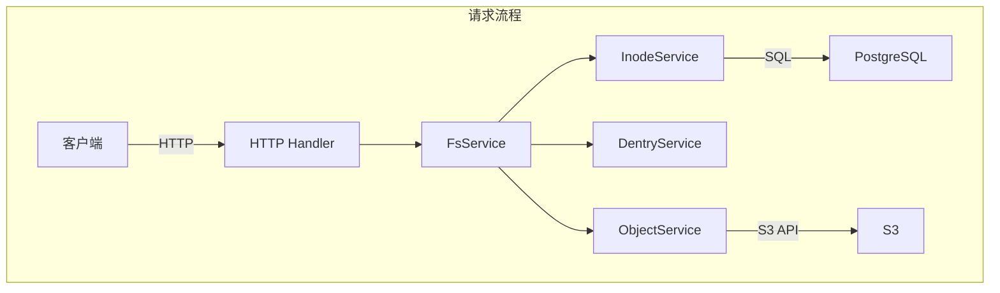
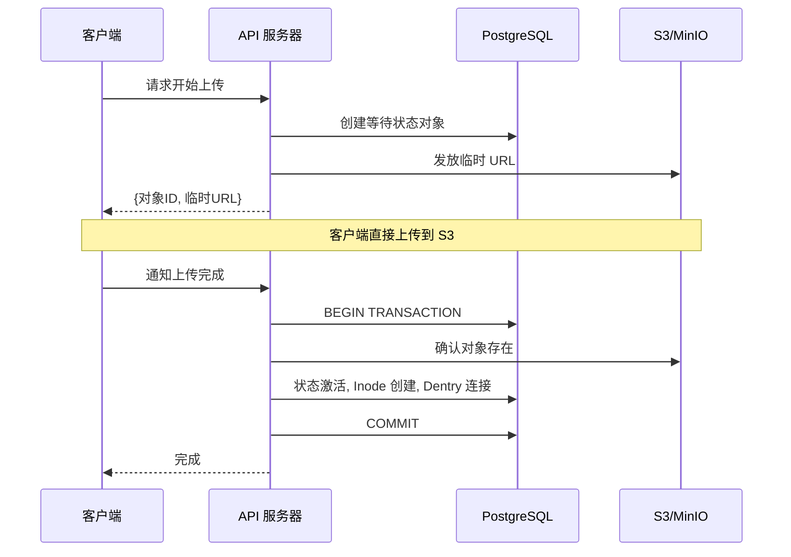

```markdown
## 问题意识

S3 提供了卓越的耐用性和可扩展性，但对开发者来说仍然复杂。
没有目录、权限管理粗糙，且需要自行实现大文件上传。

Retrowin 是一个在保持 S3 可扩展性的同时，提供 POSIX 文件系统接口的系统。
通过将 Inode 和 Dentry 以 JSON 形式存储在 PostgreSQL 中，无需连接即可查询目录，
并通过基于临时 URL 的两阶段上传高效处理大文件。
此外，结合 Windows XP 风格的复古 UI，追求技术挑战和乐趣。

## 核心设计：inode 和 dentry 的现代化再解释

最大的设计问题是
“如何在关系型数据库中表达文件系统的层次结构？”。
借用了 Linux 的 inode 和 dentry 概念，但进行了现代化再解释。

Inode 表存储文件元数据，
Dentry 管理目录内文件名和 Inode ID 的映射。
一个有趣的决定是将 Dentry 作为 JSON 存储在 Inode 的 content 列中，而不是单独的表。
查询目录时无需连接，只需读取单行，延迟较短，
并可利用 PostgreSQL 的 JSONB 索引。
缺点是修改目录时需要重新写入整个 JSON，
但大多数目录的文件数不超过数百个，因此开销很小。



## 大文件上传：临时 URL 和原子完成

通过服务器代理到 S3 上传文件会导致带宽和内存瓶颈。
Retrowin 通过基于临时 URL 的两阶段上传解决了这个问题。

客户端请求上传时，
服务器在数据库中创建等待状态记录并发放 S3 临时 URL。
客户端直接使用此 URL 上传到 S3。
上传完成后通知服务器，在 PostgreSQL 事务内
原子性地执行 S3 存在确认、状态激活转换、Inode 创建、Dentry 连接。
支持幂等性键，以便在重试相同上传请求时重用现有记录。



### 原子上传的核心

```go
func (s *FsService) AtomicUpload(ctx context.Context, objectID string) error {
    return s.db.WithTx(ctx, func(tx *sql.Tx) error {
        // 1. 确认 S3 对象存在
        if err := s.s3.HeadObject(objectID); err != nil {
            return err
        }
        // 2. 状态激活
        if err := s.objectSvc.CompleteUpload(ctx, tx, objectID); err != nil {
            return err
        }
        // 3. Inode 创建 + Dentry 连接
        inode, err := s.inodeSvc.Create(ctx, tx, objectID)
        if err != nil {
            return err
        }
        return s.dentrySvc.Link(ctx, tx, inode)
    })
}
```

由于所有操作在事务中原子性地执行，
即使中途失败，也不会导致数据不一致。

## 认证与权限：遵循标准

文件系统的权限管理至关重要。
使用 Keycloak 作为 OIDC 提供者，遵循标准化的认证流程。
应用 PKCE，使移动和桌面客户端也能安全认证，
OIDC 客户端延迟初始化，即使 Keycloak 短暂宕机也不会阻止服务器启动。

文件权限遵循标准 Unix 权限位。
控制所有者、组、其他用户的读/写/执行权限，
root 可以执行所有操作。

| 权限主体      | 读   | 写   | 执行 |
| -------------- | ---- | ---- | ---- |
| 所有者 (Owner) | ✅   | ✅   | ✅   |
| 组 (Group)     | ✅   | ❌   | ✅   |
| 其他 (Other)   | ❌   | ❌   | ❌   |

## 垃圾回收

随着时间的推移，会出现未完成上传的等待文件或
S3 中已删除但数据库中仍存在的孤立记录。
通过 Kubernetes CronJob 每天凌晨 3 点执行两阶段清理。
首先移除等待超过 24 小时的过期对象，
然后查找数据库中标记为激活但 S3 中不存在的孤立对象进行清理。

## 权衡与教训

基于 JSON 的 Dentry 提高了查询性能，
但目录并发修改的锁是基于内存的，
在水平扩展时存在限制。
此外，符号链接解析是递归的，缺乏循环检测，
容易受到链接循环的影响。
但在单用户或小团队环境中，
这些权衡是可以接受的，
简单性带来的运营优势更大。

## 结语

Retrowin 是一个结合对象存储的可扩展性和
POSIX 文件系统的熟悉性的有趣实验。
包括原子上传、OIDC 认证、GC 等考虑实际运营环境的元素，
同时积极利用 Ent ORM 和 ogen 等 Go 生态系统的现代工具。
复古 UI 展现了这一项目追求技术挑战和乐趣的身份。
```
