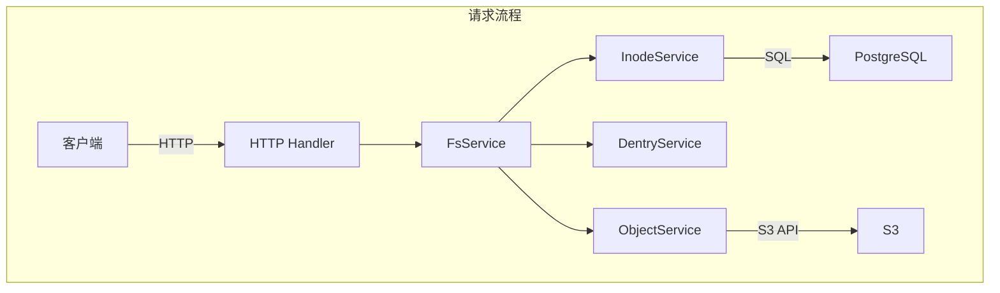
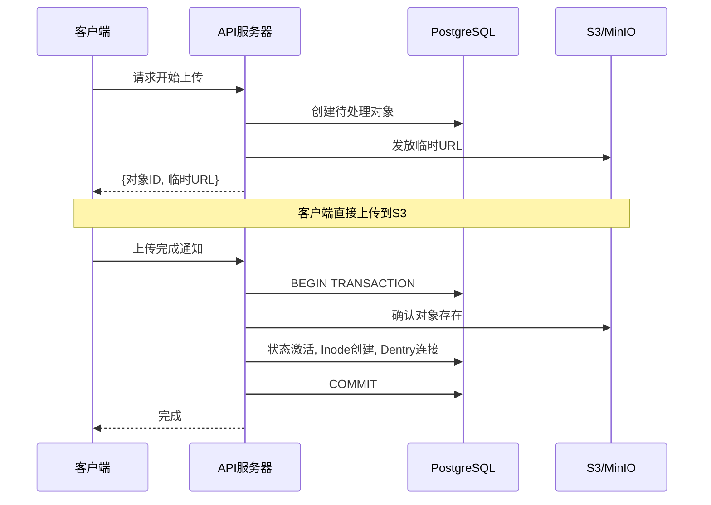

```markdown
## 问题意识

S3虽然提供了卓越的耐用性和可扩展性，但对于开发者来说仍然比较复杂。没有目录，权限管理粗糙，且需要自行实现大文件上传。

Retrowin是在保持S3可扩展性的同时，提供POSIX文件系统接口的系统。通过将Inode和Dentry以JSON格式存储在PostgreSQL中，无需联接即可查询目录，并通过基于临时URL的两阶段上传高效处理大文件。此外，还加入了Windows XP风格的复古UI，追求技术挑战和乐趣。

## 核心设计：inode和dentry的现代诠释

最大的设计问题是“如何在关系型数据库中表达文件系统的层次结构？”我们借用了Linux的inode和dentry概念，但进行了现代化的诠释。

Inode表用于存储文件元数据，Dentry则管理目录内文件名与Inode ID的映射。有趣的决定是将Dentry作为JSON存储在Inode的content列中，而不是单独的表。查询目录时无需联接，只需读取单行数据，延迟较低，并且可以利用PostgreSQL的JSONB索引。缺点是修改目录时需要重写整个JSON，但大多数目录的文件数不超过数百个，因此这一开销是微不足道的。



## 大文件上传：临时URL与原子完成

通过服务器代理到S3上传文件会导致带宽和内存瓶颈。Retrowin通过基于临时URL的两阶段上传解决了这个问题。

当客户端请求上传时，服务器在数据库中创建待处理状态记录并发放S3临时URL。客户端使用该URL直接上传到S3。上传完成后通知服务器，在PostgreSQL事务中原子地执行S3存在确认、状态激活转换、Inode创建、Dentry连接。还支持幂等键，以便在重试相同的上传请求时重用现有记录。



### 原子上传的核心

```go
func (s *FsService) AtomicUpload(ctx context.Context, objectID string) error {
    return s.db.WithTx(ctx, func(tx *sql.Tx) error {
        // 1. 确认S3对象存在
        if err := s.s3.HeadObject(objectID); err != nil {
            return err
        }
        // 2. 激活状态
        if err := s.objectSvc.CompleteUpload(ctx, tx, objectID); err != nil {
            return err
        }
        // 3. Inode创建 + Dentry连接
        inode, err := s.inodeSvc.Create(ctx, tx, objectID)
        if err != nil {
            return err
        }
        return s.dentrySvc.Link(ctx, tx, inode)
    })
}
```

由于所有操作在事务中原子执行，即使中途失败也不会导致数据不一致。

## 认证与权限：遵循标准

文件系统的生命在于权限管理。使用Keycloak作为OIDC提供者，遵循标准化的认证流程。应用PKCE以确保在移动和桌面客户端上的安全认证，OIDC客户端延迟初始化，即使Keycloak短暂宕机也不会阻止服务器启动。

文件权限遵循标准的Unix权限位。控制所有者、组和其他用户的读/写/执行权限，root可以执行所有操作。

| 权限主体      | 读   | 写   | 执行 |
| -------------- | ---- | ---- | ---- |
| 所有者 (Owner) | ✅   | ✅   | ✅   |
| 组 (Group)     | ✅   | ❌   | ✅   |
| 其他 (Other)   | ❌   | ❌   | ❌   |

## 垃圾回收

随着时间的推移，会出现未完成上传的待处理文件或在S3中已删除但在数据库中仍存在的孤立记录。通过Kubernetes CronJob每天凌晨3点执行两阶段清理。首先移除等待超过24小时的过期对象，然后查找在数据库中标记为活跃但在S3中不存在的孤立对象并进行清理。

## 权衡与教训

基于JSON的Dentry提高了查询性能，但用于目录并发修改的锁是基于内存的，因此在水平扩展时存在限制。此外，符号链接解析是递归的，且没有循环检测，容易出现链接循环。然而，在单用户或小团队环境中，这种权衡是可以接受的，简单性带来的运营优势更大。

## 结束语

Retrowin是结合对象存储的可扩展性和POSIX文件系统的熟悉感的有趣实验。它包括了原子上传、OIDC认证、GC等考虑实际运营环境的元素，同时积极利用了Ent ORM和ogen等Go生态的现代工具。复古UI很好地展示了这个项目追求技术挑战和乐趣的身份。
```
