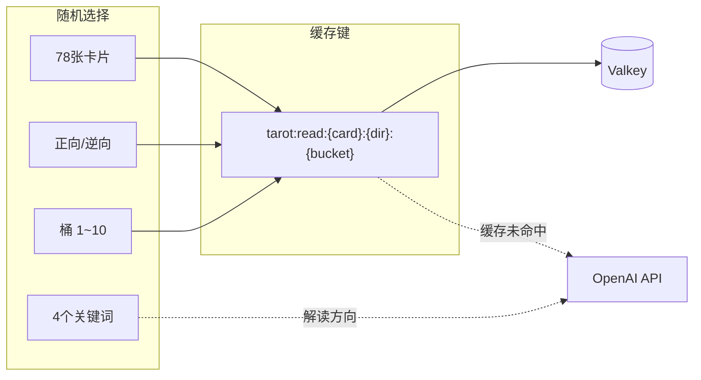
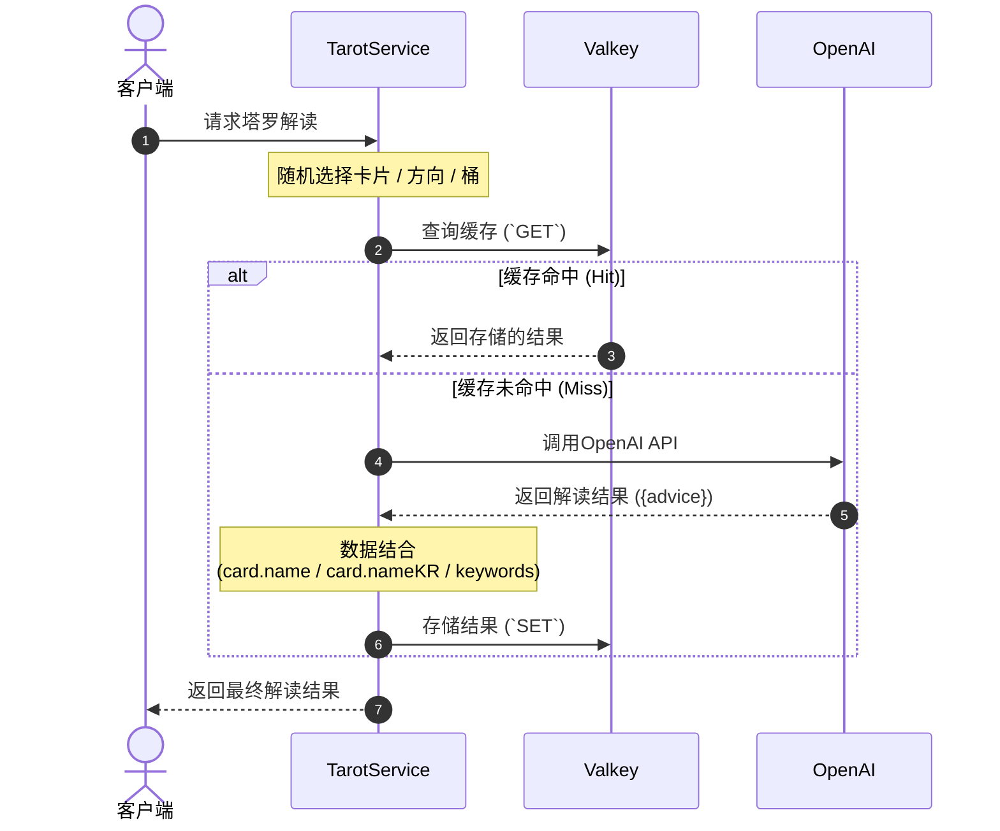
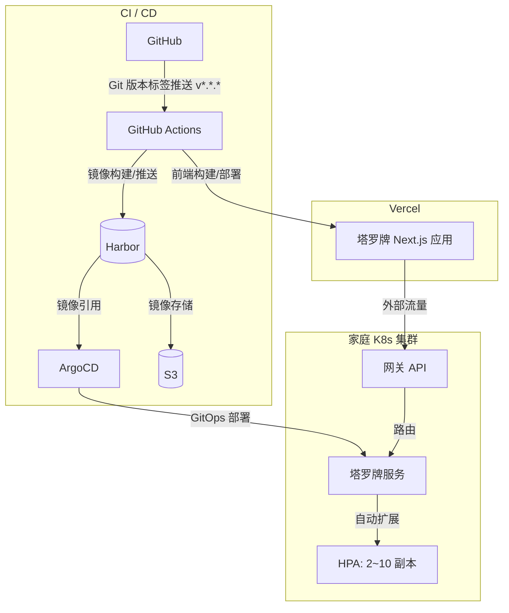

```markdown
## 问题意识

AI生成的内容每次都是新的，这是一个优点，但如果每次都为相同的输入调用API，成本会迅速累积。塔罗牌服务也是如此。
虽然我们使用OpenAI API进行卡片解读，但由于成本和响应速度的问题，无法对每个请求都调用API。

仅仅依靠卡片和方向作为键的缓存是不够的，因为用户即使抽到相同的卡片，也期望每次有不同的解读。
为缩小这一差距，我们引入了**利用桶系统的缓存策略**。

---

## 桶：多样性与效率的平衡

核心理念很简单。通过组合78张卡片、正逆方向和10个桶，创建**1,560个唯一的缓存键**，并为每个键存储AI生成的解读。

```
78张 × 2方向 × 10桶 = 1,560个唯一组合

```

每当用户请求时，会随机选择这些组合之一。缓存键的形式为`tarot:read:{card}:{direction}:{bucket}`，对于相同键的后续请求，Valkey会立即返回。
只有在缓存中没有时才调用OpenAI API。

我们还添加了一项措施。服务器每次请求时随机选择4个关键词，并将其作为上下文传递给AI。
因此，即使是相同的卡片、方向和桶，解读也会因关键词而有所不同。



整个流程用时序图表示如下。



---

## 部署

前端使用Vercel，后端在家庭Kubernetes集群上运行。



部署管道在GitHub上**新的版本标签(`v*.*.*`)推送时**自动启动。
GitHub Actions基于该标签构建镜像并推送到内部容器注册表Harbor，
ArgoCD通过GitOps设置检测变更并自动同步集群状态。
此外，前端通过GitHub Actions直接在Vercel上进行构建和部署。

后端通过HPA根据流量自动扩展为2~10个副本，
来自外部的用户请求通过内部网关API安全路由。

---

## 改进空间

目前是一个无需登录即可使用的简单服务，
但我们计划增加登录功能，以便保存用户的解读历史并提供个性化体验。

---

## 结语

塔罗牌服务是一个小项目，但包含了解决AI生成与缓存平衡的实际问题的过程。
利用桶系统的缓存策略在成本和多样性之间提供了现实的妥协点，并且有足够的改进空间。
```
