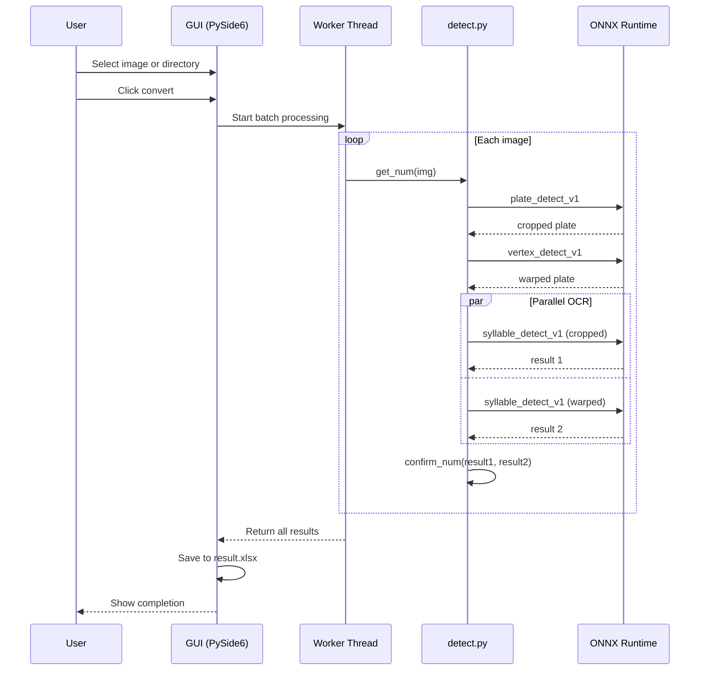

The Korean license plate detector is a real-time image processing pipeline based on ONNX Runtime that uses a YOLO object detection model to locate license plates and recognize individual characters. It uses an approach that detects each character as an independent object, rather than traditional OCR methods, to achieve high recognition rates even in difficult environments such as blurry images, tilted angles, and partial occlusions. The GUI, built with PySide6, allows users to easily perform directory-wide batch processing.

The system applies three specialized YOLO models sequentially. The first plate_detect_v1 model detects the license plate region in the image, the second vertex_detect_v1 model locates the four corners of the detected plate and performs a perspective transformation. Finally, the syllable_detect_v1 model detects individual characters as objects to read the license plate number. All models are converted to ONNX format for fast inference without the need for Python's heavy deep learning framework, and are automatically downloaded from the Hugging Face Hub.

The biggest feature is the dual OCR verification mechanism. It performs character recognition on two versions of the image, the original cropped image and the perspective-corrected image, respectively, and then validates them with regular expressions, adopting the final value only when the two results match. In case the perspective conversion fails or is anomalous, the recognition result of the original image is utilized as a fallback to ensure stability. The recognized characters are de-duplicated with NMS, and then linear regression is applied based on the extreme left and right points to separate and rearrange the region names (Seoul, Gyeonggi, etc.) and numeric regions.

The GUI is dynamically loaded via PySide6's QUiLoader, which automatically pauses and displays a failed detection image if it occurs during batch processing. The user can resume processing by manually entering the license plate number and pressing the OK button, which adopts a leave-in design. The processing results are automatically saved as a result.xlsx file via openpyxl, and the progress is visualized in the progress bar.

The build system uses a combination of Makefile and PyInstaller. For development environments, it runs on a virtualization basis, and for deployment, PyInstaller generates a single executable. In the PyInstaller spec file, we explicitly exclude large unnecessary dependencies like torch and tensorflow to minimize the binary size. Automatically generate cross-platform releases for Linux, macOS, and Windows when pushing tags via GitHub Actions.

## Detection Pipeline

