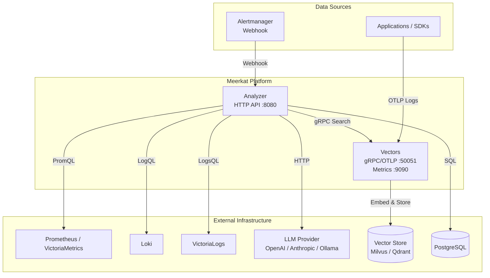

Meerkat is an AI agent-powered observability platform that collects logs and metrics from your infrastructure in real time and analyzes them directly by AI to detect anomalies. Unlike traditional rule-based alerting systems, you can ask questions in natural language or have events delivered via webhooks analyzed by AI in context for more intelligent and flexible monitoring.

The system consists of two independent services: Analyzer and Vectors. The Vectors service receives logs from applications via OpenTelemetry's OTLP protocol, removes duplicates with template extraction using the Drain algorithm, and stores them in the Milvus vector database via the OpenAI embedding API. The Analyzer service receives external requests via HTTP API to perform asynchronous analysis based on a worker pool and requests semantic search from the Vectors service via gRPC.

During the analysis process, the AI Agent does more than just read logs; it repeats a pattern of tool calling, directly invoking observation tools such as Prometheus' PromQL or Loki's LogQL. LLM digs into even complex failure situations step-by-step through an agent loop that queries metrics, searches logs, and infers causes on its own. There's also an automatic recovery mechanism built in that summarizes and compresses past conversations in case the conversation context is exceeded.

The database uses PostgreSQL and is managed by Ent ORM. The lifecycle of analytics reports is managed state-based from creation to completion, with de-duplication logic that prevents duplicate analyses for the same trigger and query at 5-minute intervals. Once analyzed, results can be delivered to set webhooks to integrate with external channels such as Slack.

The entire service is deployed as a Helm Chart in a Kubernetes environment, and Analyzer and Vectors follow a stateless architecture that allows them to scale out independently of each other. The Vectors service also exposes Prometheus metrics so you can monitor ingestion volume, deduplication rate, search latency, and more.

## Architecture

## Analysis Flow

___code_block_1___

