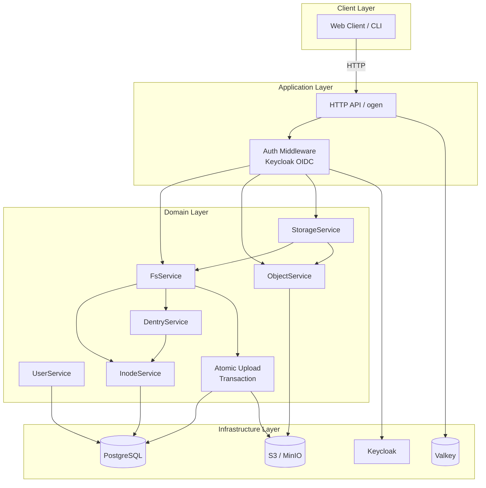

Retrowin is a distributed file management system that works with external object storage to provide a POSIX-style file management interface. Users manipulate files with a familiar directory structure and permissions scheme, while the actual data is stored securely on object storage like AWS S3 or MinIO. The Windows XP-style retro UI is implemented with React and Next.js to achieve a retro sensibility and modern user experience at the same time.

The system architecture is designed based on the hexagonal architecture pattern: an OpenAPI-based HTTP handler created with ogen receives requests and forwards them to the application service via an Uber FX dependency injection container. At the core domain layer, we use the concepts of Inode and Dentry to implement an abstraction of the Linux file system, where directory contents are encoded and stored as JSON blobs in the content column of Inode. This allows us to efficiently manage hierarchical file structures without the need for a separate Dentry table.

File uploads are handled in a two-step process based on a pre-signed URL. When a client requests an upload, the server creates an object record in PostgreSQL with a pending status and issues an S3 pre-signed PUT URL. After the client completes the upload directly to S3, the server sees the complete request and atomically switches the inode creation, Dentry connection, and object state to active within the transaction to ensure data consistency. Retries of the same upload request are also handled securely with support for equivalence keys.

For authentication, we implemented a PKCE-based login flow leveraging Keycloak OIDC. The authorization code and code verifier are temporarily stored in Valkey with a 5 minute TTL, and upon callback, a session is created after verification. Sessions are kept in Valkey and cookie-based validated for each API request to control per-user file access. The OIDC client is lazily initialized so that server startup is not blocked in the event of a Keycloak temporary failure.

Garbage Collection is a Kubernetes CronJob that runs daily at 3am to clean up expiring objects that have been pending for more than 24 hours and orphaned objects that don't exist in S3 but remain in the DB. The entire service is deployed as a Helm Chart and follows container security best practices, including running as a non-root user in a secure context and using a read-only root filesystem.

## Architecture

## File Upload Flow

___code_block_1___

## Garbage Collection Flow

___code_block_2___

