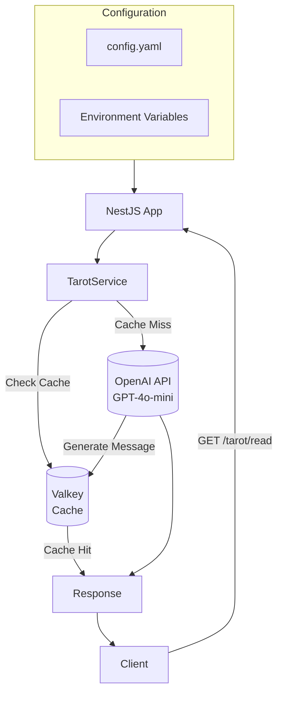

TarotCards is an AI-powered service that leverages OpenAI's GPT-4o-mini model to provide users with tarot card readings. Rather than simply drawing a card at random and showing a set interpretation, it generates contextual readings using different keyword combinations and bucket systems each time, and leverages Valkey cache to optimize the cost and response speed of OpenAI API calls.

The NestJS-based backend loads the full deck of 78 cards from the TarotService into memory, and uses Math.random() to randomly select 1 card, its forward/reverse direction, a bucket number from 1 to 10, and 4 of the 60 keywords. The cache key generated by this combination is of the form tarot:read:{card}:{direction}:{bucket}, where the same card and direction can yield different readings with different bucket numbers. The cache works in a Cache-Aside pattern, calling the OpenAI API only on cache misses and storing the result with a TTL of 1 hour.

The OpenAI integration uses the Structured Outputs API to enforce response formatting in a Zod schema. The system prompts are written in a cold, natural Korean tone, like a fortune teller, but constrained to avoid special characters and user-direct information. User messages include the card name, direction, and four selected keywords in JSON to prompt the AI to generate contextualized advice. Even if the cache server is full, it is wrapped in try/catch, so it responds gracefully with a direct call to OpenAI.

The configuration system is based on a YAML file and can be overridden with environment variables. OpenAI API keys, Valkey connection information, cache TTLs, bucket sizes, system prompts, and more are all configurable. Default values and validation are handled simultaneously via Zod schema and injected throughout the application via NestJS ConfigModule.

The frontend is implemented in React and Next.js, and deployment is done via Docker multi-stage builds and Kubernetes Helm Chart. The application runs in two or more replicas and scales automatically with load via HPA. Low-spec Valkey instances can be optionally included within the Helm Chart, allowing the entire stack to be deployed with a single command.

## Architecture

## Request Flow

**_code_block_1_**
